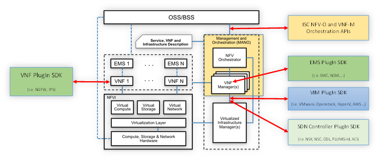

# NFV

Network Functions Virtualization (NFV) envisages the implementation of NFVs as software-only entities that run over the NFV Infrastructure (NFVI). Figure below illustrates the high-level NFV framework as referenced by ETSI. As such, three main working domains are identified in NFV:   
* Virtualized Network Function (VNF), as the software implementation of a network function which is capable of running over the NFVI.
* NFV Infrastructure (NFVI), including the diversity of physical resources and how these can be virtualized. NFVI supports the execution of the VNFs
* NFV Management and Orchestration, which covers the orchestration and lifecycle management of NFV’s that support the infrastructure virtualization. NFV Management and Orchestration focuses on all virtualization-specific management tasks necessary in the NFV framework.  

  
*Virtualization and NFV*

The NFV framework enables dynamic construction and management of VNF instances and the relationships between them regarding data, control, management, dependencies and other attributes. To this end, there are at least three architectural views of VNFs that are centered on different perspectives and contexts of a VNF. These perspectives include:
*	A virtualization deployment/on-boarding perspective where the context can be a VM, 
*	A vendor-developed software package perspective where the context can be several inter-connected VMs and a deployment template that describes their attributes,
*	An operator perspective where the context can be the operation and management of a VNF received in the form of a vendor software package.
