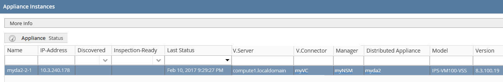

# OSC - Removing The Agent Functionality
The support for the agent based flows in OSC has been deprecated. This document describes the proposed changes to completely remove all agent related functionality from OSC.  

## API Changes

### Get Agent Status

The OSC REST API **PUT** `server/v1/distributedApplianceInstances/status` will no longer return the type `AgentStatusResponseDto` which contains `agentType:string` and `response:AgentStatusResponse` instead this API will return directly a collection of `AgentStatusResponse`.  
Since there is no longer an agent **agentType** is not needed.

### Authenticating Distributed Appliance Instance
The API **PUT** `/server/v1/distributedApplianceInstances/authenticate` is used to re-authenticate/register the appliance through the agent. This API is no longer applicable and is being removed.

### Registering The Agent
The API POST `/api/agent/v1/agentregister` is currently used by the agent to call OSC in order to register the status of the appliance instance. This API is no longer applicable and is being removed.

## UI Changes
As part of removing the agent flows and functionality the OSC UI will go through a few changes. Below are the UI mock ups highlighting these changes.

### Distributed Appliance Instances

The image below depicts the new view for the Appliance Instances. All the agent related and specific fields and buttons have been removed.

  
*New Appliance Instances View*  

In in addition to removing inapplicable UI elements the existing button "Agent Status" is being relabeled to "Appliance Status". It will trigger the following view:  

  
*New Appliance Instance Status View*  

As part of deprecating the agent we believe that some of its responsibilities will be done by the manager like heartbeat and providing appliances full status. This will likely be an optional functionality provided by the managers. This will affect the presented UI in the following way:
* For managers that do not provide appliance status the **Discovered** and **Inspection Ready** columns will display **N/A**. Additionally the **"Appliance Status"** button will pop up a warning message "The security manager for this appliance instance does not provide appliance status".  
* For managers that provide appliance status all the UI elements will work as expected, providing the status and remaining information.  

### Users
The **Users View** (Manage -> Users) should no longer display any user of type `SYSTEM_AGENT`

## Code Cleanup

### Agent
The code under `osc-agent` will be entirely deleted from the code base. Along with it, all the code on `osc-common` that is used only by/for the `osc-agent` will be also deleted, like the class `VmidcAgentApi`.  

### Tasks
The following tasks are no longer applicable and will be removed:

* AgentInterfaceEndpointMapSetTask
* AgentInterfaceEndpointMapUpdateTask
* AgentInterfaceEndpointMapRemoveTask
* AgentsInterfaceEndpointMapUpdateMetaTask  
* AgentsInterfaceEndpointMapRemoveMetaTask
* PasswordChangePropagateToDaiTask
* IpChangePropagateToDaiTask  
* SyncAgentMetaTask  
* UpgradeAgentTask  
* UpgradeAgentMetaTask
* RegisterAgentTask  
* RegisterAgentMetaTask  

### Services
The following services are no longer applicable and will be removed:

* AgentRegisterService  
For VMware flows this code is currently responsible for create a distributed appliance instance. This responsibility will be moved to the service `NSXUpdateAgentsRequest`, creating a DAI if one does not exist.

* SyncAgentService 
* UpgradeAgentsService 
* RegisterAgentService  

## Database and Entities
The following column/fields will be removed from the data base (on fresh deployment and and during database update).
`TABLE DISTRIBUTED_APPLIANCE_INSTANCE`: password, agentVersion*, agentType, isPolicyMapOutOfSync.  

Also the `enum AgentType` is being removed.

## Security Manager Plugin API
The only proposed change to the security manager API is to have the method `isAgentManaged` removed. Now that all appliances are agentless this API is no longer needed.

## Test Considerations

### Security Managers and Images
As part of this work two Cirros images, one for NSM and one for ISM. The **NSM** plugin will be configured to **NOT** provide appliance status. The **ISM** plugin will be configured to provide appliance status and it will return true/true for Discovered/Inspection Ready, it will also return hardcoded values for CPA and DPA information.  Both of these plugins will be available with this behavior in the official build.  
All tests should be done with Cirros images moving forward (until NSM or SMC provides agentless appliances).

### Upgrades
* Build to build upgrade should continue to work after this feature, it may not work from a build prior to this feature to a current one.  
* Database upgrades MUST continue to work from build to build and, more importantly, from 2.5 to current build.

### VMware and OpenStack
* Devices should still be discovered by the manager in both VMware and OpenStack environments.  

