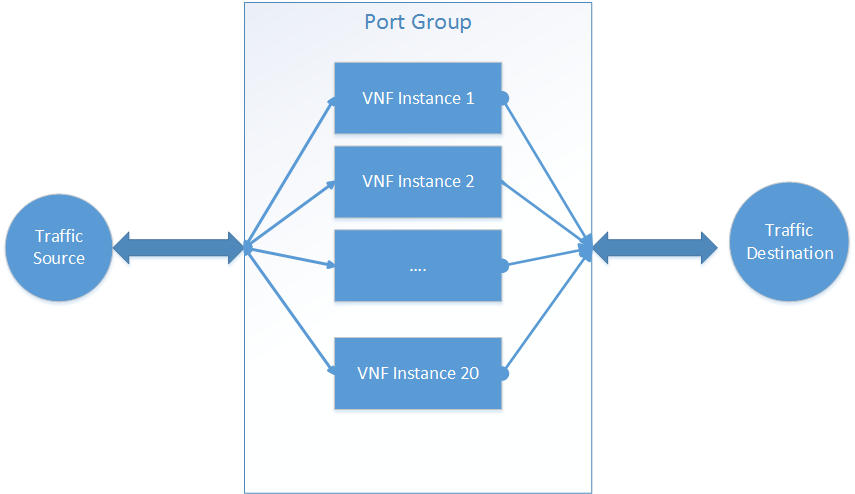

# VNF Auto-Scaling
When a service is overloaded, we want to scale the VNF’s so the extra traffic is handled automatically. When the service is resting, we want to scale down the VNF’s so extra compute resources are not consumed.

There have been 2 broad proposals for scaling security with VNF:
1. Scale the VNF's deployed in place.
Every VNF which is deployed is configured to use X amount of CPU, memory, storage etc. When a scaling request comes up we want to "hot plug" extra resources(CPU, memory, storage) and the appliance automatically detects this and starts using the extra resources. There are some open issues with scaling down and also there is a limit to the expansion of resources etc
2. Scale the number of VNF's and load balance traffic across these instances
Increase or decrease the number of VNF's while using the same resources across all the instance. When "Scaling up" request comes in, increase the number of VNF's and vice versa. This model simplifies the deployment but depending on the security appliance boot up time it might be slower to respond to scale up and scale down requests.

This proposal talks about taking the #2 approach.
## Assignees
Arvind Nadendla
## Background
Currently, the security admin creates a deployment specification which provides the intent for deployment.

We have 2 Basic options
1. Create a VNF deployment tied to the number hosts within a Availability Zone/region/Host Aggregate etc
Auto scaling is “built-in” when new hosts get added/deleted VNF also get added/deleted (there is still work that needs to be done to enable this in OSC)

2. Static definition of number of VNF’s per host.
Here we select the hosts where we want VNF’s to be deployed AND we select the number of instances to be deployed per host.  
Auto-scaling here means we increase the number of instances while keeping the hosts constant. The intent is the security admin is providing a base line from which you would scale up and scale down.

## Constraints and Assumptions
The Security manager is monitoring the appliance instances and can determine if a particular instance is overloaded.

## Design Changes

### Deployment
The admin provides the lower threshold implicitly when creating the deployment specification. In addition, we take an option to specify the upper threshold for the number of instance per host. When a scaling up request comes in, we will deploy extra VNF's upto the upper threshold defined by the administrator.

For example, the deployment specifiation can declare that for 2 hosts H1 and H2 we will deploy 1 VNF instance and the upper theshold is set to 3 VNF instances.

When a scaling request comes up, we are expecting to get the [exact instance which is overloaded as part of the request.](#Constraints-and-Assumptions) Assume H1/VNF1 is this instace  
OSC will deploy H1/VNF2 the first time and an additional H1/VNF3 if another scaling up request comes in. OSC should NOT deploy any additonal VNF's in H2 since that VNF did not initiate a scale request.
If another scaling request comes in, OSC has exhausted the scale up policy defined and throws an error. 
The scale down happens the same way, the extra VNF's are undeployed until we are left with the baseline VNF's only. 
Any further scale down request will result in a no-op.

### Load balance

Once the VNF's are deployed/undeployed, it is upto the SDN controller to take advantage of the extra VNF's

hen a new VNF's is deployed in response to a scale event, OSC registers this new VNF with SDN controller under a "Port Group" where the existing VNF's are already registered. The SDN controller determines how the traffic is load balanced between all the instances. There are a variety of ways to implement this starting with a basic round robin approach to using a consistent hashing mechanism using the port id's/mac/IP.

### REST API 
**TBD Future**
Describe in details any changes to the OSC REST APIs. This should include any new, modified or removed API and describing their payloads, headers and response status.
> Note: Using the [swagger specification](#swagger-specification) is highly recommended.

### OSC SDKs

#### VNF Security Manager SDK
**TBD Future**
Describe the API changes to be made in the VNF security manager SDK. 

#### SDN Controller SDK
**TBD Future**
Describe the API changes to be made in the SDN Controller SDK. 

### OSC Entities 
**TBD Future**
Describe any changes to the OSC database schema.

### OSC UI
**TBD Future**
Use UI mock ups to describe any UI change.

### OSC Synchronization Tasks
**TBD Future**
Describe any changes on the OSC internal synchronization tasks or metatasks. Use a diagram to represent any updated or new task graph.

## Tests
**TBD Future**
Describe here any new test requirement for this feature. This can include: virtualization platform, test infrastructure, stubs, etc. 
> Note: Any feature should be demonstrable and testable independently of a particular vendor component or service. 

## References
**TBD Future**

