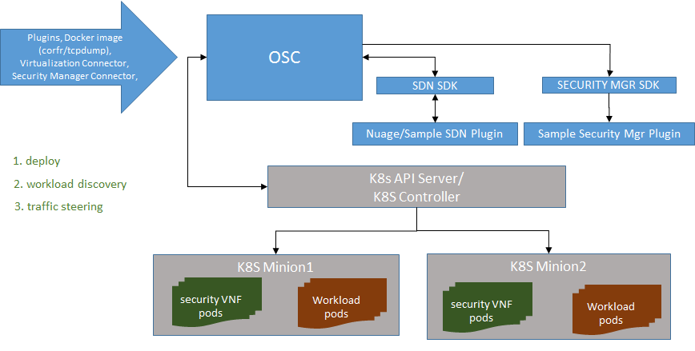
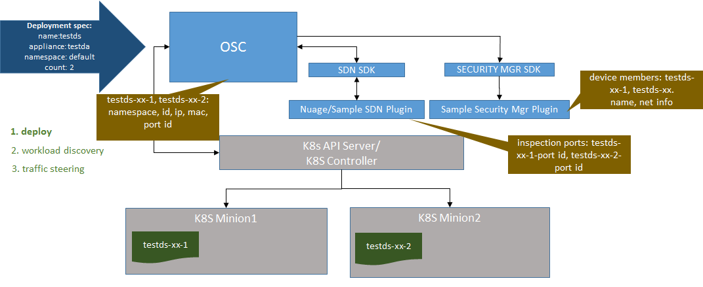
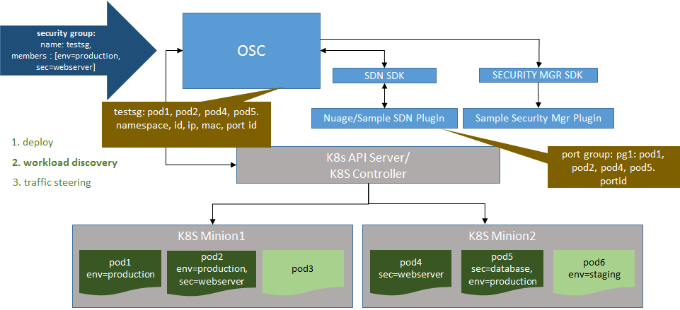
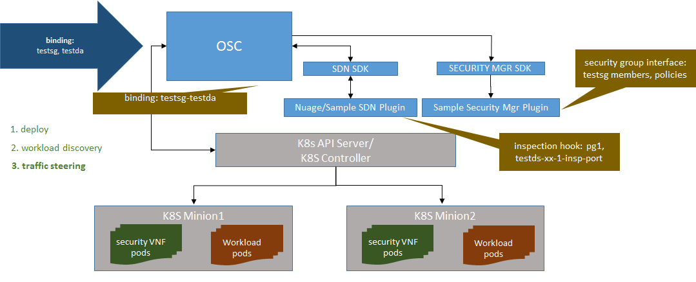
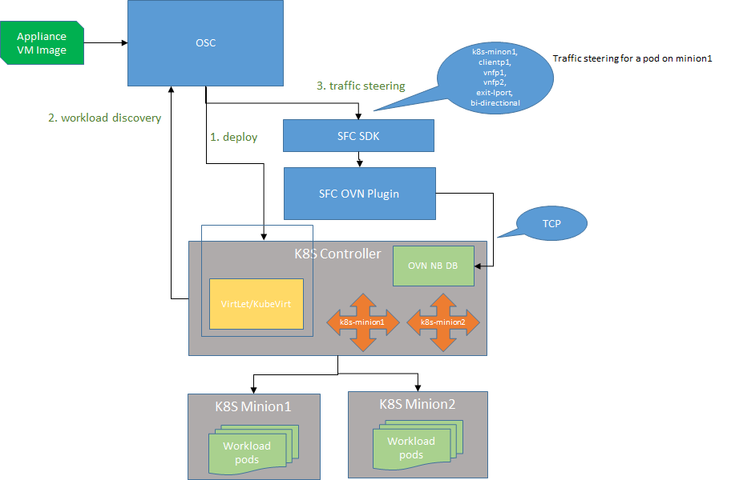

# OSC Containers Support
This document describes the high level architecture for supporting protection of containerized workloads managed by Kubernetes (K8s). It highlights the main integration points between OSC and the related external services, lists assumptions and restrictions, and scopes the work targeted for the next OSC release. 

## High Level Architecture

The image below depicts the logical components that make up this solution. The overall flow implemented by OSC for protecting containerized applications is very similar to its existing integration with OpenStack. On this flow the user will deploy a security VNF, create security groups using a property of the virtualization platform and configure the traffic steering to apply the security policies.

*OSC and K8S: High Level Architecture*

As shown above OSC will communicate with the virtualization platform using the K8s API server, configure the SDN components using the Nuage SDN controller (or optionally the sample SDN plugin) and sync the device and policy information with the security manager.

### Deployment

*OSC and K8S: Container Security VNF Deployment*

The deployment of the container VNFs is done through the creation of deployment specs on OSC. To deploy the VNF OSC creates a Kubernetes Deployment entity which is realized into pods. Each pod instance is represented in OSC as a distributed appliance instance and its network information (IP, MAC, port id) is fetched by OSC from the SDN controller. Just like for OpenStack, when a deployment is created OSC ensures that all the inspection ports are registered with the SDN controller and the corresponding devices are communicated to the security manager.

> **Restriction:**  The Nuage SDN currently requires the pod VNFs to be present on the same namespace as the protected workloads.

> **Restriction:**  Only appliances with a single port (same port for ingress and egress traffic) are currently supported.

> **Restriction**:  Currently the only security manager plugin compatible with OSC container features is the sample security manager plugin and the deployed VNF is represented by a container with `tcpdump`. A new plugin can be developed for any security solution that provides container VNFs.

### Workload Discovery

*OSC and K8S: Security Groups*

The workloads to be protected will be defined in OSC using K8s labels. The user can add multiple security group members to a Kubernetes security group, each one representing a Kubernetes label.  A pod with any of the labels in the security group is then identified by OSC for protection. Each identified label is represented in OSC as a protected pod and its network information (IP, MAC, port id) is fetched from the SDN controller. Similar to OpenStack, when a security group is created OSC ensures that a port group is registered in the SDN controller with all the protected container port IDs.

> **Restriction:**  This flow is compatible only with SDN controller plugins configured to support port groups.

### Traffic Redirection

*OSC and K8S: Traffic Redirection*

Once the container VNF instances have been deployed and workloads can be discovered by OSC it should now be able to steer the traffic through the VNF. Just like in OpenStack, this will be done through registering a inspection hook on the SDN controller, this hook directs any traffic to/from any of the ports in the indicated port group through the indicated inspection port.  In addition to configuring this, OSC also communicates the security group members along with applied policies to the security manager.

> **Restriction**: If using the SDN sample plugin instead of Nuage a real traffic redirection will not happen given that the sample plugin is only a stub.

## Releases

### Release 0.8

This is the first release for integrating OSC with K8S. The main goal of this release is enhancing OSC to be able to protect containerized workloads, adjusting its current architecture and adding all the necessary new integration pieces.  The following items apply to all features targeted by this release:

1.  All the *Restrictions* mentioned previously apply to this release.

2.  No regression on existing OSC functionalities.

3.  Production readiness is **out of scope**.  While all the features on this release will be part of the OSC codebase and will be repeatable they will not go through QA validation and should be considered as a prototype.

4.  All the features listed below will be exposed through the OSC APIs when applicable, **UI updates are out of scope**.

5.  Automatic notifications to identify changes on the virtualization environment is out of scope. The workaround consists of resyncing the corresponding entity (security group or deployment spec) on OSC.

### Features

#### Containers - VNF Deployment
**Description:**
As a security administrator, I want to be able to deploy a security VNF container to perform protection of containerized workloads hosted on a Kubernetes environments.

**Acceptance Criteria:**

* Demonstrate a container capable of intercepting the traffic between containers can be deployed on a virtualization environment.

* The container can be removed (un-deployed) from the virtualized environment.

* If the container is deleted by the user from the virtualized environment it must be recreated as expected.

* The security manager responsible to manage the deployed security appliance is notified when the container is deployed or removed.

#### Containers  - Workload Discovery

**Description:**

As a security administrator, I must be able to define security groups in OSC to determine which workloads to protect on the containerized environment.

**Acceptance Criteria:**

* Demonstrate a security group can be created in OSC using Kubernetes parameter (labels).

* OSC must identify all current entities related to that parameter populating the security group with those members.

* OSC must discover the network ids related to the workloads (port, mac, ip address).

* OSC must identify creation and deletion of entities on the container environment decorated with that parameter (label) creating or removing that entity from their respective security group.

#### Containers  - Traffic Steering

**Description:**

As a security administrator, I must be able to bind a defined container security group to a deployed container (dummy VNF) to protect container workloads and perform traffic redirection to that container.

**Acceptance Criteria:**

* Demonstrate a security group can be bound to a deployed distributed appliance for the container (dummy VNF).

* Demonstrate the SDN plugin responsible for configuring the traffic steering receives from OSC the correct information needed to perform the action when:
    * A new pod gets created on K8S with the parameter defined in the OSC security group.
    * A pod gets deleted on K8S with the parameter defined in the OSC security group.

## Appendix - Using a VM VNF

An alternative approach to protecting container based workloads is to use a VM VNF. This section contains the initial notes from when this approach was initially considered using Kubernetes with OVN and the deployment of VM VNFs also done in Kubernetes. After the initial investigation it was found that the projects that enable deployment of VMs on K8s were not mature enough for this work.

### High Level Architecture

*OSC and K8S: High Level Architecture*

#### Deployment
The deployment of the security VNF should be done on the same virtualization environment managed by the Kubernetes Controller. This should be possible by using one of the available implementations for the [Container Runtime Interface (CRI)](http://blog.kubernetes.io/2016/12/container-runtime-interface-cri-in-kubernetes.html) such as [Kubevirt](https://github.com/kubevirt/kubevirt) or [Virtlet](https://github.com/Mirantis/virtlet).

> **Restriction:**  The protected workload must reside in the same node as the VM VNF. To workaround this restriction the VNF will be depployed on all existing K8S nodes for the first release.  To accomplish this we should to consider using [Kubernetes Daemon Sets](https://kubernetes.io/docs/concepts/workloads/controllers/daemonset/) instead of Deployments for virtualization connectors using OVN SDN. A daemon set might map to an OSC deployment spec just like a Kubernetes Deployment does but additional investigation is needed.

> **Assumption:** When deployed in the environment the VM VNF will be automatically registered in the OVN network.

Once OSC has deployed all the VM instances (one in each node) it should also store their  OVN port ids registered on their respective vswitch, in the image above the port id would be `vnfp1` and `vnfp2`.

#### Workload Discovery
The workloads to be protected will be defined in OSC using K8S labels. The user should be able to define a security group on OSC using one or more K8S label and OSC should apply an `OR` to the labels on that list: as long as a pod has at least one of the defined labels in the security group it should be protected.

> **Assumption:** A notification mechanism exists in K8S that will allow OSC to discover when new pods are created or deleted.  OSC may need to perform additional calls to the OVN NB to retrieve detailed network information such as the name of the switch (i.e.: `k8s-minion1`) and the port identifier of the pod in that switch (i.e.: `clientp1`)

#### Traffic Steering
Once the VM VNF instances have been deployed and workloads can be discovered by OSC it should now be able to steer the traffic through the VNF. This will be done through operations performed in the OVN NB database.

OVN supports SFC operations to perform the traffic steering, additionally there might be other SFC implementations exposed by different virtualization platforms, i.e.: OpenStack. To isolate the implementation details of specific SFC operations, a well defined interface should be created for the SFC APIs, the `OSC SFC SDK`. We would then have an `SFC OVN Plugin` implementing those APIs by communicating with the OVN VN database through `TCP`.

> **Assumption**: Remote communication with the OVN NB database is possible through TCP provided the correct endpoint and necessary credentials. 
> **Restriction**:  The redirection will always be performed with the values `exit-lport` and `bi-directional` for the first release. 

