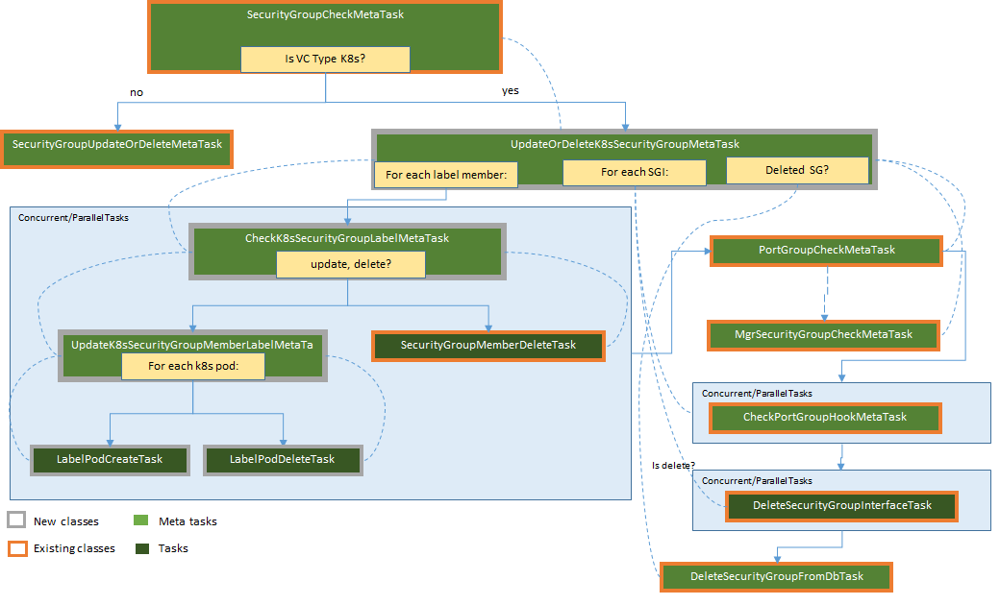

# OSC Container Support - Traffic Redirection
This document describes the design changes needed for OSC to support redirect traffic between containers in a Kubernetes(K8s) cluster through a deployed container VNF.  Learn more about the other related features [Container VNF Deployment](#container-vnf-deployment) and [Container Workload Discovery](#container-workload-discovery).

## Assignees
Emanoel Xavier - https://github.com/emanoelxavier

## Background
OSC currently supports protection of workloads hosted on VM based virtualized environments. This work expands OSC to also control security on container based environments orchestrated by [Kubernetes](#kubernetes-home). The adoption of container technologies is becoming more and more widespread due to its benefits such as easy maintainability, reusability, and minimal overhead with K8s being one of the most popular container orchestrators.  
For the first release of the OSC containers support the focus will be mostly on the integration points between OSC, the virtualization environment (K8s) and the software defined network(SDN) controller services needed to discovering the workloads to be protected, deploying the security VNFs and performing traffic redirection through a demonstrable E2E flow.  

## Constraints and Assumptions

### Nuage SDN for Kubernetes
The redirection implemented by this feature will utilize the Nuage SDN Plugin.  While additional changes in the plugin might be necessary to discover network information, other Nuage functionalities currently not supported by the plugin and not essential to this work will not be implemented as part of this (i.e.: service function chaining).  
Also, because the plugin supports **port group** all the new synchronization flows implemented for this feature will be designed for this type of plugins only.  To facilitate interim tests the NSC plugin might be used with the configuration `supportsPortGroup: true`.  

## Design Changes
The implementation of this feature will require changes only on the OSC tasks and metatasks to synchronize information with the OSC database, SDN controller and security manager. 

### REST API  
No changes are expected to be done in the REST API, however it is worth noting which API will be used to create security group bindings for redirection:  `PUT /api/server/v1/virtualizationConnectors/{vcId}/securityGroups/{sgId}/bindings`.  This API will be called with a single bind and a time and it will also be used to trigger unbinding.  

### OSC Services
Not applicable.

### OSC SDKs

#### VNF Security Manager SDK
Not applicable.

#### SDN Controller SDK
Not applicable.

### OSC Entities  
Not applicable.

### OSC UI
Out of scope.

### OSC Synchronization Tasks
Most of the changes needed for this feature will include expanding the already planned class `UpdateK8sSecurityGroupUpdateOrDeleteMetaTask` to include additional existing tasks and metatasks in its graph. See below the pictures comparing the graphs planned for synchronization of security group and members and now the graphs planned for syncrhonization of the binding/unbiding of a SG.  

*Tasks and Metatasks for Synchronizing Security Group Members*  

*Tasks and Metatasks for Synchronizing Security Group Bindings/Interfaces*

#### UpdateK8sSecurityGroupOrDeleteMetaTask  
In addition to conform the security group members and pods, this meta task will also now trigger other existing tasks and metatasks to synchronize the port groups and port group hooks with the SDN controller using the tasks `PortGroupCheckMetaTask` and `CheckPortGroupHookMetaTask`; security group members with the manager using the `MgrSecurityGroupCheckMetaTask`; and deleting  the security group interfaces using the `DeleteSecurityGroupInterfaceTask` when applicable.  

#### CheckPortGroupHookMetaTask  
The main aspects of this meta tasks will remain as is, however some minor changes might be needed for Kubernetes virtualization connectors to properly discover the available DAI and respective domain id.  

#### CreateMgrSecurityGroupTask
This existing task is invoked by `MgrSecurityGroupCheckMetaTask` and it will need to include some minor updates  to also extract `PodPorts` from **label** security group members.  

## Tests

Describe here any new test requirement for this feature. This can include: virtualization platform, test infrastructure, stubs, etc. 
> Note: Any feature should be demonstrable and testable independently of a particular vendor component or service. 

## References
### [Container VNF Deployment](https://github.com/opensecuritycontroller/community/blob/master/designs/containers/vnf-deployment/vnf-deployment.md)  
### [Container Workload Discovery](https://github.com/opensecuritycontroller/community/blob/master/designs/containers/workload-discovery/workload-discovery.md)  
