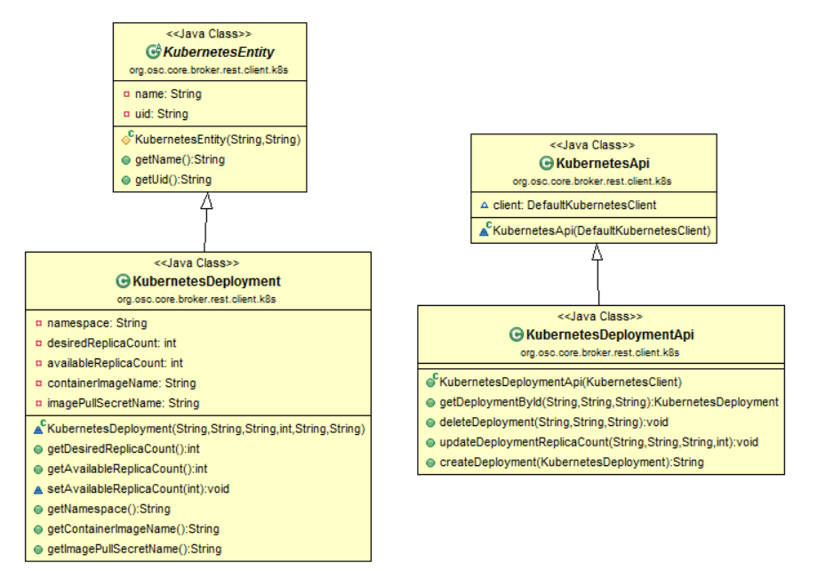
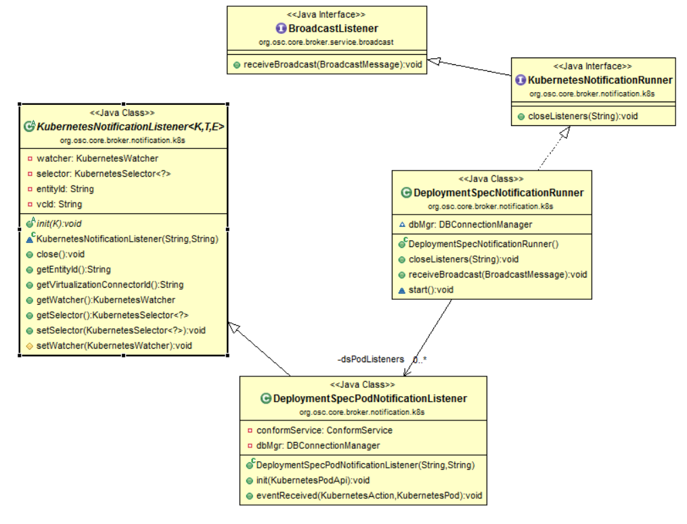
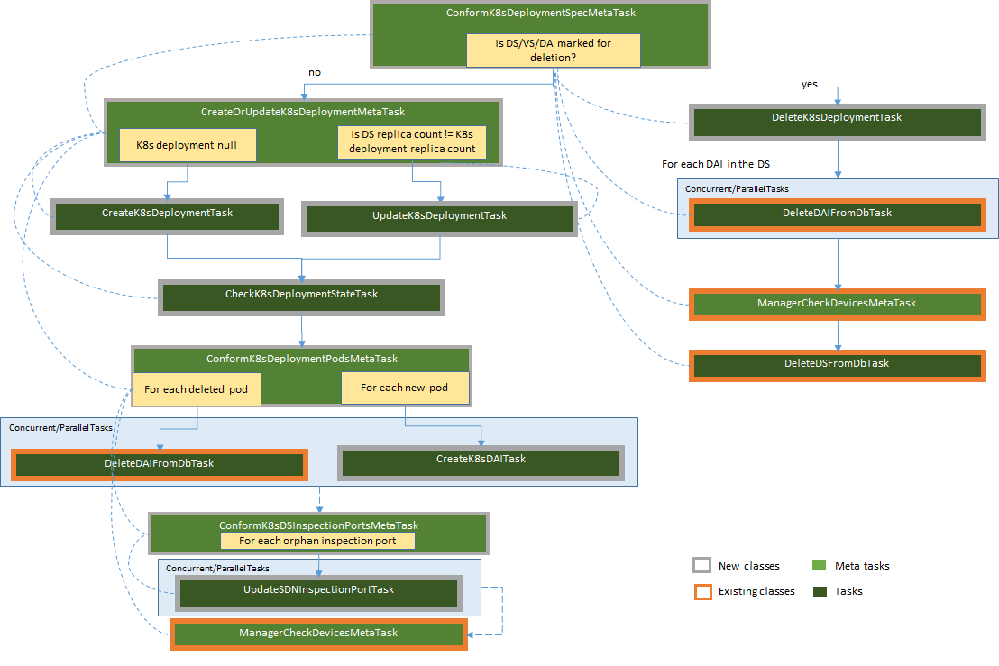

# OSC Container Support - VNF Deployment
This document describes the design changes needed for OSC to support deployments of container VNFs on a Kubernetes(K8s) cluster.  The deployed VNF instances will be used to protect the network traffic between workload containers present on the cluster.  

## Assignees
Emanoel Xavier - https://github.com/emanoelxavier

## Background
OSC currently supports protection of workloads hosted on VM based virtualized environments. This work expands OSC to also control security on container based environments orchestrated by [Kubernetes](#kubernetes-home). The adoption of container technologies is becoming more and more widespread due to its benefits such as easy maintainability, reusability, and minimal overhead with K8s being one of the most popular container orchestrators.  
For the first release of the OSC containers support the focus will be mostly on the integration points between OSC, the virtualization environment (K8s) and the software defined network(SDN) controller services needed to discovering the workloads to be protected, deploying the security VNFs and performing traffic redirection through a demonstrable E2E flow.  

## Constraints and Assumptions

### OVN with SFC for Kubernetes
To perform the redirection through a container VNF using OVN the container must be on the same Kubernetes node as the protected pod. For this reason OSC may need to deploy one pod (container) per node in the cluster and ensure that new nodes will have a container VNF. To address this we should to consider using [Kubernetes Daemon Sets](#kubernetes-daemon-sets) instead of Deployments for virtualization connectors using OVN SDN. A daemon set might map to an OSC deployment spec just like a Kubernetes Deployment does but additional investigation is needed.  


### Nuage SDN for Kubernetes
Nuage does not present a restriction with respect to where the container VNF should be deployed. The VNF can be deployed on any node or namespace independently of where the protected containers might be. The virtual subnet corresponding to the deployment namespace may need have some policies manually configured on Nuage though to allow for traffic to flow from another subnets/namespaces.   

### Container VNF Upgrades
Upgrading a container VNF already deployed is out of scope for this release.  

## Design Changes
The implementation of this feature will require changes on the OSC entities and operations involved on the definition and registration of VNF images; deployment specification; and monitoring of container VNFs.  

### Container VNF Images
In order for a user to deploy a VM VNF using OSC they must register the image file of the VNF along with some additional metadata. For container VNFs this model will be further simplified.  The image for the container is not necessary as it will be retrieved by the virtualization platform from a Docker registry, the user will simply need to provide the metadata needed for OSC to match the VNF with the supported security manager and virtualization platform versions and create the [K8s Deployment object](#kubernetes-deployment).
This new model is implemented by a couple of new **POST** REST APIs to create the existing types `ApplianceDTO` and `ApplianceSoftwareVersionDTO`. The choice of using two APIs instead of a single one to create both objects is consistent with the existing APIs to GET and DELETE these resources, this also allows the clients to manage appliances and their software versions independently.  

### Container Deployment Specs
OSC supports deployment of VM VNFs through the creation of **Deployment Spec (DS)**. When a user creates or updates a deployment spec OSC will manage the VM instances related to that DS, creating or deleting new ones accordingly. The approach for container VNFs deployed in Kubernetes will be slightly different because Kubernetes already supports the concept of deployments, allowing clients to transparently scale out services and update containers/pods without having to manage specific instances. OSC will take advantage of this feature by mapping its DS into K8s Deployments.  
This new implementation will also require OSC to find out which pods are related to a given K8s deployment and automatically update its data when pods are deleted and (re)created by Kubernetes. OSC will also need to ensure that the external services like SDN controllers and the Security managers are updated accordingly when such changes happen.  

### REST API  

#### Appliance
The resource `/api/server/v1/catalog/{applianceId}/` will have a create/POST API implemented by the class `ApplianceApis`.  This API implementation will make use of the new service `AddApplianceService`.  


#### Appliance Software Version
The resource `/api/server/v1/catalog/{applianceId}/versions/{ApplianceSoftwareVersionId}` will have a create/POST API implemented by the class `ApplianceApis`.  This API implementation will make use of the new service `AddApplianceSoftwareVersionService`.  
In addition to that, the object `ApplianceSoftwareVersionDto` will include a new field: `imagePullSecretName`. This optional field can be used for clients to provide the name of the secret to be used by Kubernetes to [retrieve images from a private Docker registry](#private-docker-registry). 


```java
ApplianceSoftwareVersionDto {
id (integer, optional),
parentId (integer, optional),
swVersion (string),
virtualizationType (string) = 
['OPENSTACK', 'KUBERNETES'],
virtualizationVersion (string),
imageUrl (string),                            // For container VNFs this should be the Docker image name TODO: ref
imagePullSecretName (string, optional),       // New field added for container VNFS. Contains the name of the key used by the virtualization platform to pull the container images from a private registry.
encapsulationTypes (Array[string], optional),
imageProperties (object, optional),
configProperties (object, optional),
minCpus (integer, optional),
memoryInMb (integer, optional),
diskSizeInGb (integer, optional),
additionalNicForInspection (boolean, optional),
}
```

#### Deployment Spec
Some of the fields in the resource `/api/server/v1/virtualSystems/{vsId}/deploymentSpecs` are not applicable to deployment specs for container VNFs and will be made **optional**. Additionally, two new fields are being added `externalId`, that will contain the UID of the deployment on Kubernetes; and `namespace`, that will contain the Kubernetes namespace for the deployment:  

```java
DeploymentSpecDto {
id (integer, optional),
parentId (integer, optional),
name (string, read only),
projectId (string, read only, **optional**),  // Not needed for container deployment specs
projectName (string, read only, **optional**),  // Not needed for container deployment specs	
region (string, read only, **optional**),  // Not needed for container deployment specs
managementNetworkName (string, read only, **optional**),  // Not needed for container deployment specs
managementNetworkId (string, read only, **optional**), 	// Not needed for container deployment specs
inspectionNetworkName (string, read only, **optional**),  // Not needed for container deployment specs
inspectionNetworkId (string, read only, **optional**),  // Not needed for container deployment specs
externalId (string, read only, **optional**),  // Will contain the UID of the corresponding deployment object on Kubernetes
namespace (string, read only, **optional**),  // Will contain the namespace of the corresponding deployment object on Kubernetes
floatingIpPoolName (string, optional, read only),
availabilityZones (Array[AvailabilityZoneDto], optional, read only),
hosts (Array[HostDto], optional, read only),
hostAggregates (Array[HostAggregateDto], optional, read only),
count (integer, read only),
markForDeletion (boolean, read only),
lastJobState (string, optional, read only),
lastJobStatus (string, optional, read only),registereed registereed 
lastJobId (integer, optional, read only),
shared (boolean, optional)
}
```

### OSC Services

#### Appliance and Appliance Software Version Services
Two new services are being added to enable the creation of an Appliances and Appliance Software Versions: `AddApplianceService` which expects the `ApplianceDto` as input, validating and persisting it; and `AddApplianceSoftwareVersionService` which expects the `ApplianceSoftwareVersionDto` as input, validating and persisting it.  
The business logic and validation implemented by these services should mirror the existing service `ImportApplianceSoftwareVersionService`, also, to avoid code duplication, `ImportApplianceSoftwareVersionService` must be refactored to make use of the new services instead of making direct domain calls to persist those entities.  

#### Deployment Spec Services
The existing services `AddDeploymentSpecService` and `UpdateDeploymentSpecService` will need to be slightly updated to ensure that the optional fields for a container deployment spec are not present for virtualization connectors of type `KUBERNETES` but continue to perform the existing validation for virtualization connectors of type `OPENSTACK`. Some of these changes might need to be done within those services; some of them on the base class `BaseDeploymentSpecService`; and some others on validator `DeploymentSpecDtoValidator`.  
Additionally, because we are using the deployment spec name as the name of the Kubernetes Deployment which must be unique and not changeable `UpdateDeploymentSpecService` must enforce that the name of the DS is not modified.


### OSC SDKs

#### VNF Security Manager SDK
Not applicable.

#### SDN Controller SDK
**Retrieving Network Information**  

After creating or updating a deployment spec OSC discover the related pods from Kubernetes. However additional network information related to the pod must be retrieved from the SDN controller. To allow for that the following API is being to the SDN Controller SDK interface `SdnRedirectionApi`.  
```java
NeworkElement getNetworkElement(String deviceOwnerId) // The provided ID will be the container UID. The returned network element will container vport id, mac address, ip address and parent id (domain id)
```

### OSC Entities  
#### Appliance Software Version  
The `ApplianceSoftwareVersion` domain entity will have a new optional field `imagePullSecretName` .

```java
@Table(name = "APPLIANCE_SOFTWARE_VERSION", ...)
public class ApplianceSoftwareVersion extends BaseEntity {
	// ... 
	@Column(name = "image_pull_secret_name")
    private String imagePullSecretName;
	// ....
}
```  

#### Deployment Spec
The `DeploymentSpec` domain entity will have some of its fields made `nullable`; the new `externalId` field to store the Kubernetes deployment UID; the `namespace` field for the deployment namespace; and set of the new entity `InspectionPort` :
```java
Entity
@Table(name = "DEPLOYMENT_SPEC", ...)
public class DeploymentSpec extends BaseEntity implements LastJobContainer {

    // ...

    @Column(name = "region", nullable = **true**)
    private String region;

    @Column(name = "project_name", nullable = **true**)
    private String projectName;

    @Column(name = "project_id", nullable = **true**)
    private String projectId;

    @Column(name = "management_network_name", nullable = **true**)
    private String managementNetworkName;

    @Column(name = "management_network_id", nullable = **true**)
    private String managementNetworkId;

    @Column(name = "inspection_network_name", nullable = **true**)
    private String inspectionNetworkName;

    @Column(name = "inspection_network_id", nullable = **true**)
    private String inspectionNetworkId;
	
	@Column(name = "external_id", nullable = **true**)
    private String externalId;                           // Stores the Kubernetes deployment id.
	
	@Column(name = "namespace", nullable = **true**)
    private String namespace;                           // Stores the Kuberneted deployment namespace.
	
	@OneToMany(mappedBy = "deploymentSpec", fetch = FetchType.LAZY)
    private Set<InspectionPort> inspectionPorts = new HashSet<InspectionPort>(); // The set of inspection ports associated with this DS.
	// ...
}
```

### Distributed Appliance Instances
In Kubernetes, containers may be deleted and re-created at any time, without the direct control of OSC. This means it is possible for a container whose port is being used for traffic redirection to be deleted and replaced by Kubernetes. Because of that, OSC needs to have a way to update inspection ports registered with the SDN controller with a new virtual port. To enable this, OSC will persist two new columns in the entity `DistributedApplianceInsance`: `inspectionElementId` and `inspectionElementParentId`. These optional values will store the identifier of the registered inspection port and its parent respectively, both returned from the SDN controller method `SdnRedirectionApi.registerInspectionPort`. Also, the DAI will have a column to store the pod UID, `externalId`.  
Additionally, most of the existing fields of the `DistributedApplianceInstance` entity will be reused for Kubernetes as indicated below: 


```java
@Entity
@Table(name = "DISTRIBUTED_APPLIANCE_INSTANCE")
public class DistributedApplianceInstance extends BaseEntity {
	@Column(name = "name", unique = true, nullable = false)
    private String name;                                     // Stores the name of the Kubernetes pod
	
	@Column(name = "ip_address")
    private String ipAddress;                               // The ip address of the Kubernetes pod
	
	@Column(name = "parent_id")
    private String inspectionElementParentId;                               // The id of the parent (network domain) of the inspection port this appliance is associated with.
	
	@Column(name = "external_id")
    private String externalId;                               // The unique id of the Kubernetes pod.
	
	@Column(name = "parent_id")
    private String inspectionElementParentId;                               // The id of the parent (network domain) this appliance belongs to.
	
	@Column(name = "inspection_os_ingress_port_id")         
    private String inspectionOsIngressPortId;               // Stores the virtual port id of the pod retrieved from the SDN controller. 
	
	@Column(name = "inspection_ingress_mac_address")
    private String inspectionIngressMacAddress;            // Stores the virtual port id of the pod retrieved from the SDN controller.  
	
	
}
```

> **Note:** All the tables and relationships indicated on the previous entities will also be updated on the files `org/osc/core/broker/util/db/upgrade/ReleaseUpgradeManager.java,Schema.java`.  

### OSC UI
Out of scope.

### Kubernetes Wrapper Package  
The OSC wrapper package will need to be extended to support the Deployment APIs as well:

*Kubernetes Wrapper Package Classes for Container Deployments*  

All the methods implemented by the class `KubernetesDeploymentApi` are meant to be idempotent. Aside from `createDeployment` all of them expect the pod `uid`, `name` and `namespace`.  
The code snippet below shows a simple example on how to create a K8s Deployment object:

```java
Deployment newDeployment = new DeploymentBuilder()
                    .withKind("Deployment")
                    .withNewMetadata()
                    .withName(dep.name) // the provided deployment name
                    .endMetadata()
                    .withNewSpec()
                    .withReplicas(count)
                    .withNewTemplate()
                    .withNewMetadata()
                    .addToLabels("osc-deployment", dep.name)  // the provided deployment name
                    .endMetadata()
                    .withNewSpec()
                    .addNewContainer()
                    .withName(name).withImage(dep.containerImageName) // the container image name
                    .endContainer()
                    .endSpec()
                    .endTemplate()
                    .endSpec()
                    .build();
					
Deployment result = client.extensions().deployments().inNamespace(namespace).create(newDeployment);
```

### Deployment Spec Notifications
The notifications related to container deployment specs will be handled similarly to the security group members notifications. The document [K8s notification mechanism on OSC](#osc-kubernetes-notifications) provides more details on how OSC will receive notifications from K8s and keep the watcher in sync.  

  
*Kubernetes Deployment Spec Notification Events Class Diagram*  

* **DeploymentSpecNotificationRunner:** This class is responsible for managing instances of KubernetesNotificationListeners, keeping these instances in sync with the deployment specs in the database. An instance of this class must be initiated by the `Server` class and registered with the OSGi framework. When `start` is invoked it will list all the deployment specs in the database and create or delete the correspoding DeploymentSpecPodNotificationListener. `receiveBroadcast` will listen to events related to deployment specs and create or delete the corresponding listener. When creating a listener the runner must make use of the method `KubernetesNotificationListener.init` providing the `PodApi` to be used to create the watcher within the listener. `closeListeners` must close all the listeners with a virtualization connector with the id matching the provided id parameter.  

* **DeploymentSpecPodNotificationListener:** This listener is responsible for receiving events corresponding to pods related to the given deployment spec. When `init` is invoked the Deployment Spec will be retrieved from the database and its name + id will be used as a label and set in the selector of the listener, then a PodApi will be created with a client obtained with the KubernetedClientProvider.getKubernetesClient and PodApi.watchPod will be invoked which will initialize a pod watcher. When `eventReceived` is called it will react to CREATE or DELETE events in the pod and it will trigger a sync of the deployment spec using the `conformService`.  

### OSC Synchronization Tasks
A new set of tasks and meta tasks is being added to allow OSC to synchronize deployments with Kubernetes and update the corresponding appliance instances, inspection ports and manager devices.  

  
*Tasks and MetaTasks Needed for Syncing Kubernetes Deployment Specs*

#### **ConformK8sDeploymentSpecMetaTask**
This task will be triggered by creation, update or deletion of deployment specs through the existing method `ConformService.startDsConformJob`. This method triggers the existing metatatask `DSConformanceCheckMetaTask` which will then trigger `ConformK8sDeploymentSpecMetaTask` if the DS is for a **Kubernetes** virtualization environment. The same method will also be invoked when events are received for pods associated with targeted deployment.  
If the DS, virtual system (VS) or distributed appliance (DA) are marked for deletion this meta task will create a graph that will delete the deployment object on K8s, delete the DAIs from the OSC db, conform the devices with the manager and delete the DS from the OSC db. With the exception of deleting the K8s deployment, the remaining tasks added to the graph are the existing ones: `DeleteDAIFromDbTask`, `ManagerCheckDevicesMetaTask`, `DeleteDSFromDbTask`. If the DS is being created or updated it will trigger the meta task `CreateOrUpdateK8sDeploymentMetaTask`.  

#### **DeleteK8sDeploymentTask**
This task is responsible for deleting the K8s deployment object corresponding to the DS. For that it will invoke the method `KubernetesDeploymentApi.deleteDeployment` providing the following parameters: `uid: ds.externalId`, `namespace: ds.namespace`, `name: ds.name_ds.id`. Observe that the deployment name is the **OSC DS name + '_' +  id**, this should guarantee uniqueness of the K8s deployment name.  Also, because the method `deleteDeployment` is expected to be idempotent this task **should not** need to verify whether a deployment exists or not before deleting it.  


#### **CreateOrUpdateK8sDeploymentMetaTask**
This task is responsible for identifying whether a K8s deployment must be created or updated. If a DS `externalId` is null or `KubernetesDeploymentApi.getDeploymentById` returns null (providing the following parameters: `uid: ds.externalId`, `namespace: ds.namespace`, `name: ds.name_ds.id`) a new one must be created with the task `CreateK8sDeploymentTask`. Otherwise this task will update the existing deployment using the task `UpdateK8sDeploymentTask`.  


#### **CreateK8sDeploymentTask**  
This task is responsible for creating a Deployment on Kubernetes and update the OSC DS entity `externalId` with the Deployment UID. The deployment will be created using the method `KubernetesDeploymentApi.createDeployment` with a new instance of the class `KubernetesDeployment` constructed with `name : ds.name_ds.id`, `namespace : ds.namespace`, `uid : null`, `desiredReplicaCount : ds.instanceCount`, `containerImageName: ds.vs.appliance-software-version.image-url`, `imagePullSecretName : ds.vs.appliance-software-version.image-pull-secret`.  

#### **UpdateK8sDeploymentTask**  
This task is responsible for updating a Deployment on Kubernetes using the method `KubernetesDeploymentApi.updateDeploymentReplicaCount`  ith `name : ds.name_ds.id`, `namespace : ds.namespace`, `uid : ds.externalId`, `desiredReplicaCount : ds.instanceCount`.  

#### **CheckK8sDeploymentTask**  
This task is responsible for checking whether all instances expected by the **Deployment** are available using the method `KubernetesDeploymentApi.getDeploymentById` with `name : ds.name_ds.id`, `namespace : ds.namespace`, `uid : ds.externalId` and validating whether the fields of the returned deployment `desiredReplicaCount` and `availableReplicaCount` have the same value.  This task will run a looped process similar to what we do for checking OpenStack VMs status, this check will iterate 30 times with intervals of 10 seconds. If after that the deployment is still not ready or not found this task must fail.

#### **ConformK8sDeploymentPodsMetaTask**  
This task is responsible for listing all the Kubernetes pods related to a given deployment and identifying whether a DAI needs to be created or deleted.  For each case it will add to the graph either a `DeleteDAIFromDbTask` or a `CreateK8sDAITask`. After all these tasks run concurrently (even if some fail), this meta task will trigger the task `ConformK8sDSInspectionHooksMetaTask` and then the task `ManagerCheckK8sDeviceMetaTask`.  
To list all the pods belonging to a Deployment this task will use the method `KubernetesPodApi.getPodsByLabel` providing the `label : "KubernetesDeploymentApi.OSC_LABEL_KEY=ds.name_id"`. We can safely rely on this to query the pods belonging to a deployment due to the [Kubernetes Deployment Selector design](#kubernetes-deployment-selector).  

#### **CreateOrUpdateK8sDAITask**
This task is responsible for persisting a DAI in the OSC database for a newly found pod VNF.  It will receive an `KubernetesPod` object, retrieve the network information from the SDN controller using the method `SdnRedirectionApi.getNetworkElement()` with `deviceOwnerId : pod.uuid` and persist DAI entity in the database with the returned network info.  When persisting it must identify whether there is a DAI currently without network information (i.e.: ingress port) but with an inspection port id. If so it will create the new DAI using the found inspection port id and parent id, persist it and delete the old DAI.

#### **DeleteOrCleanK8sDAITask**
This task is responsible for deleting or cleaning up a DAI in the OSC database for a deleted pod.  It will receive an `KubernetesPod` object.  When deleting  it must identify whether the targeted DAI (same pod UID) has an inspection port id. If so instead of deleting the DAI from the database it will clean up the network information (i.e.: ingress port) and update it, otherwise it will delete the targeted DAI.  

#### **ConformK8sDSInspectionPortsMetaTask**  
This task is responsible for checking whether each DAT with an inspection port id has the same virtual ports in the SDN controller as the one we are persisting. For that it will call `SdnRedirectionApi.getInspectionPort` and if the virtual ports are different then it will schedule a task `UpdateSDNInspectionPortTask` to have the virtual ports updated.  

#### **UpdateSDNInspectionPortTask**   
This task is responsible for updating an existing inspection port registered with the SDN controller with a new virtual port id. For that this task will invoke the SDN API SDK `SdnRedirectionApi.registerInspectionPort` providing the id of the inspection port, the parent id and the new virtual port(s). If that succeeds it will persist the DAI reference in the corresponding `InspectionPort` in the OSC database.   

### Nuage SDN Plugin
The following changes will be added to this plugin:
* Implement the new SDK method `getNetworkElement(String deviceOwnerId)`. The implementation of this method will list all the containers within the user `Enterprise` and filter by the provided `deviceOwnerId` using `uuid like %s`. Using the returned container it will retrieve the vport id, domain id, mac address and ip address from the first interface and return a new `NetworkElement` containing this information or `null` if the container is not found.  
* The existing implementation of the `registerInspectionPort` method must return the **id** and **domaind** of the created redirection target. It will also identify if the provided inspection port element has an id, if it does it will update the existing redirection target with the provided port(s).  

## Tests

Describe here any new test requirement for this feature. This can include: virtualization platform, test infrastructure, stubs, etc. 
> Note: Any feature should be demonstrable and testable independently of a particular vendor component or service. 

## References
### [Kubernetes Home](https://kubernetes.io)  
### [Kubernetes Deployment](https://kubernetes.io/docs/concepts/workloads/controllers/deployment/)
### [Kubernetes Daemon Sets](https://kubernetes.io/docs/concepts/workloads/controllers/daemonset/)
### [Private Docker Registry](https://kubernetes.io/docs/tasks/configure-pod-container/pull-image-private-registry/)
### [Kubernetes Deployment Selector](https://kubernetes.io/docs/concepts/workloads/controllers/deployment/#selector)
### [OSC Kubernetes Notifications](https://github.com/opensecuritycontroller/community/blob/master/designs/containers/workload-discovery/workload-discovery.md#kubernetes-notification-events)
