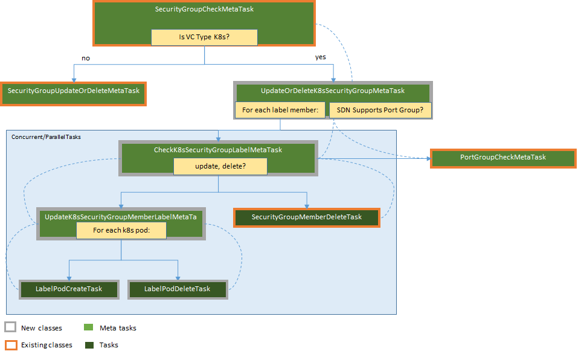

# OSC Container Support - Workload Discovery
This document describes the design changes needed for OSC to support microsegmentation of workloads on a Kubernetes(K8s) cluster.  Microsegmentation is implemented on OSC through the creation of [security groups](#osc-security-groups) which identify the workloads to be protected by a VNF as defined by the security policies applied to the group.  
Applying the security policies to the group by deploying the VNF and configuring the traffic redirection (aka, steering) is out of scope for this document and will be covered on complimentary design documents. 

## Assignees
Emanoel Xavier - https://github.com/emanoelxavier

## Background
OSC currently supports protection of workloads hosted on VM based virtualization environments. This work expands the OSC scope to include also container environments orchestrated by [Kubernetes](#kubernetes-home). The adoption of container technologies is becoming more and more widespread due to its benefits such as easy maintainability, reusability, and minimal overhead with K8s being one of the most popular container orchestrators.  
For the first release of the OSC containers support the focus will be mostly on the integration points between OSC, the virtualization environment and the software defined network(SDN) controller services needed to discovering the workloads to be protected, deploying the security VNFs and performing traffic redirection through a demonstrable E2E flow.  

## Constraints and Assumptions
### Kubernetes Version and Configuration
* **Kubernetes Version:** 1.6.7. 
* **Network Layer**:  [OVN](#ovn-kubernetes) with [SFC](#ovs-sfc) enabled or Nuage.
* **Authentication**: For this first release the access to the Kubernetes API is allowed over `http` and **without user authentication**.  This should be acceptable as the intent of this release is for prototype/demonstration only rather than production readiness. For the longer run we want to allow only `https` access with authenticated users, this should be possible with [Fabric8](#fabric8-credential-example), the java SDK being adopted. 

### OVN with SFC for Kubernetes
> This assumption is being called out given that the traffic redirection using OVN SFC is still under investigation.

To create a traffic redirection using OVN SFC additional calls to the OVN northbound database will be needed to retrieve the **switch name** and **port id** of the pod under protection. For that the following values from Kubernetes will suffice: **name of the node hosting the pod, pod namespace, pod name.**

### Nuage SDN for Kubernetes
> This assumption is being called out given that the traffic redirection using Nuage must still be tried out. 

To create a traffic redirection using Nuage for Kubernetes the only required information about the workload pod is its **port id**. OSC will obtain this **port id** from Nuage by making a separate call while providing the following values: **name of the node hosting the pod, pod namespace, pod name.**  


### Design Assumptions
> Note: The assumptions below refer to design changes not yet fully described in this document but necessary to understand some of its current content. In the next revision of this document those details will be added (look for **TBD on the next revision** along this document) and these assumptions removed.  

* **Security Group:**
The security group entity and DTO in OSC will have a set of labels. These labels will be strings with the format `key=value`. For the first release of this feature all the `key` values of the labels in a given security group will always be the same, i.e.: security=webserver, security=backend, etc.

* **Pod Security Group Member:**
A new type of security group member is created, **Pod** along with the type **PodPort**. The **Pod** will store a `namespace`, `name`, `externalid`, `nodename` and a collection of `PodPort`.  The **PodPort** will store an `externalid`, a `collection of macaddresses` and a collection of `ipaddress`. 
> Note: Although currently a pod can only have one ip address [support for multiple ip addresses and networks is intended](#k8s-pods-with-multiple-ips-issue).

* **Virtualization Connector:**
A new type of Virtualization Connector (VC) will be added: **Kubernetes**. 


## Design Changes
The discovery flow adopted for this work will follow the same model already adopted by OSC for OpenStack with RabittMQ:
1. The user creates a security group providing the needed primitives defined by the virtualization environment. In this case those primitives are a set of labels.
2. OSC will watch for notifications related to any entities, in this case pods, labeled with any of the values on the security group.
3. When a meaningful notification is received OSC will trigger a synchronization job for the whole security group.
4. The synchronization job will retrieve the entities associated with the security group from Kubernetes and update its database and other services (security manager and SDN controller) accordingly.  


### REST API  
**TBD  on next revision**

Describe in details any changes to the OSC REST APIs. This should include any new, modified or removed API and describing their payloads, headers and response status.
> Note: Using the [swagger specification](#swagger-specification) is highly recommended.

### OSC SDKs

#### VNF Security Manager SDK
Not applicable.

#### SDN Controller SDK
Details on this is **TBD** but we will at least need to add APIs to return a network element given the **pod name, namespace and name of the hosting node**.  The returned network element should contain the unique port id for both OVN SFC and Nuage. For OVN SFC it should also return the name of the logical switch.  

### OSC & Kubernetes
This section describes how OSC will use the Kubernetes API service endpoint to retrieve and perform live discovery of the protected workloads, highlighting the chosen SDK, connectivity inputs and required APIs.   

#### OSC Kubernetes Wrapper Package
The direct communication between the OSC core modules and the Kubernetes API service will be contained within the new package `org.osc.core.broker.rest.client.k8s` . The purpose of this package is to make it easier for other osc core components to use the K8s APIs as well as prevent leaks of SDK specific details. The class diagram below depicts the classes and functionalities exported by this package.
  
*Kubernetes Wrapper Package Class Diagram*  


* **KubernetesApi**: Represents the base class for the `Kubernetes*Api` classes and it is reponsible for initializing the `KubernetesClient`, as part of its constructor and close it, as part of its `close()` method.
* **KubernetesPodApi**: This class provides all the pod related methods to the other OSC core packages: `getPodsByLabels`, this method should enforce that all labels must be in the form "key=value" with all the "key"s having the same value. For details [see below](#k8s-targeted-apis). `getPodsById` should return the pod with the given uid, namespace and name. Both these methods should through a `VmidcException` if an SDK (Fabric8) specific exception is caught.
* **KubernetesPod**: This class provides all the pod information needed by other OSC core packages.

##### Unit Tests
Because the Fabric8 uses a fluent interface design, unit testing this package might require the use of [mockito deep stubs](#mockito-deep-stubs). If this does not work another approach can be adding a new class to this package `KubernetesPodFluentApi` as package private. This class will be used by `KubernetesPodApi` and isolate the fluent code. Unit tests targeting the `KubernetesPodApi` will then be able to mock the `KubernetesPodFluentApi` thus removing the complexity of the fluent interfaces from the unit tests. 

#### Java SDKs for K8s APIs
Two java client libraries are listed in the [Kubernetes Reference Documentation](#k8s-client-libraries): **amdatu-kubernetes** and **Fabric8 Kubernetes Client**. Due to its higher popularity and active community **Fabric8** will be used for this work and the targeted version is `2.5.6`.  
One of the drawbacks identified with Fabric8 is the lack of compliance with OSGi. The workaround for this issue is to *"osgify"* this dependency with an uber bundle. This approach is similar to what we have done for the OpenStack4j dependencies and it has been done and validated: https://github.com/emanoelxavier/osc-core/tree/k8s-example2/osc-uber-kubernetes . 
> Note: The Kubernetes API call examples on this document uses this SDK.


#### Connectivity with Kubernetes
As mentioned in the Constraints section, the connectivity with Kubernetes will be done through `http` and without user credentials (unauthenticated). 
> Note: Currently, the OSC Virtualization Connector does require the user name to be passed in the `providerUser` field though. This field will continue to be required however its value will not be used.  

The inputs needed to connect with the Kubernetes API service will be: the **ip address** of the service endpoint, provided in the Kubernetes virtualization connector; and **port**, harcoded to 8080. 
> Note: Support to other ports can be added in the future by adding a new field in the `providerAttributes` map: `providerPort`.

#### K8s Targeted APIs

**Receiving Notifications from K8s**
OSC will make use of two Kubernetes API features in order to receive live notifications:  

1. [K8s Selection with Labels](#k8s-labels-and-selectors)
This feature allows filtering notification by labels applied to the pods.  In the first iteration of this work we will support filtering pods using an `OR` operator: a pod with at least one of the defined labels in the security group is a targeted pod.  This can be easily and directly implemented by Kubernetes APIs for labels with the same key and this will be the scope of this implementation. Implementing this functionality with labels of different keys is possible but not natively supported by the K8s APIs, requiring additional code on the client side using multiple watchers. 
2. [K8s Watch APIs](#k8s-pod-watch-api)
These APIs allow a client to receive live notification of the filtered objects on Kubernetes. Notifications arrive on an `eventReceived` method through **Fabric8** while the running thread is alive.  This will likely require one instance of the watcher per security group given that inclusive filtering (`OR`) is not supported by K8s APIs or Fabric8.  
Below we can see a code snippet of this API, the `labelsKey` parameter is the common key of all labels in a security group, the `labelValues` parameter is the set of each label in the security group. **Previously mentioned assumption:** a security group contains a collection of labels with the format  `key=value` where all the `keys` are the same.


```java
try (final KubernetesClient client = connection.getConnection()) {
	try (Watch watch = client.pods().withLabelIn(labelsKey, labelValues).watch(new Watcher<Pod>() {
		@Override
        public void eventReceived(Action action, Pod resource) {
        	// ...
        }

		@Override
        public void onClose(KubernetesClientException e) {
        	/// ...
        }
		})) {
			// ....
		} catch (KubernetesClientException | InterruptedException e) {
			/// ...                
		}
} catch (Exception e) {
	// ....            
}
```

The actions that should trigger a resync of the security group are **ADDED**, **DELETED** and **MODIFIED** under certain conditions. MODIFIED should only trigger a resync if a stored value of the pod has changed (uid, nodename, namespace).   

**Retrieving pod Information from K8s**
In addition to receiving notifications OSC will also need to actively make calls to K8s to retrieve information about the pods. At very least OSC will need to list all the pods in a security group and retrieve a pod by its name. These operations will be invoked by OSC synchronization jobs and accessible through the class `org.osc.core.broker.rest.client.k8s.KubernetesPodApi`. Below you can see a code snippet for each one of these operations.


1. **Listing pods in a security group**
The semantics of the `labelsKey` and `labelValues` parameters are the same as the ones described in the notification selector above.  
> Note: this API will return an empty collection in case no pod is found with any of the provided labels.

```java
try (final KubernetesClient client = connection.getConnection()) {
	PodList pods = client.pods().withLabelIn(labelsKey, labelValues).list();
		for(Pod pod : pods.getItems()) {
			// ....
		}

} catch (KubernetesClientException e) {
	// ...
}
```
The values OSC should persist for a pod are: `namespace`, `name`, `uid`, `nodename`

2. **Retrieving a single pod**
In order to receive a single pod the K8s APIs require the **name** and the **namespace** of the pod. Because retrieving a pod by its [unique identifier (uid) is not supported](#k8s-retrieving-pods-by-uid-issue) it is responsibility of the client to ensure that the pod retrieved with a given name has the expected uid. This must be taken into consideration when we design our customer wrapper around Fabric8.

``` java
try (final KubernetesClient client = connection.getConnection()) {
	Pod pod = client.pods().inNamespace(namespace).withName(name).get();
		if (pod == null) {
			// ...
		} else {
			// Ensure this pod has the expected id.
		}

} catch (KubernetesClientException e) {
// ...
}
```

### OSC Entities  
**TBD on next revision**
Describe any changes to the OSC database schema.

### OSC UI
Out of scope.

### OSC Synchronization Tasks
The security group(SG) membership will be synchronized by OSC using its tasks and metatasks. This synchronization will continue to be triggered, as today, by: security group creation, update or deletion; and notifications received from Kubernetes relevant for the security group.
The diagram below depicts the tasks and metatasks involved on this change:
  
*Tasks and Metatasks for Synchronizing Security Group Members*
* **SecurityGroupCheckMetaTask**: This metatask will continue mostly as is, but for SGs of Virtualization Connectors of type Kubernetes it will add to the graph `KubernetesSecurityGroupUpdateOrDeleteMetaTask` instead of the existing `SecurityGroupUpdateOrDeleteMetatask`.  
* **KubernetesSecurityGroupUpdateOrDeleteMetaTask:** The main purpose of this task is to trigger the task `KubernetesSecurityGroupLabelCheckMetTask` for each label security group member. Similarly to the existing `SecurityGroupUpdateOrDeleteMetatask` this task will also add the existing task `PortGroupCheckMetaTask` if the SDN controller supports port group.  
* **KubernetesSecurityGroupLabelCheckMetaTask:** This metatask forks the graph in two possible options for a given label security member: update or deletion, adding to the graph either `SecurityGroupMemberLabelUpdateMetaTask` or 
* **SecurityGropuMemberDeleteTask**: This existing task is currently responsible for deleting security members, entities (VM, network, etc) and ports when applicable. It will remain mostly the same but also handling the member type `Label`.  
* **SecurityGroupMemberLabelUpdateMetaTask:** The main purpose of this task is to list the K8s pods using the `KubernetesPodApi` and checking if a new pod needs to be created or an existing one must be deleted.  Observe that pod updates are not expected, any changes on the pod: name, namespace, node, network info should represent a new pod (K8s does not currently support pod migration). Once binding is developed this metatask will also include tasks to synchronize information with the SDN controller.  `
* **LabelPodCreateTask:** This task is responsible for retrieving additional network information from the SDN controller related to the targeted pod and it will persit the pod with that information on the OSC db.  `
* **LabelPodDeleteTask:** This task is responsible for purging pod and pod network information from the OSC db.  `

## Tests
**TBD on next revision**

Describe here any new test requirement for this feature. This can include: virtualization platform, test infrastructure, stubs, etc. 
> Note: Any feature should be demonstrable and testable independently of a particular vendor component or service. 

## References
### [Kubernetes Home](https://kubernetes.io/)  
### [K8s Pod Watch API](https://kubernetes.io/docs/api-reference/v1.7/#watch-64)  
### [K8s Labels and Selectors](https://kubernetes.io/docs/concepts/overview/working-with-objects/labels/)   
### [K8s Authentication](https://kubernetes.io/docs/admin/authentication/)   
### [Fabric8 Credential Example](https://github.com/fabric8io/kubernetes-client/blob/master/kubernetes-examples/src/main/java/io/fabric8/kubernetes/examples/CredentialsExample.java)   
### [K8s Retrieving Pods by UID Issue](https://github.com/kubernetes/kubernetes/issues/20572)   
### [K8s Pods Migration Support Issue](https://github.com/kubernetes/kubernetes/issues/3949)   
### [K8s Pods with Multiple IPs Issue](https://github.com/kubernetes/kubernetes/issues/27398)    
### [OSC Security Groups](https://github.com/opensecuritycontroller/opensecuritycontroller.org/blob/master/overviewandarchitecture/concepts.md#security-groups) 
### [K8s Client Libraries](https://kubernetes.io/docs/reference/client-libraries/)   
### [OVN Kubernetes](https://github.com/doonhammer/ovn-kubernetes)  
### [OVS SFC](https://github.com/doonhammer/ovs/tree/sfc.v30)  
### [Mockito Deep Stubs] (https://www.atlassian.com/blog/archives/mockito-makes-mocking-fluid-interfaces-easy)  


