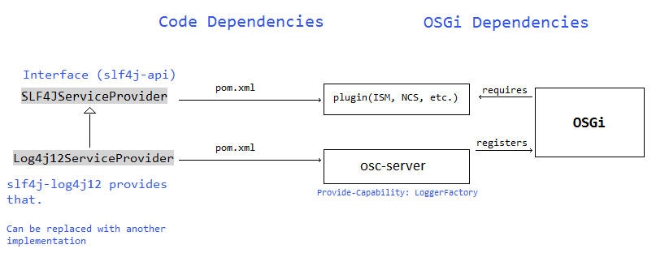

# Using SLF4J Logging Facade
Currently, as of [osc-core / 02b8024](https://github.com/opensecuritycontroller/osc-core/commit/02b80247faa29b069d2b6082f2e866a2f71b0f20),
OSC uses the **log4j** logging framework directly. The goal is to add flexibility by having all the code reference 
the **slf4j** facade only. Behind the facade would be **logback**, **log4j** or another logging framework. The development team will be able to make that change with minimal effort.

## Background

The **slf4j** facade provides a common API, including logging levels: **error**, **warn**, **info**, **debug** and (since 1.4.0) **trace**. It detects the presence of one of several logging frameworks and uses it. 

We want to be able to use **slf4j** throughout the project because:
- It would then be easy to replace the logging framework behind the facade.
- The implementation log4j-1.2, currently used, is obsolete.
- A specific requirement is that plugin implementations be able to use our **slf4j** log configuration without any dependency on any of our packages. 
- Example implementations with **logback** and **log4j** have been added. See **LogComponent** under **osc-ui** and the security manager plugin projects under the two experimental branches,  and .

## Design Changes
- All the osc java code to only import **org.slf4j** packages, except **osc-server** and **osc-export** bundles. 
- For **osc-server**, the following changes are required:
  - The dependencies added to pom.xml: **slf4j-api** plus some implementation dependency. (**slf4j-log4j12**, **logback**, etc.)
  - The **LogUtil.initLogging()** function is modified to initialize the selected logging framework and register with the context.
  - **osc-server/bnd.bnd** receives the following header:
  
    `Provide-Capability: osgi.service;objectClass=org.slf4j.ILoggerFactory`
    
- **osc-export** needs the same pom.xml dependency as **osc-server** and the logging framework must be listed in the \*bndrun files.
- Other bundles (**osc-ui** or plugins) have to implement their own utility @Component classes to obtain the *ILoggerFactory* implementation from the OSGi framework and deliver it to the non-OSGi classes.

One way a utility @Component class within a plugin may work is:

    @Component
    public class LogComponent {

        private static BundleContext context;
        
        @Reference 
        ILoggerFactory osgiLog;
        
        private static ILoggerFactory loggerFactory;
        
        @Activate
        public void activate(BundleContext context) {
            if (loggerFactory == null) {
                loggerFactory = osgiLog;
            }
            LogComponent.context = context;
        }

        public static Logger getLogger(String className) {
            if (loggerFactory != null) {
                return loggerFactory.getLogger(className);
            } else if (context != null) {
                ServiceReference<ILoggerFactory> ref = context.getServiceReference(ILoggerFactory.class);
                if (ref != null) {
                    loggerFactory = context.getService(ref);
                    if (loggerFactory != null) {
                        return loggerFactory.getLogger(className);
                    } 
                }
            }
            
            return LoggerFactory.getLogger(className);
        }
    }

## Logging framework options

Several logging frameworks have been considered to use with **slf4j**. **Logback** is the recommended one.

- **logback** -- [More robust](https://logback.qos.ch/reasonsToSwitch.html) than **log4j2**.
  - Groovy or XML configuration.
  - Log rotation and compression.
  - Well tested.
  
- **log4j2** version 2 -- very common and is currently used by most of the project directly. Considered second best.
  - XML, YAML or JSON configuration.

- **log4j** -- Not actively maintained, though it significantly [outperforms](http://blog.takipi.com/the-logging-olympics-a-race-between-todays-top-5-logging-frameworks/) its successor, according to some benchmarks.

- **jacarta.commons.logging (jcl)** -- according to the [slf4j](https://www.slf4j.org/manual.html) documentation, buggy and not entirely reliable.

- **java.util.logging (jul)** -- level naming not compatible with the others. Also, it is [rather unpopular](http://blog.takipi.com/is-standard-java-logging-dead-log4j-vs-log4j2-vs-logback-vs-java-util-logging/).

- **slf4j-simple** -- according to the [slf4j](https://www.slf4j.org/manual.html) this one is suitable for smaller projects. Only one "appender," fewer features.

### REST API 
N/A.

### OSC SDKs
Make sure there are no explicit references to **log4j**, etc.

#### VNF Security Manager SDK
Make sure there are no explicit references to **log4j**, etc.

#### SDN Controller SDK
Make sure there are no explicit references to log4j, etc.

### OSC Entities 
N/A.

### OSC UI
N/A.

### OSC Synchronization Tasks
N/A.

## Tests
POC build of the osc-core project.

## References
[SLF4j](https://www.slf4j.org/manual.html)

[Logback](https://logback.qos.ch/index.html)

[Java Logging Dead](http://blog.takipi.com/is-standard-java-logging-dead-log4j-vs-log4j2-vs-logback-vs-java-util-logging/)

[Logging Olympics](http://blog.takipi.com/the-logging-olympics-a-race-between-todays-top-5-logging-frameworks/)

[Chainsaw](https://logging.apache.org/chainsaw/)
