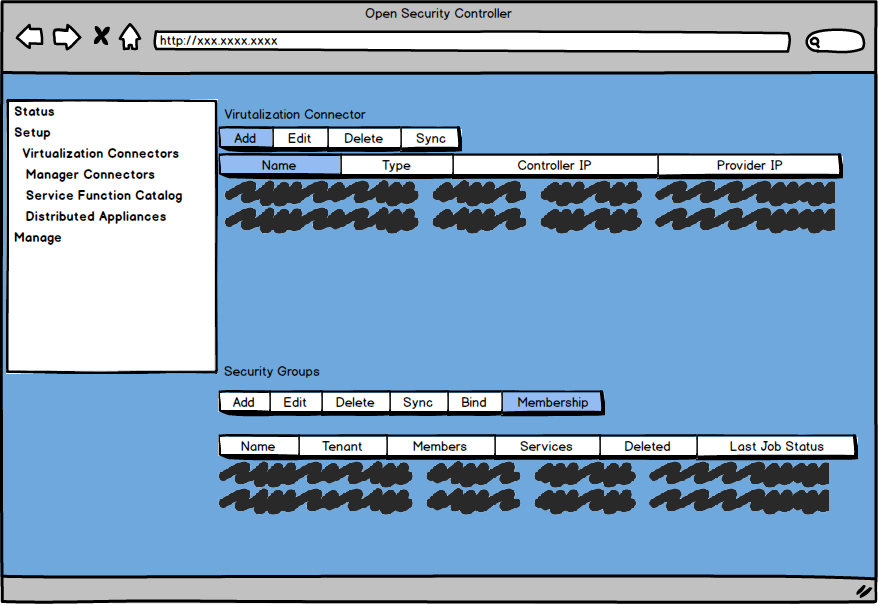
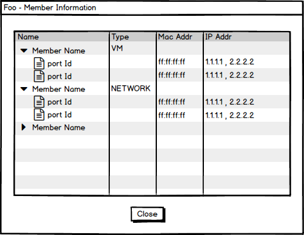

# Expose IP/Mac address of security group members in OSC API/UI
Customer needs to look at the realized list of IP/Mac addresses for each security group.

## Assignees
Arvind Nadendla https://github.com/arvindn05

## Background

For security groups defined under OSC there is limited visibility on what actual network entities the security group translates to. OSC already gathers all the network information based on the security group membership but provides no easy/accesible way to expose this information either on the UI or the API.

This feature proposal address this shortfall. At a highlevel, OSC needs to do the following

- For each member of the security group show the IP/MAC addresses associated with it.
- Consolidate the IP/Mac addresses for all the members in a security group and expose it in the UI group by the member instance
- Expose this via the API and the UI
- The Ip/Mac needs to reflect the latest available information(the sync jobs already gather the IP/Mac information)

## Constraints and Assumptions
N/A.

## Design Changes
N/A.

### REST API

There is an existing API to get details on the security group members. This API will be enhanced to show the list of IP/Mac for each of the members.

	GET /api/server/v1/virtualizationConnectors/{vcId}/securityGroups/{sgId}/members

```java
SecurityGroupMemberItemDto {
id (integer, optional),
parentId (integer, optional),
name (string),
region (string),
openstackId (string),
type (string),
protectExternal (boolean, optional),
parentOpenStackId (string, optional),
ports (Array[PortDto]) // New Field
}
// New DTO
PortDto {
id (integer, optional),
parentId (integer, optional),
macAddress (string, optional),
openstackId (string, optional),
ipAddresses (Array[string], optional)
}
```

### OSC SDKs

#### VNF Security Manager SDK
N/A

#### SDN Controller SDK
N/A

### OSC Entities 
N/A

### OSC UI

Clicking on the membership button for each security group shows the following UI



### OSC Synchronization Tasks
N/A

## Tests
The updated UI/API needs to be tested to make sure the information is provided as expected.


