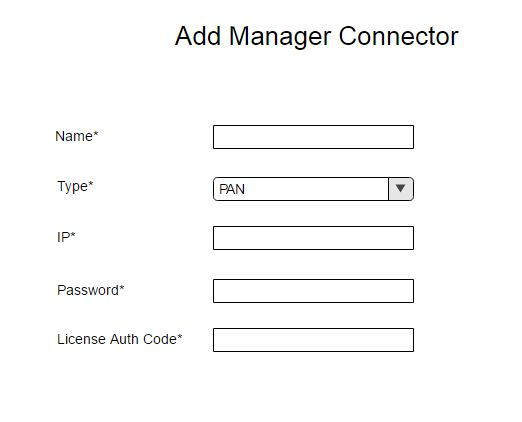

# OSC Security Manager Licensing
Currently, we hardcode the license auth code (e.g. PAN plugin) and provide it as bootstrap information. This document describes the proposed changes to receive the custom properties from the user while adding the manager connector. **License Auth Code** is one of the custom property which user needs to provide for the managers that support licensing.

## Scope of Security Manager License
- **Manager Connector**: All device groups and device members share the same license.
- **Distributed Appliance**: All device group share the same license.
- **Deployment Specification (DAI)**: All device members share the same license.

## API and OSC Server Changes
The OSC REST API **POST** `/api/server/v1/applianceManagerConnectors` will accept a map of custom properties.

`ApplianceManagerConnectorDto`: The `ApplianceManagerConnectorDto` will have a new map of custom properties to accept values from API and UI.

`ApplianceManagerConnector`: The `ApplianceManagerConnector` will have a new map of custom properties.

## SDK Changes

`ApplianceManagerApi`: The API `List<String> getCustomPropertyNames()` will return the list of property names. If you do not require any custom properties, you need to return null. The custom property names will be used on UI as label. For license auth code, we expect **License Auth Code** as a label.

`ApplianceManagerConnectorElement`: The API `HashMap<String, String> getCustomProperties()` will return the custom properties.

## Plugin Changes

Plugin authors implementing `ApplianceManagerApi` need to implement functionality to get the custom properties names.

Plugin authors also need to implement functionality:
- To get the license when creating a device member. If the license is not valid, we expect plugin to return valid error message.
- To delete the license when deleting a device member.

## UI Changes

The `AddManagerConnectorWindow` will have a text field with label **License Auth Code** to accept the license auth code from the user for managers that support licensing.

For managers that do not support licensing, the **License Auth Code** field will be hidden.

## Database Changes

The `APPLIANCE_MANAGER_CONNECTOR_ATTR` table in `Schema` will hold a map of custom properties.

## Release License
Plugin author needs to call Security Manager API to delete/deactivate the license after the device is deleted.

## Enhancement
The API `List<String> getCustomPropertyNames()` can contain the list of objects with different properties, e.g, property name, type, isRequired etc.

## Open Issues/ Questions
1. What is the PAN license policy?
	-	Same license for all device groups and device members? **Yes**
	-	Same license for a single device group?
	-	Same/different license for each of the device members?

2. If the license for each device member (DAI) is different, how do we accept the license for the DS with more than one count? **N/A**

3. How do we release/manage the license? Is there any API we need to call or the manager handles it? **Yes. PAN has API's to manage the license.**

4. Does the license expire? **Yes. VMs can still run just cannot use more than 2 cores and cannot download updates to no action is required.**
	- If yes, how do we update the bootstrap information? **N/A**

5. Can we increase the license bundle count? **Yes. This is done by issuing a new activation code – only one code can be present at a time.**

6. How do we save the license auth code in OSC database? Do we need any encryption mechanism? **N/A**

## References

[PAN Licensing API](https://www.paloaltonetworks.com/documentation/71/virtualization/virtualization/license-the-vm-series-firewall/licensing-api)
