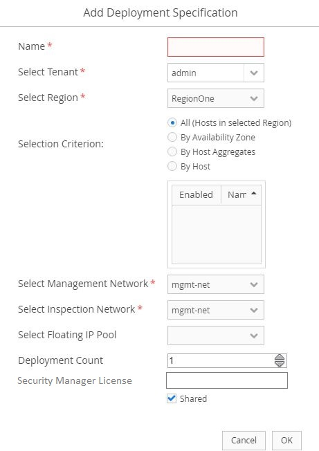

# OSC Security Manager Licensing
Currently, we hardcode the license auth code (e.g. PAN plugin) and provide it as bootstrap information. This document describes the proposed changes to receive the license auth code from the user.

## Scope of Security Manager License
- **Manager Connector**: All device groups and device members share the same license
- **Distributed Applianc**e: All device group share the same license
- **Deployment Specification (DAI)**: All device members share the same license*

## API Changes
The OSC REST API **POST** `/api/server/v1/virtualSystems/{vsId}/deploymentSpecifications` will accept additional field “licenseAuthCode”.

`DeploymentSpecDto`: Update `DeploymentSpecDto` to add new variable `licenseAuthCode` to receive the value from API and UI.

`DistributedApplianceInstance`: Update `DistributedApplianceInstance` to add a new variable/mapped column `licenseAuthCode` to persist the license auth code.

`OsSvaServerCreateTask`: Update method `generateBootstrapInfo` in `OsSvaServerCreateTask` to add `<LICENSE_AUTH_CODE_KEY,LICENSE_AUTH_CODE_VALUE>` to the `bootstrapProperties` map.

`OsSvaCreateMetaTask`: Update method `getDAI` in `OsSvaCreateMetaTask` to set and persist the `licenseAuthCode` to DAI.

## SDK Changes

`Constants`: Add new constants `SERVICE_REQUIRE_LICENSE` and `LICENSE_AUTH_CODE_KEY` in `Constants`

## Plugin Changes

`PLUGIN_NAMEApplianceManagerApi`: Add a new property `SERVICE_REQUIRE_LICENSE` to determine whether license is supported or not, e.g., `PANApplianceManagerApi`

## UI Changes

Add and enable a text field on Deployment Specification window to accept the license auth code from the user for manager supporting licensing.

For the manager not supporting licensing, the text field will be disabled.

`BaseDeploymentSpecificationWindow`: Update `BaseDeploymentSpecificationWindow` to add a new text field `licenseKey`.

## Database Changes

Update `TABLE DISTRIBUTED_APPLIANCE_INSTANCE` in Schema to add a new column `license_auth_code`.

I don't see any possibility to update `ReleaseUpgardeMgr` as we do not have any manager supporting licensing with the previous releases.

## License Upload
Assumption: Device members share the same license.

UI: User will provide the license auth code in text field `Security Manager License`.

API: User will provide license auth code for `licenseAuthCode` field with body.

## Release License
We need to call Security Manager API to delete the license after the device member is deleted.

## Open Issues/ Questions
1. What is the PAN license policy?
	-	Same license for all device groups and device member?
	-	Same license for a single device group?
	-	Same/different license for each of the device member?

2. If the license for each device member (DAI) is different, how do we accept the license for the DS with more than one count?

3. How do we release/manage the license? Is there any API we need to call or the manager handles it?

4. Does the license expire?
	- If yes, how do we update the bootstrap information?

5. If the vendor does license bundles for a certain group of device members:
	- How do we maintain the count?
	- How do we accept the count for license bundle?

6. How do we save the license auth code in OSC database? Do we need any encryption mechanism?

