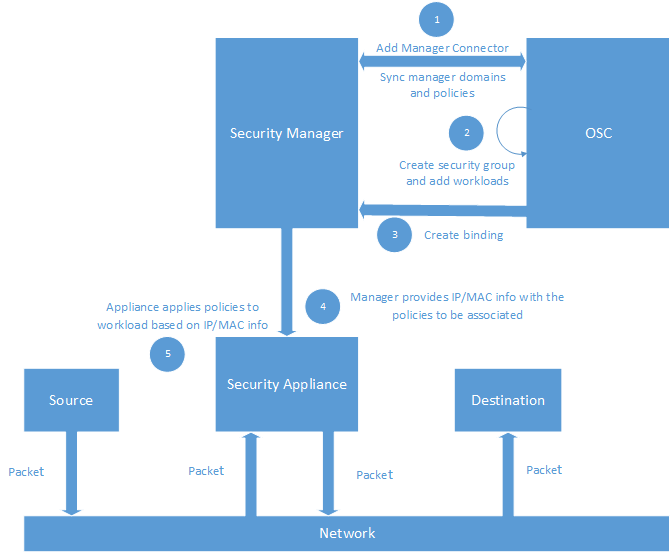

# Multi-Policy Mapping Workflow

This document describes the proposed changes for multi-policy mapping workflow.

## Background

Currently, we have two ways to determine which policy gets applied to which workload:

- Providing the VNF security manager with the encapsulation tag
- Providing the VNF security manager with the IP/Mac information and a list of polices/tags to be associated

If the manager is supporting [Policy Mapping](https://github.com/opensecuritycontroller/security-mgr-api/blob/master/src/main/java/org/osc/sdk/manager/Constants.java#L70) and [Security Group](https://github.com/opensecuritycontroller/security-mgr-api/blob/master/src/main/java/org/osc/sdk/manager/Constants.java#L60), we provide the manager with the security group name and members (their IPs and MACs) information to bind the policy.

**Policy mapping workflow**



OSC as a part of binding process provides the security manager with IP/MAC information and the list of policies/tag to be associated with the workload. The security manager provides the supplied information to security appliance. Security appliance applies the right policies to the workload based on the IP/MAC information.

## Constraints and Assumptions
The appliance security manager will not delete a security group with one or more security group interfaces.

## Design Changes
`SecurityGroup`: Currently, `SecurityGroup` and `SecurityGroupInterface` have many to many entity mapping. The proposed design will change this relationship to a one to many relationship between the SG and the SGIs.

### REST API

**API** to retrieve all the available Security Group Bindings to Security Function Service.

**GET** `/api/server/v1/virtualizationConnectors/{vcId}/securityGroups/{sgId}/bindings`

Now returns the list of policy id's associated with the binding along with additional details
```
"policyIds": []
```
**API** to Add/Update/Remove Security Group Bindings to Security Function Services.

**PUT** `/api/server/v1/virtualizationConnectors/{vcId}/securityGroups/{sgId}/bindings`

```
[
  {
    "virtualSystemId": 0,
    "name": "string",
    "policyIds": [
      0						// Provide comma seperated list of policy id's supported by security manager
    ],
    "policies": [
      {
        "id": 0,
        "parentId": 0,
        "policyName": "string",
        "mgrPolicyId": "string",
        "mgrDomainId": 0,
        "mgrDomainName": "string"
      }
    ],
    "multiplePoliciesSupported": false,
    "markedForDeletion": false,
    "failurePolicyType": "FAIL_OPEN",
    "order": 0,
    "binded": false
  }
]
```
### OSC SDKs

#### VNF Security Manager SDK

`SecurityGroupInterfaceElement`: Add a new interface

```java
public interface SecurityGroupInterfaceElement {

	/**
	 * @return the identifier of the security group interface defined by the manager
	 */
	String getManagerSecurityGroupInterfaceId();

	/**
	 * @return the name of the security group interface defined by OSC
	 */
	String getName();

	/**
	 * Provides the identifier of the security group defined by security managers that support policy mapping and
	 * security groups
	 *
	 * @return the identifier of the security group defined by the manager
	 */
	String getManagerSecurityGroupId();

	/**
	 * Provides the context information of manager policy element
	 *
	 * @return the set of manager policy elements
	 */
	Set<ManagerPolicyElement> getManagerPolicyElements();

	/**
	 * @return the encapsulation tag supported by the manager
	 */
	String getTag();
}
```


`ManagerSecurityGroupInterfaceApi`: Update `ManagerSecurityGroupInterfaceApi` interface

**Current interface methods**

```java
public interface ManagerSecurityGroupInterfaceApi {

    String createSecurityGroupInterface(String name, String policyId, String tag) throws Exception;

    void updateSecurityGroupInterface(String id, String name, String policyId, String tag) throws Exception;
}
```

**Proposed changes to the interface methods**

```java
public interface ManagerSecurityGroupInterfaceApi {

    String createSecurityGroupInterface(SecurityGroupInterfaceElement sgiElement) throws Exception;

    void updateSecurityGroupInterface(SecurityGroupInterfaceElement sgiElement) throws Exception;
}
```

`ManagerPolicyElement`: Update `ManagerPolicyElement` interface

**Current interface methods**

```java
public interface ManagerPolicyElement {
    /**
     * @return the identifier of the policy defined by the security manager
     */
    String getId();

    /**
     * @return the name of the policy defined in the security manager
     */
    String getName();
}
```

**Proposed changes to the interface methods**

```java
public interface ManagerPolicyElement {
    /**
     * @return the identifier of the policy defined by the security manager
     */
    String getId();

    /**
     * @return the name of the policy defined in the security manager
     */
    String getName();

    /**
     * @return the identifier of the domain the policy belongs to in the security manager
     */
    String getDomainId();
}
```

#### SDN Controller SDK
No changes to SDN Controller SDK are required.

### VNF Security Manager Plugins
Updating the plugins implementing these APIs is out of scope for this feature, with the exception of the security-mgr-sample-plugin which will be modified to support multiple policy mapping.

### OSC UI
Multi-policy mapping is out of scope for the upcoming release.

### OSC Entities
`SecurityGroupInterface`: The `SecurityGroupInterface` domain entity will have `managerSecurityGroupId` field of type string; the new table mapping many SGI to many policies.

```java
@Entity
@Table(name = "SECURITY_GROUP_INTERFACE")
public class SecurityGroupInterface extends BaseEntity {

	// ...

	@ManyToMany(fetch = FetchType.LAZY)
	@JoinTable(name = "SECURITY_GROUP_INTERFACE_POLICY",
			joinColumns = @JoinColumn(name = "sgi_fk", referencedColumnName = "id"),
			inverseJoinColumns = @JoinColumn(name = "policy_fk", referencedColumnName = "id"))
	private Set<Policy> policies = new HashSet<>();            // Many to Many mapping between SGI's and policies

	/**
	 * The tag is assumed to be in the format "SOMESTRING" "-" "LONG VALUE".
	 * isc-456 for example.
	 */
	@Column(name = "tag", nullable = true)
	private String tag;

	@ManyToOne(fetch = FetchType.EAGER)
	@JoinColumn(name = "security_group_fk", nullable = true, foreignKey = @ForeignKey(name = "FK_SECURITY_GROUP"))
	private SecurityGroup securityGroup;

	@Column(name = "user_configurable", columnDefinition = "bit default 0")
	private boolean isUserConfigurable;

	@Column(name = "mgr_interface_id")
	private String mgrSecurityGroupInterfaceId;

	@Column(name = "mgr_security_group_id")
	private String mgrSecurityGroupId;             // Stores the manager security group identifier

    // ...

```

`SecurityGroup`: Delete the `mgrId` field

### OSC Synchronization Tasks
The major tasks affected by the change are `CreateMgrSecurityGroupTask`, `SecurityGroupUpdateOrDeleteMetaTask`, `MgrSecurityGroupCheckMetaTask`, `UpdateMgrSecurityGroupTask`, `ForceDeleteDATask`, `ForceDeleteVirtualSystemTask`, `ForceDeleteSecurityGroupTask`, `DeleteSecurityGroupInterfaceTask`.

## Tests
- In case of manager not supporting security group, the policy binding should be done based on the tag
- If the manager is supporting the security group, the manager security group id should not be null