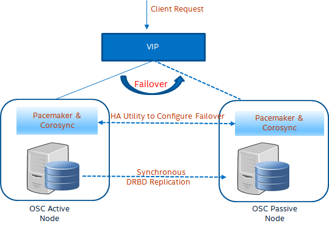
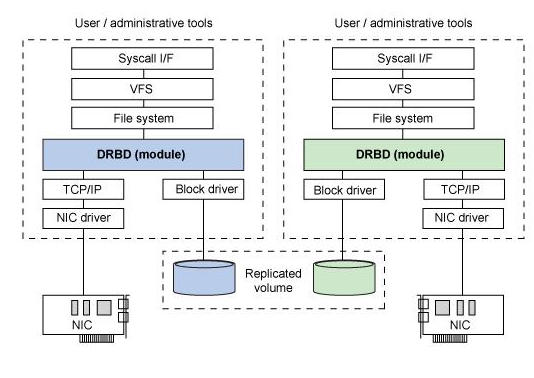
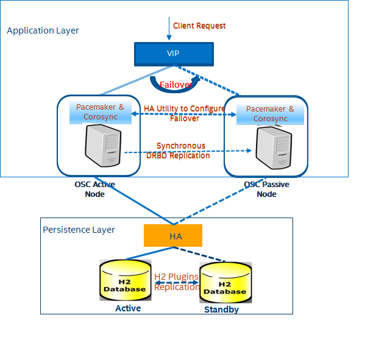
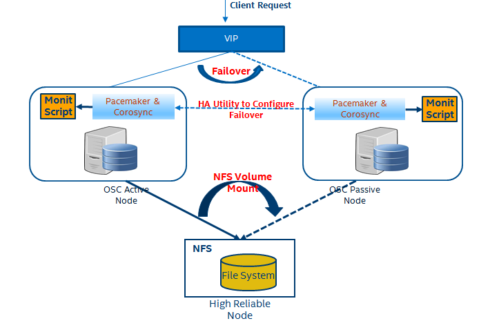

# OSC High Availability
- OSC High Availability eliminates from single points of failure which protects from unplanned downtime.
- Performs regular checks to make sure each OSC Service Node is working properly, and if one fails, switch it out for one that is working.
- It tries to bring back the failed service/nodes into the cluster and maintains the same number of service nodes.
    
#### There are 2 types of failures
1. Service Stops
	OSC service may be stopped abnormaly.
2. Node Level Stops
	OSC Service Node Stopped because of some reasons.

## Background
Currently, OSC does not have the HA configuration option to handle above failure types. So, A high availability OSC will work by having more service nodes than it needs, will perform regular checks to make sure each service/node is working properly. If current active node moves into failure state then it turns on the service in other working node.

We have explored three approaches.
1. OSC node cluster with Active/Passive setup using Pacemaker, Corosync and Distributed Replicated Block Device(DRBD).
2. Segregate Application and Persistence Layers(The option has discarded since H2 does not provide the option of Active/Passive Cluster)
3. Using NFS and Custom Monitor Script

## OSC HA with Active/Passive Setup 
OSC node cluster with Active/Passive setup using Pacemaker, Corosync and Distributed Replicated Block Device(DRBD).
Active Node serves the requests where as Passive Node is Standby. So, on fails of Active Node, Passive Node will get promoted to Active Node.
Pacemaker and Corosync maintains Service HA where It achieves maximum availability for our cluster services by detecting and recovering from node- and resource-level failures by making use of the messaging and membership capabilities provided by Corosync.
DRBD is a software-based, shared-nothing, replicated storage solution mirroring 
the content of block devices (hard disks, partitions, logical volumes etc.) between hosts.

#### Active/Passive Architecture Diagram

 

**Pacemaker and Corosync provide Service HA where as DRBD data replication through Synchronous updates.**

#### DRBD Architecture Diagram

 

**DRBD is the replacement of shared storage systems by networked mirroring. Also, called Network based RAID 1 mirroring for the data. It allows read writes on Active Node where as completely disallows to Passive Node.**

## OSC HA Through Segregating Application and Persistence Layers
Currently, OSC is tightly coupled with the Application and Persistence Layers. So, creating HA for persistence layer is little hard. Seprating the Application and Persistence Layers will make the OSC loosly coupled. Also, creating the HA for both the layers will be easier and align with other openstack services.

#### HA Architecture Diagram for Application and Persistence Layers

 

**Application and Persistence Layers seprated out with seprate HA. H2 Database has H2 Plugins for Active/Standby setup options and replications.**

###### Note: Seprating Database is not feasible in OSC since H2 does not provide the Active/Passive Cluster option.Hence,discarding this option.

## OSC HA Using NFS and Custom Monitoring Script
NFS Hosts the Docker Volume File System and will be Mounted/Un-Mounted in the case Active/Passive. Custom Monitoring Script will Mount/Un-Mount the volume and Start the OSC Docker Container pointing to NFS File System. Pacemaker will execute the Custom Monitoring Script based on the status change.

#### HA Architecture Diagram Using NFS and Custom Monitoring Script

 

**NFS Hosts File System for Docker Volumes and will be Mounted/Un-Mounted during Active/Passive.**

### Deployment
OSC cluster which will be deployed on single controller node. Threre will be a single Active instance running with extra standby node(s) for failover. Active Node always servers the request where as standby will be completely in dump state.

### Load balance/HA redundancy
HAProxy will do the Load Balancing as well traffic redirection to the Active Node.

# Concerns Using the above Proposed Designs
1. How to Avoid Running OSC Jobs when it is in Passive Mode?
    The Passive Mode running OSC jobs may cause the problem . But we can avoid it through below strategy.
    - There should be a Monitoring thread to check the status of the node.
    - The Monitoring thread should be in the loop and in sleep state until it gets the Node status as Active.
    - The Node status can get through “pcs status resources” command.
    If it is passive , should not start RabbitMq, WebSocket, Scheduler, Opening the database connection etc during Server Start.
    - As soon as the OSC Node gets promoted to Active, it should start remaining OSC dependencies services such as  RabbitMq, WebSocket, Scheduler, Opening the database connection etc.

2. How pacemaker notifies the status to the registered node?
    - Pacemaker provides the brain that processes and reacts to events regarding the cluster. These events include nodes joining or leaving the cluster; resource events caused by failures, maintenance and scheduled activities; and other administrative actions. Pacemaker will compute the ideal state of the cluster and plot a path to achieve it after any of these events. This may include moving resources, stopping nodes and even forcing them offline with remote power switches.
    - It notifies all the cluster nodes.
    - Through configurations,the state changes get notified.

3. Is it possible to hook on the pacemaker to bring up docker container based on pacemaker passive-to-active notification?
	- It seems, its possible. Hence, updated with 3rd approach for HA.

4. We need to be generic in HA solution. we should not use any service which is only openstack specific.
	- Pacemaker and Corosync are not Openstack specific service. Hence, can be used in any Linux flavours.
5. Is it possible to have shared volume between all the instances and keep all OSC related stuff in that volume?
	- iSCSI provides it. But we will be using the linux provided NFS.
6. How does DRBD work in multi node deployment?
	- It seems, it supports muti node deployment. It added many multi node features in DRBD9.
7. How to customize data replication between Active-Passive nodes?
	- Its quite possible to configure only required volume data.
8. eed to analyze for the code changes required to segregate Application and Database Layers.
	- As Active/Passive setup is not possible in H2 databse, hence analyzing code changes are not required until database gets changed.
9. Is there any better HA for OSC?
	- Approach 1 and 3 seems good to go ahead for POC but better HA can be investigated if any.

# Further Investigations
- Approach 3 needs more investigation to narrow down detailed implementation path.
- How to configure DRBD, Pacemaker and Corosync in Heat Template?

