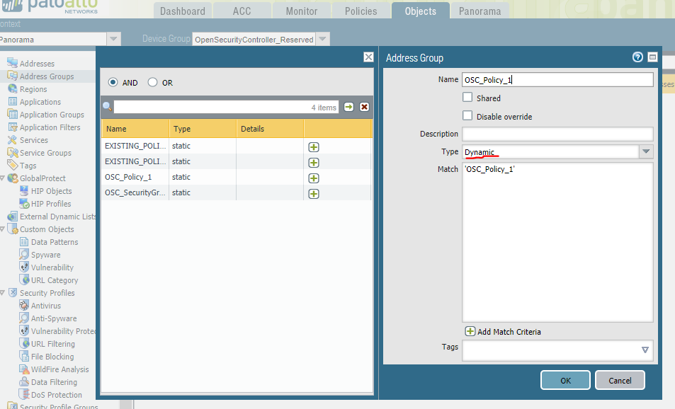
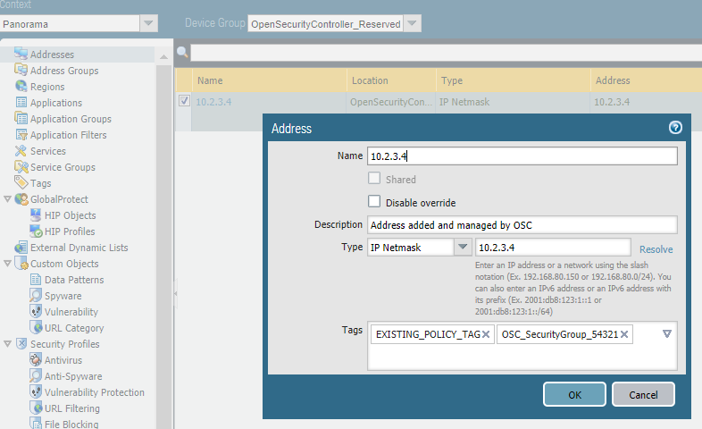

# Panorama Security Plugin
This is a security appliance plugin for the Panorama Security Management Appliance, which orchestrates PaloAlto virtual firewalls deployed by OSC. The plugin shall conform to the [security manager api](https://github.com/opensecuritycontroller/security-mgr-api) specification. We propose to have:
- A Panorama Dynamic address group for each OSC security policy. It will be labeled by a tag and targeted by a _Panorama_ security policy.
- In Panorama, we define two classes of tags: one to associate Panorama Address Objects with a security group, and another -- with a security policy.
- The security group tags are managed by osc (through Panorama API) and the policy tags are managed manually on Panorama.

## Assignees
Dmitry Gerenrot ([dmitryintel](https://github.com/dmitryintel)).

## Constraints and Assumptions
The Panorama version is 7.1. The firewalls are running PAN-VM-KVM-7.1.4.

## Design Changes

We propose the following workflow for creating a security group from OSC.

- Begin by creating a distributed appliance on OSC with PAN-VM-KVM-7.1.4 as the service function. OSC then creates a Device Group under panorama via Panorama API. (For example, **DistributedAppGroup**).
- Proceed by defining the security policies on panorama as follows:
	- For each policy to be managed by the **Panorama Security Plugin**, there will be a dynamic address group (DAG) under the **DistributedAppGroup** and a _shared_ tag, e.g., **OSC_Policy_1**. Panorama administrators _create these manually_.
	- Under the panorama **Policies** tab, create a security policy to target the DAG as usual.
	

- There should be no more manual steps on the panorama side.
- In the OSC, create a security group. (E.g. security group id is **aaaaa01**). For each address in a security group, the OSC will create an address object under the **DistributedAppGroup**.
- OSC also creates a tag of the form  **OSC_SecurityGroup_aaaaa01**.
- There will be one such tag per security group. All the address objects will be labeled by it.
- Binding happens when OSC edits the address objects to also reference one of the policy tags. This way, address is always labeled by a security group tag and sometimes by a policy tag. This is only while the security group is bound.
- The OSC will edit all the addresses and tags via the [Panorama API](https://www.paloaltonetworks.com/documentation/71/pan-os/xml-api).

Panorama administrators should:
- Understand this workflow 
- Recognize the DAGs and tags created by OSC
- Generally, should not edit any of them.

The naming conventions/prefixes are up for discussion.

### REST API 
No changes anticipated.

### OSC SDKs
No changes anticipated.

### SDN Controller SDK
No changes anticipated.

## Tests
TBD

## References
### [Panorama XML API](https://www.paloaltonetworks.com/documentation/71/pan-os/xml-api)
### [OSC Security Manager API](https://github.com/opensecuritycontroller/security-mgr-api)

