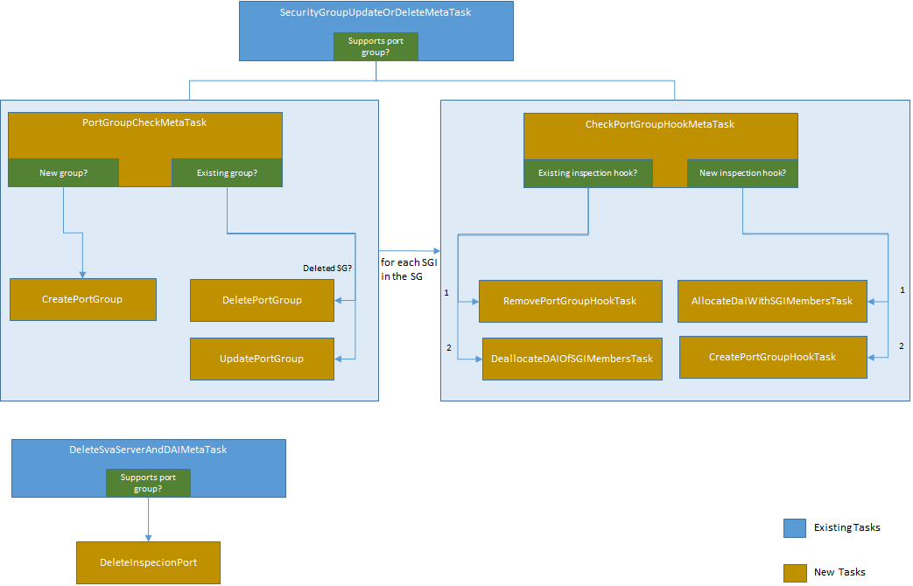

# Port Group Support for SDN Controllers
Some SDN controllers implement traffic redirection at the level of port groups rather than for each individual network element. This design allows OSC to make use of this capability while redirecting traffic to security VNFs.

## Design Changes

### OSC Synchronization Tasks  

#### PortGroupCheckMetaTask
Responsible to check whether a port group must be created, updated or deleted in the SDN controller.

#### PortGroupHookCheckMetaTask
Responsible to check whether a port group hook must be created or deleted in the SDN controller. It will also invoke the tasks to assign or unassign the distributed appliance instance ports (redirection ports) to the security group member ports.  
This task executes only after the PortGroupCheckMetaTask finishes succesfully.  

> Note: Update is currently not supported by an SDN controller.

#### Create/Update/DeletePortGroupTask
Creates/updates/deletes a port group in the SDN controller.

#### Create/RemovePortGroupTask
Creates/deletes a port group hook in the SDN controller.

#### AllocateDaiWithSGIMembersTask
Assigns the security VNF instance (distributed appliance instance) with the security group interface member ports. This operation affects the OSC database only.

#### DeallocateDaiOfSGIMembersTask
Detaches the security VNF instance (distributed appliance instance) from the security group interface member ports. This operation affects the OSC database only.

#### DeleteInspectionPortTask
Deletes the inspection port group from the SDN controller.
> Note: This task should be called even if the SDN controller does not support port groups. 
