# Service Function Chaining (SFC) Plugin in OSC  
This document gives a brief introduction to network service function chaining (SFC) in Openstack and high level design of SFC configuration as a plugin in OSC and its requirements.  
## Background  
The design purpose of SFC plugging to Open Security Controller (OSC) is to leverage service function chaining concepts of Openstack platform to redirect the traffic in SDN way. With this implementation OSC will support SFC feature of Openstack for traffic redirection, an alternative to third party SDN controllers.  

## Overview  
Open security controller (OSC) currently has Nuage and NSC SDN plugins to redirect traffic to and from a protected port of VM instance in a Openstack platform to a Service Appliance (IPS).This design overview is to define a SFC plugin to OSC; SFC is a concept related to Policy Based Routing in physical networks but it is typically thought of as a Software Defined Networking technology on a Openstack platform.  

This document explains in high level, the design process, configuration requirements, and mapping of the SDN Controller SDK APIs and interface functions in OSC to SFC plugin.  

## Constraints and Assumptions  
SFC is an extension to the Openstack Neutron module. In the current design SFC uses OVS as a back end driver. The POC was configured and tested in Openstack Redhat Ocata release.   

This document assumes that readers are familiar with: 
1. OSC’s functionality and design concepts. 
1. Openstack configuration and networking.
1. SDN concepts.

## Network Service Function Chaining (SFC)  
Service function chaining overrides the basic destination based forwarding in IP networks. It is conceptually related to Policy Based Routing in physical networks but it is typically thought of as a Software Defined Networking technology in Openstack virtual network connections.  

A basic example of IP packet forwarding, with respect to SFC is, packets that are from point A to point B will be redirected to an IPS or Firewall VMs (Service Functions) , even though the service functions are not in between their route.  

The SF’s can be chained to make packets go through different Service Appliances(IPS,FIREWALL.  

### SFC Concepts
- Service Functions (SF) . Like IPS, firewalls ..etc.  

- Port-Pairs : A port pair represents a service function instance that includes an ingress and egress port.  
- Port-Pair-Groups : A port pair group may contain one or more port pairs. Multiple port pairs enable load balancing/distribution over a set of functionally equivalent service functions.  
- Port-Chain : A port chain consists of a sequence of port pair groups. Each port pair group is a hop in the port chain. A group of port pairs represents service functions providing equivalent functionality. A flow classifier attached to port-chain will steer the traffic into the port-chain.  
- Flow-Classification : A flow classifier identifies a flow. A port chain can contain multiple flow classifiers. Omitting the flow classifier effectively prevents steering of traffic through the port chain.  

### SFC Configuration
- SFC is neutron extension in Openstack compute node
- OVS will be used as backend driver
- Current configuration on Ocata red hat Openstack platform.

SFC work flow in Openstack Environment.
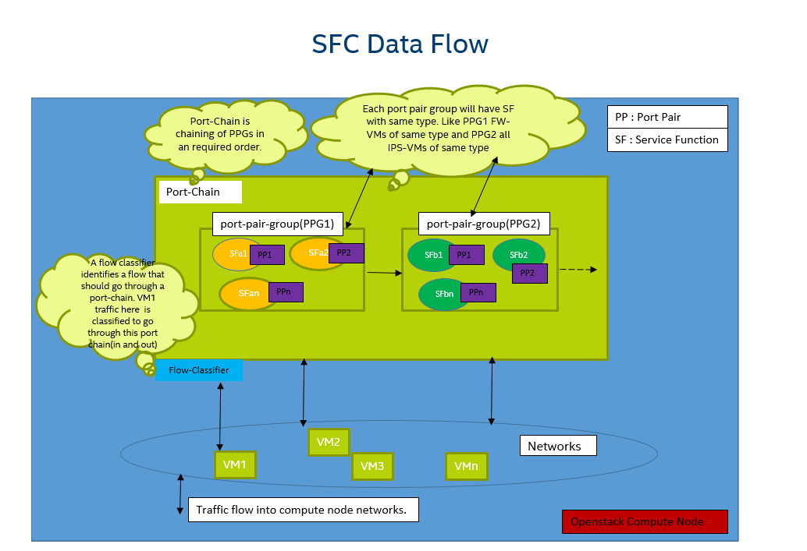


## Design Changes  
SFC functionality in OSC will adapt to existing SDN controller SDK APIs.SFC configuration work flow, changes to SDK APIs and interfaces to support SFC plugin are described below in detail. Other supported SDN controller plugins should adapt to all the below mention changes.


### REST API   
Currently not applicable.

### OSC Configuration Changes
OSC security group binding configuration for SFC will be different compare to current configuration steps. For binding a security group with Service Function in Openstack using SFC, user has to create chain by selecting the DAs in a VC.
Each DA in a VC is a service function. And user should be able to select DAs in particular order to create a service function chaining.  

The step are show below. And steps in bold represent changes in OSC for SFC functionality.  

1. DA Creation (A service function chain is one or more DAs)
1. **Port Chain Creation ( Create service function chaining)**
1. Create a security group
1. **Binding a Security Group**

#### Port Chain
A new configuration requirement, Port Chain is introduced for SFC functionality. In this configuration an OSC configuration entity called port chain (SERVICE_FUNCTION_CHAIN) will be created and this will have a reference point to corresponding Virtual connectors and DAs. In OSC DB a SERVICE_FUNCTION_CHAIN table and related fields of entities will be create. And this Database table will have reference to DAs(VSS) attached to this chain.Port Chain is setup only in OSC and no action is taken place at target Openstack VC during its creation.

**OSC Entities Mapping**
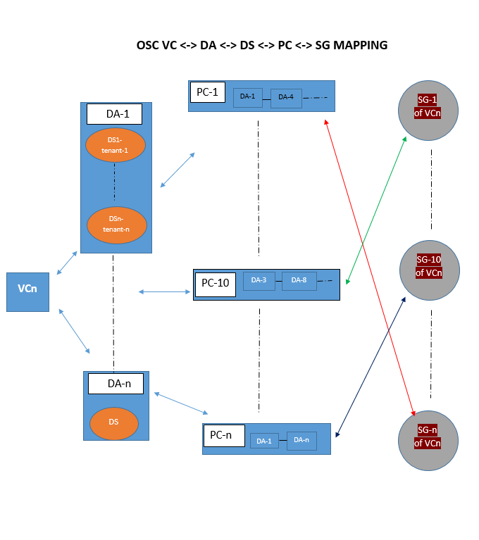

#### Security Group Binding.
Currently in OSC a security group is binded to one or more DAs. With SFC a security group will now be bonded not to a DA but to a port chain(SFC). And it cannot bind to more than one port chain(SFC). But multiple security groups can bind to same port chain.OSC SDN controller SDK API `installInspectionHook` explain in detail how OSC will make use of port chain mapping and configures target Openstack for traffic redirection using SFC chaining.

* [Work Flow for Security Group binding in SFC](#CreateSFCFlowClassifierHookTask)
* [Work Flow for deletion of Security Group binding in SFC](#CreateSFCFlowClassifierHookTask)
### OSC SDKs  

#### SDN Controller SDK  
Following section describes in detail changes in SDN controller SDK APIs and interfaces to support SFC plugin.
Over all changes related to SDN controller APIs and Interfaces are listed below.  

##### Interface Changes
Following Interfaces are modified to fit SFC plugin to SDN SDK APIs
* [NetworkElement()](#NetworkElement)
* [InspectionPortElement()](#InspectionPortElement)

###### NetworkElement()
For re-usability NetworkElement() interface will be split into two.  
Current NetworkElement interface  
```
public interface NetworkElement {
    String getElementId();

    List<String> getMacAddresses();

    List<String> getPortIPs();
 
    String getParentId();

}
```
Proposed changes to NetworkElement
Create a new interface Element
```
public interface Element {
	String getElementId();
	
	String getParentId();
}
```
Modify the exisiting class NetworkElement() to inherit Element()
```
public interface NetworkElement extends Element{
    
    List<String> getMacAddresses();

    List<String> getPortIPs();
   
}
```

###### InspectionPortElement()
This interface will inherit ElementIdInfo. Inspection port work flow described below  
Current InspectionPortElement interface
```
public interface InspectionPortElement {

    NetworkElement getIngressPort();

    NetworkElement getEgressPort();
}
```
Proposed changes to InspectionPortElement interface
```
public interface InspectionPortElement extends ElementIdInfo{

    NetworkElement getIngressPort();

    NetworkElement getEgressPort();

}
```


##### APIs Definition Changes
Following SDK Controller APIs are proposed to change
* [registerInspectionPort()](#registerinspectionport)
* [installInspectionHook()](#installInspectionHook)
* [removeInspectionHook()](#removeInspectionHook)


###### registerinspectionport()
This API for SFC functionality will be changed to return `ElementIdInfo()` interface . Inspection port work flow is described in following sections.  
Current API definition.  

```
void registerInspectionPort(InspectionPortElement inspectionPort) throws NetworkPortNotFoundException, Exception;
```
Proposed API Definition  

```
ElementIdInfo registerInspectionPort(InspectionPortElement inspectionPort) throws NetworkPortNotFoundException, Exception;
```
###### installInspectionHook()
This API uses updated `InspectionPortElement` . This interfaces parentId argument carries already existing port chain Id to add more flow classifiers to that port chain ID. And the same parentId is used for `installInspectionHookId`. Detail installInspectionHook work flow is show below. `networkElement` will be a list of elements.  

Current API definition  

```
String installInspectionHook(NetworkElement networkElem, InspectionPortElement inspectionPort, Long tag,
            TagEncapsulationType encType, Long order, FailurePolicyType failurePolicyType)
                    throws NetworkPortNotFoundException, Exception;
```
Proposed API Definition  

```
String installInspectionHook(List NetworkElement networkElem , InspectionPortElement inspectionPort,
									 Long tag,
            						TagEncapsulationType encType, Long order, FailurePolicyType failurePolicyType)
                    				throws NetworkPortNotFoundException, Exception;
```
###### removeInspectionHook()
This API also carrie port-chain-id as `installInspectionHookId`. All protect ports of a security group , flow classifier rules will be deleted on a given installInspectionHook Id which is a port-chain-id on a target Openstack node.
Detail work flow on remove fucntionality is show below.

Current API definition.  
```
void removeInspectionHook(NetworkElement networkElem, InspectionPortElement inspectionPort) throws Exception;
```
Proposed API Definition  

```
void removeInspectionHook(List NetworkElement networkElem, InspectionPortElement inspectionPort) throws Exception;
```
#####  Inspection Port Interface Work Flow
OSC core will create inspection port during creation of new distribution specification (DS) under a distribution Appliance.  

SDN controller SDK APIs `registerinspectionport` and `removeinspectionport` will be called to create and remove the inspection port with `InspectionPortElement` interface as the argument.  
`InspectionPortElement`  will have port-pair Id as ElementId and Port-Pair-Group-Id as ParentId.

SFC plugin should adapt the same SDK controller APIs to create and delete inspection port hook entity in OSC. 

Inspection port work flow is shown below.  

RegisterInspectionPort  
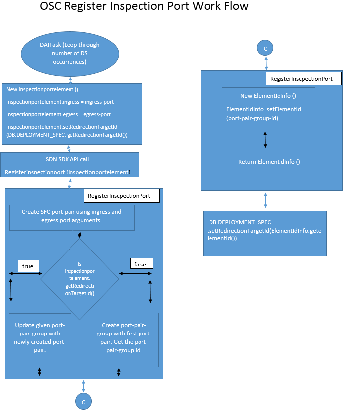

RemoveInspectionPort 
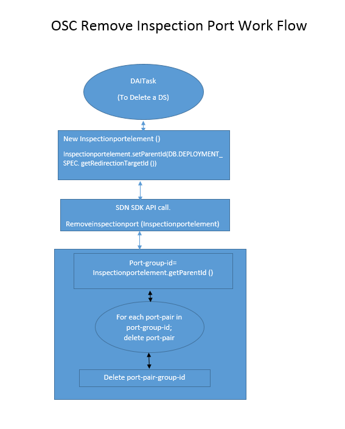

##### Install Inspection Hook Work Flow.
In OSC install inspection work flow is used during security group binding operations. For SFC a security group will be binding to a chain of service functions i.e port chain in OSC. Earlier this SG was binding to a DA.  
During binding OSC gets all the service function(DS) for the tenant of SG, call `registerNetworkElement` API to create a port chain. This port chain will be used to create installInspectionHook. Detail work flow is give below.

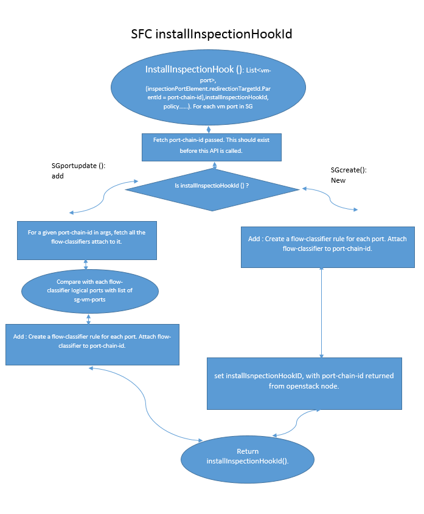

##### Remove Inspection Hook Work Flow.
This API in SFC will be used in two way, to delete a security group binding and also to delete a particular vm-port in a security group.Detail workflw is show below.

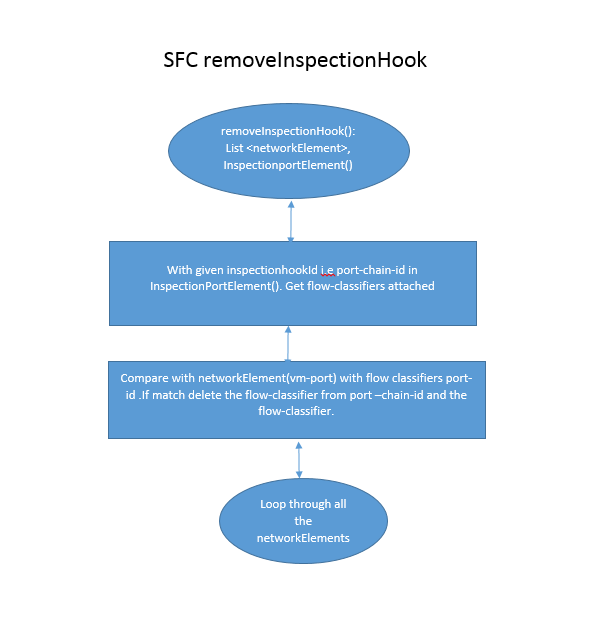

##### registerNetworkElement Work flow for SFC.
This API is used to create port-chain-id give list of PPGIds (redirection targets).
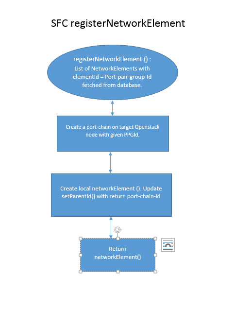

##### deleteNetworkElement Work flow for SFC.
This API is used to delete port-chain-id.
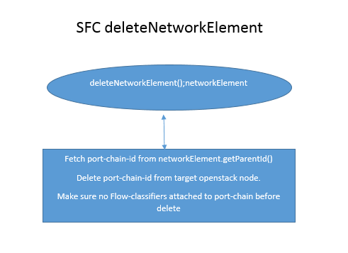

### OSC Entities
This section describes changes recommended in the OSC database for SFC plugin.  

#### SFC Port-Pair-Group-id  <-> redirection-target-id in DEPLOYMENT SPECIFICATION Table
In SFC plugin, new field `redirection-target-id` is used as Inspection port that is used for traffic redirection. According SFC requirements, the DS Appliance instances (one or more than one) ingress and egress ports are paired and grouped into port-pair-group. This port-pair-group Id is used later for port-chaining and traffic redirection. 
So a data base entry is required and added in DEPLOYMENT_SPEC database table to save configured port-pair-group-id.  

Proposed changes to the data base.  
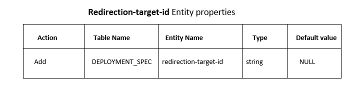

#### SERVICE_FUNCTION_CHAIN Database  
SFC will introduce a new table (SERVICE_FUNCTION_CHAIN) to OSC database for maintaining the port chaining of DA's.
As mentioned earlier each DA will represent a service function in OSC. User will be allowed to configure chaining of these DA to perform service function chaining. And since DA's represent a virtual system in OSC database, a `SERVICE_FUNCTION_CHAIN` foreign_key is mapped to VIRTUAL_SYSTEM table.  
Show below are table and mapping of `SERVICE_FUNCTION_CHAIN` table in OSC database.  
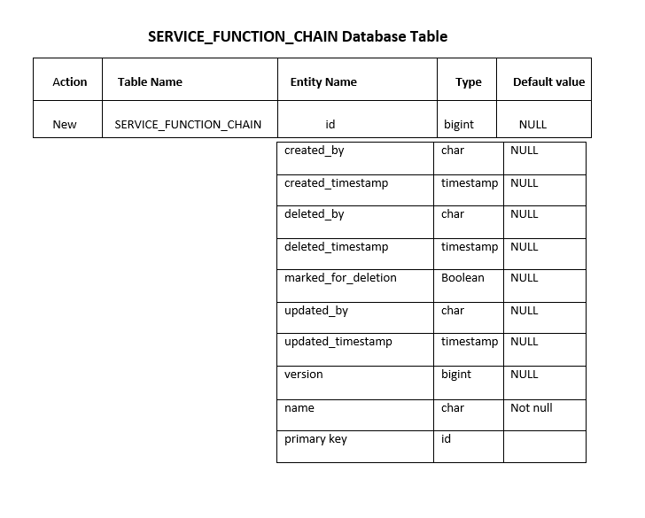

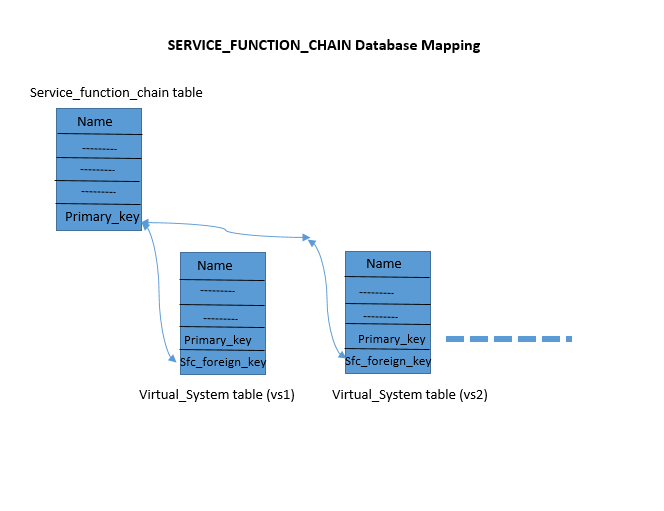  

Database mapping procedure:
1. User creates a service function chain from UI.  
1. User selects DAs that should be part of chain in order.  
1. Osc-core will update `SERVICE_FUNCTION_CHAIN` database with Name, primary_key..etc.  
1. Osc-core will fetch from given DAs the` VIRTUAL_SYSTEM` database of that DA and updates` service_function_chain_fk`  

```
create table SERVICE_FUNCTION_CHAIN (" +
				   "id bigint generated by default as identity," +
				   "created_by varchar(255)," +
				   "created_timestamp timestamp," +
                   "deleted_by varchar(255)," +
                   "deleted_timestamp timestamp," +
                   "marked_for_deletion boolean," +
                   "updated_by varchar(255)," +
                   "updated_timestamp timestamp," +
                   "version bigint," +
                   "name varchar(255) not null," +
				   "primary key (id)" +
				   ")
```

### OSC UI  
For SFC addition, deletion and edit UI page is located under VC. All DAs pertaining to a particular VC can be chained together. Since both security group and service function chaining are related to a Virtualization Connector (VC) the main page of VC should modify.
All recommended OSC service function chaining UI pages are show below.

**Virtualization Connector main page**
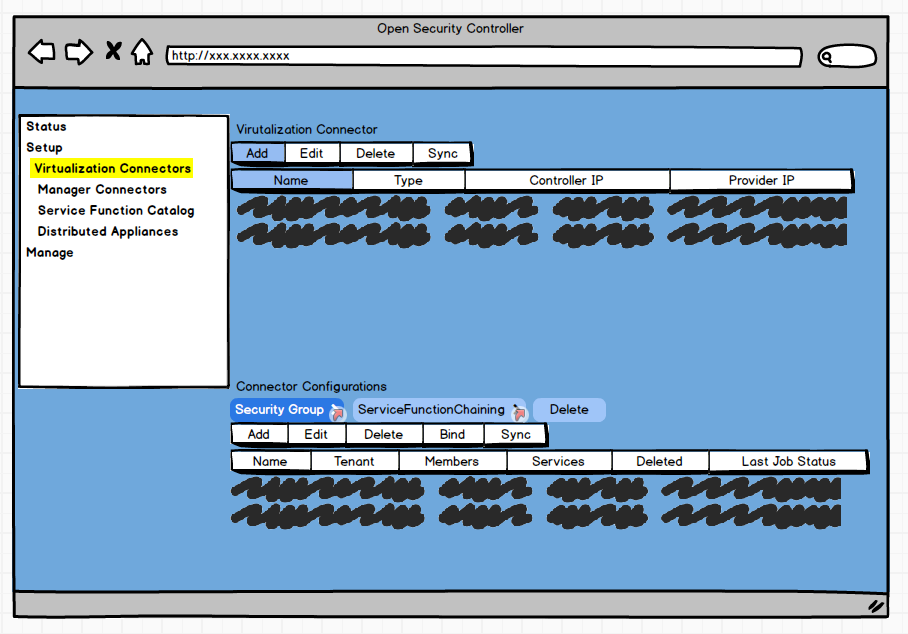
**SFC Main page**
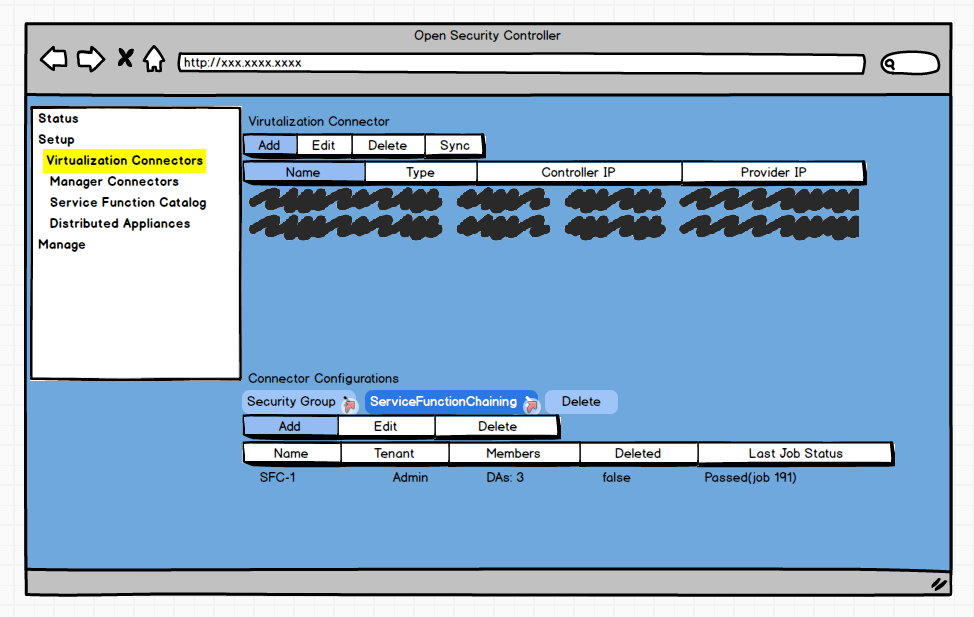

**SFC Add page**
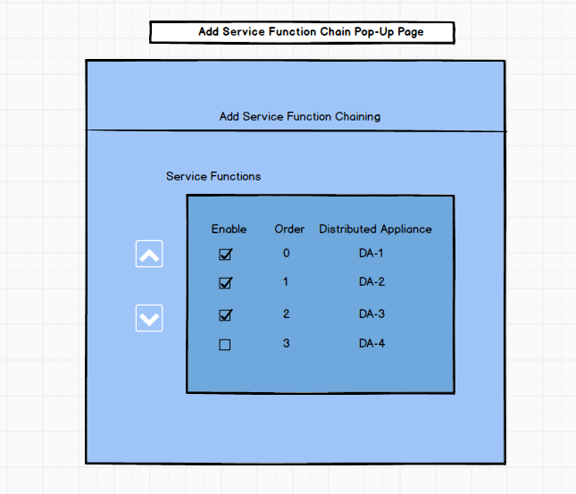

**SFC Chain Edit**
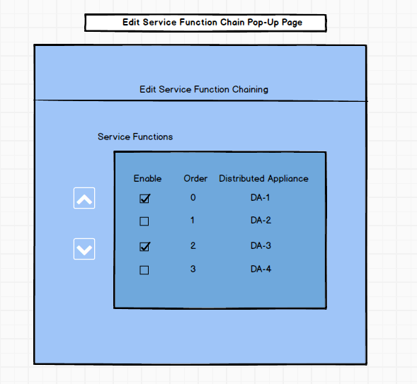

### OSC Synchronization Tasks  
SFC implementation will have create and delete security binding procedures. The task flow for these procedures are shown below.
* [CreateSFCFlowClassifierHookTask()](#CreateSFCFlowClassifierHookTask)
* [DeleteSFCFlowClassifierHookTask()](#registerinspectionport)

#### CreateSFCFlowClassifierHookTask
This OSC task will be invoked for binding a security group with a service function chain. Work flow for this task is show below.
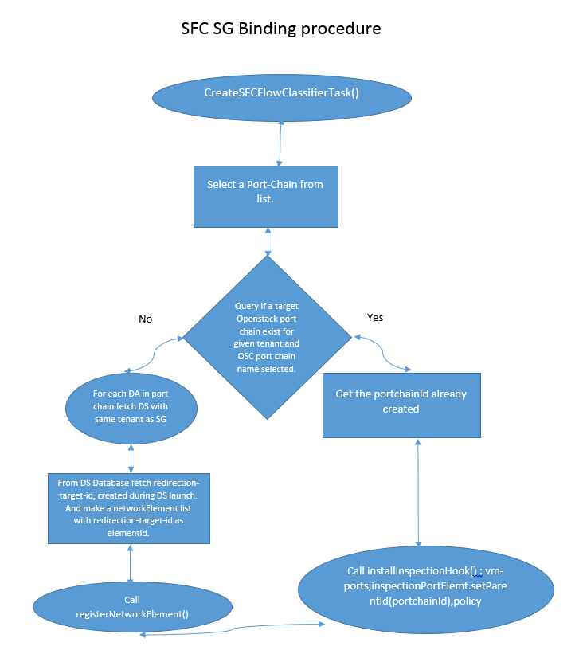

#### DeleteSFCFlowClassifierHookTask
This OSC task will be invoked for deleting a security group binding with a service function chain. Work flow for this task is show below.
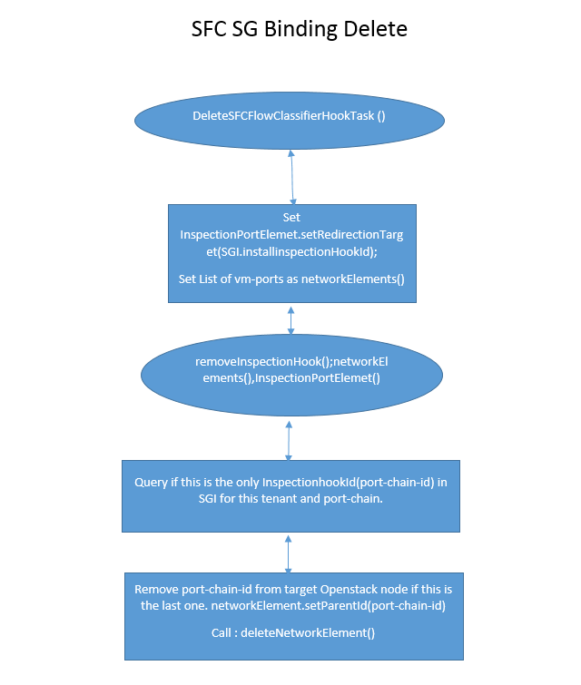
## Tests  
Describe here any new test requirement for this feature. This can include: virtualization platform, test infrastructure, stubs, etc.   
> Note: Any feature should be demonstrable and testable independently of a particular vendor component or service. 
