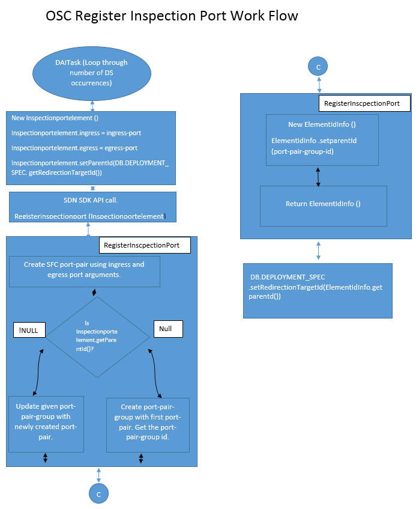

# Service Function Chaining (SFC) Plugin in OSC  
This document gives a brief introduction to network service function chaining (SFC) in Openstack and high level design of SFC configuration as a plugin in OSC and its requirements.  
## Background  
The design purpose of SFC plugging to Open Security Controller (OSC) is to leverage service function chaining concepts of Openstack platform to redirect the traffic in SDN way. With this implementation OSC will support SFC feature of Openstack for traffic redirection, an alternative to third party SDN controllers.  

## Overview  
Open security controller (OSC) currently has Nuage and NSC SDN plugins to redirect traffic to and from a protected port of VM instance in a Openstack platform to a Service Appliance (IPS).This design overview is to define a SFC plugin to OSC; SFC is a concept related to Policy Based Routing in physical networks but it is typically thought of as a Software Defined Networking technology on a Openstack platform.  

This document explains in high level, the design process, configuration requirements, and mapping of the SDN Controller SDK APIs and interface functions in OSC to SFC plugin.  

## Constraints and Assumptions  
SFC is an extension to the Openstack Neutron module. In the current design SFC uses OVS as a back end driver. The POC was configured and tested in Openstack Redhat Ocata release.   

This document assumes that readers are familiar with: 
1. OSC’s functionality and design concepts. 
1. Openstack configuration and networking.
1. SDN concepts.

## Network Service Function Chaining (SFC)  
Service function chaining overrides the basic destination based forwarding in IP networks. It is conceptually related to Policy Based Routing in physical networks but it is typically thought of as a Software Defined Networking technology in Openstack virtual network connections.  

A basic example of IP packet forwarding, with respect to SFC is, packets that are from point A to point B will be redirected to an IPS or Firewall VMs (Service Functions) , even though the service functions are not in between their route.  

The SF’s can be chained to make packets go through different Service Appliances(IPS,FIREWALL.  

### SFC Concepts
- Service Functions (SF) . Like IPS, firewalls ..etc.  

- Port-Pairs : A port pair represents a service function instance that includes an ingress and egress port.  
- Port-Pair-Groups : A port pair group may contain one or more port pairs. Multiple port pairs enable load balancing/distribution over a set of functionally equivalent service functions.  
- Port-Chain : A port chain consists of a sequence of port pair groups. Each port pair group is a hop in the port chain. A group of port pairs represents service functions providing equivalent functionality. A flow classifier attached to port-chain will steer the traffic into the port-chain.  
- Flow-Classification : A flow classifier identifies a flow. A port chain can contain multiple flow classifiers. Omitting the flow classifier effectively prevents steering of traffic through the port chain.  

### SFC Configuration
- SFC is neutron extension in Openstack compute node
- OVS will be used as backend driver
- Current configuration on Ocata red hat Openstack platform.

SFC work flow in Openstack Environment.


## Design Changes  
SFC functionality in OSC will adapt to existing SDN controller SDK APIs.SFC configuration work flow, changes to SDK APIs and interfaces to support SFC plugin are described below in detail. Other supported SDN controller plugins should adapt to all the below mention changes.


### REST API   
Currently not applicable.
 
### OSC SDKs  

#### SDN Controller SDK  
Following section describes in detail changes in SDN controller SDK APIs and interfaces to support SFC plugin.
Over all changes related to SDN controller APIs and Interfaces are listed below.  

##### Interface Changes
Following Interfaces are modified to fit SFC plugin to SDN SDK APIs
1. InspectionPortElement()
1. NetworkElement()

###### InspectionPortElement()
This interface will have an additional field getRedirectionTargetId().For more understanding of `getRedirectionTargetId` follow inspection port work flow described below  
Current InspectionPortElement interface
```
public interface InspectionPortElement {

    NetworkElement getIngressPort();

    NetworkElement getEgressPort();
}
```
Proposed changes to InspectionPortElement interface
```
public interface InspectionPortElement {

    NetworkElement getIngressPort();

    NetworkElement getEgressPort();

	String getRedirectionTargetId();			// Parent ID will be set with port-pair-group id, return from openstack 
    											afte the port-pair is either added or updated to port-pair-group.(PPG)
}
```
###### NetworkElement()
For re-usability NetworkElement() interface will be split into two.  
Current NetworkElement interface  
```
public interface NetworkElement {
    String getElementId();

    List<String> getMacAddresses();

    List<String> getPortIPs();
 
    String getParentId();

}
```
Proposed changes to NetworkElement
Create a new file ElementIdInfo.java and add new class
```
public interface ElementIdInfo {
	String getElementId();
	
	String getParentId();
}
```
Modify the exisiting class NetworkElement() to inherit ElementIdInfo()
```
import ElementIdInfo.java
public interface NetworkElement extends ElementIdInfo{
    
    List<String> getMacAddresses();

    List<String> getPortIPs();
   
}
```

##### APIs Definition Changes
Following SDK Controller APIs are proposed to change
1. registerInspectionPort()

###### registerinspectionport()
This API for SFC functionality will be changed to return `ElementIdInfo()` interface . Inspection port work flow is described in following sections.  
Current API definition.  

```
void registerInspectionPort(InspectionPortElement inspectionPort) throws NetworkPortNotFoundException, Exception;
```
Proposed API Definition  

```
ElementIdInfo registerInspectionPort(InspectionPortElement inspectionPort) throws NetworkPortNotFoundException, Exception;
```

#####  Inspection Port Interface Work Flow
OSC core will create inspection port during creation of new distribution specification (DS) under a distribution Appliance.  

SDN controller SDK APIs `registerinspectionport` and `removeinspectionport` will be called to create and remove the inspection port with `InspectionPortElement` interface as the argument.  

SFC plugin should adapt the same SDK controller APIs to create and delete inspection port hook entity in OSC. 

Inspection port work flow is shown below.  

**RegisterInspectionPort**  


**RemoveInspectionPort**  


### OSC Entities
This section describes changes recommended in the OSC database for SFC plugin. Mostly like new table creation, additions to existing table entities and mapping between the tables.  

#### SFC Port-Pair-Group-id  <-> redirection-target-id
In SFC plugin, new entity `redirection-target-id` is used as Inspection port that is used for traffic redirection. According SFC requirements, the DS Appliance instances(one or more than one) ingress and egress ports are paired grouped into port-pair-group. This port-pair-group Id is used for later for port-chaining and traffic redirection. So this port-pair-group-id will be save as redirection-target-id in database.  

Proposed changes to the data base.  


### OSC UI  
Use UI mock ups to describe any UI change.  

### OSC Synchronization Tasks  
Describe any changes on the OSC internal synchronization tasks or metatasks. Use a diagram to represent any updated or new task graph.  

## Tests  
Describe here any new test requirement for this feature. This can include: virtualization platform, test infrastructure, stubs, etc.   
> Note: Any feature should be demonstrable and testable independently of a particular vendor component or service. 
