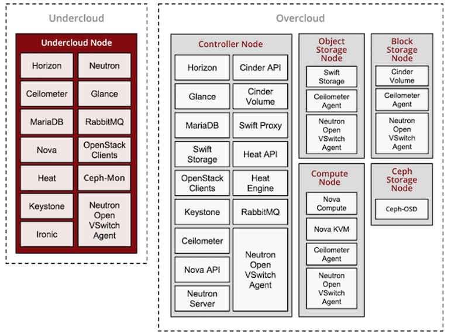
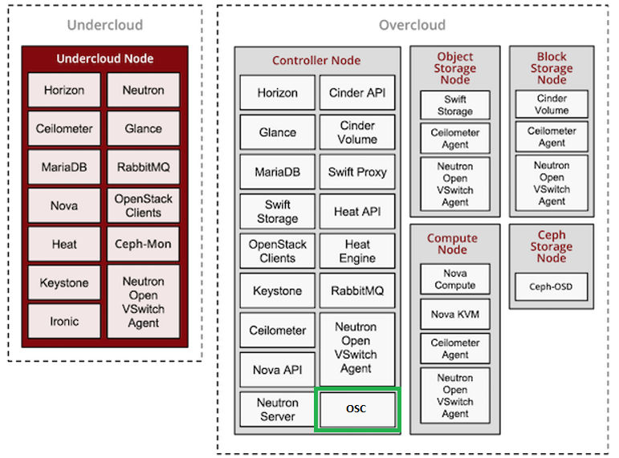

# OSC Integration with TripleO
In order for OSC to be installable and configurable by [TripleO](#tripleo-home) a TripleO-Heat-Template (THT) must be created. This document outlines the details of this template highlighting OSC specific configuration and environment variables, TripleO required configuration, data persistence, TLS and high availability (HA) settings.   
> Note: Details for HA, TLS and other advanced configuration will be added later. The first draft of this document covers required files, template parameters, environment variables and volumes.  

## Assignees
Emanoel Xavier - https://github.com/emanoelxavier

## Background

[TripleO](#tripleo-home) is the friendly name for “OpenStack on OpenStack”. It is an official OpenStack project with the goal of allowing you to deploy and manage a production cloud onto bare metal hardware using a subset of existing OpenStack components.  The deployed production cloud is called **overcloud** and the infrastructure services used for deployment are called **undercloud** as shown in the picture below. 

  
*TripleO Undercloud & Overcloud*  

The intent of this work is to allow OSC to be more easily deployed and configured in a OpenStack cloud by using TripleO. OSC will be deployed in the **controller** node of the **overcloud** as shown below:  
  
*OSC In the TripleO Overcloud*  

## Constraints and Assumptions
### OSC Packaged Binaries
TripleO can only deploy OSC through a template if the OSC binaries are available in a public repository. There are multiple paths to achieve this:  
1.  RPM package.
2.  Docker container image on an arbitrary Docker repository.
3.  Docker container image on a Kolla repository.

The source of the OSC binaries is outside of the scope for this document but it assumes option *3. Kolla repository* at the moment. For any other choice the OSC THT may need changes and/or additional Puppet manifests might be needed.   

### Puppet TripleO
No changes or new files will be needed in the Puppet TripleO Repository: [https://github.com/openstack/puppet-tripleo](https://github.com/openstack/puppet-tripleo)   

## Design Changes
A THT describes the OpenStack deployment in Heat Orchestration Template YAML files and Puppet manifests. A template for the OSC service will be created and registered with TripleO. The goal is for all the changes described on this section to be upstreamed to the [THT repository](#tripleo-repo)

### OSC THT  

#### Template Location  
The OSC THT will be  `/tripleo-heat-templates/docker/services/osc.yaml`. The resource must be registered in the environment file `tripleo-heat-templates/environments/docker.yaml` as follows:  
```OS::TripleO::Services::OSC: ../docker/services/osc.yaml```  

With these files in place the user can include the OSC service as a resource in the *overcloud* by adding `OS::TripleO::Services::OSC` to the *controller* role during deployment and providing *--environment* files with the values of the parameters defined on the template.   

#### Template Content
The file `../docker/services/osc.yaml` starts with the template version and a description, followed a set of parameters, a list of resources and outputs generated by the template. For details on THTs, see the [guide](#tht-guide).  

```yaml  
heat_template_version: queens

description: >
  Open Security Controller: service for orchestration of virtual network security functions.

 parameters:
  #  The paramater EndpointMap is required for all service templates*. TODO: Clarify how/why this is needed.
  EndpointMap:
    default: {}
    description: Mapping of service endpoint -> protocol. Typically set
                 via parameter_defaults in the resource registry.
				 
  # The name of the OSC image in the Kolla repository**.
  OSCDockerImage:
    description: image
    type: string

  # Placeholder to exemplify an OSC environment variable.
  OSCEnvVar:
    description: image
    type: string
	
resources:
  # This resource containers a static list of configurations and scripts necessary 
  # for the deployment of container services in the *overcloud*
  ContainersCommon:
    type: ./containers-common.yaml

outputs:
  # Service templates must output a role_data value containing the config_settings for the service configuration*.
  role_data:
    description: Role data for the OSC service.
    value:
      config_settings:
        docker_config:
        step_1:
          osc:
            start_order: 0
			# The name of the OSC image in the Kolla container repo**.
            image: &osc_image {get_param: OSCDockerImage}
            privileged: false
            net: host
            detach: true
            user: osc # TODO: root?
            restart: always
            volumes:
              list_concat:
                - {get_attr: [ContainersCommon, volumes]}
                -
                  - /var/lib/osc/data:/opt/vmidc/bin/data/
            environment:
              - OSC_ENV_VAR={get_param: OSCEnvVar}
```  

*[THT Tutorial](#tht-tutorial)  

**[Kolla Container Repos](#kolla-container-repos)  

> **Assumption:** The images in the Kolla Repos will be picked and replicated in the TripleO Repo https://hub.docker.com/r/tripleoupstream 

#### OSC Environment Variables  
Environment variables required by OSC can be provided by THT parameters as shown `OSC_ENV_VAR={get_param: OSCEnvVar}`.  
TODO: Replace placeholder with actual environment variables required by OSC.  

#### OSC Mounted Volume  
OSC requires a mounted volume for persistence of data such us the OSC H2 database files, plugins, VNF images, etc. The source of the mount will be the host folder `/var/lib/osc/data` and target `/opt/vmidc/bin/data/`. 

#### OSC Service Ports  
TODO: How are the ports used by the service provided through the THT?

#### OSC HA Configuration  
TODO: Things to consider:  

1. Configure single instance for OSC
2. Persistence in case of container migration


#### OSC TLS & Secret Data Configuration  
1. How are TLS certificates provided  
2. Other secret data and passwords  

## Tests
TBD

## References
### [TripleO Home](http://tripleo.org/)  
### [TripleO Repo](https://github.com/openstack/tripleo-heat-templates)  
### [THT Guide](https://docs.openstack.org/heat/pike/template_guide/hot_guide.html)  
### [THT Tutorial](http://tripleo.org/install/developer/tht_walkthrough/changes-tht.html)  
### [Kolla Container Repos](https://hub.docker.com/r/kolla/centos-binary-neutron-server-opendaylight)  


