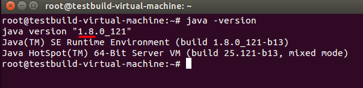
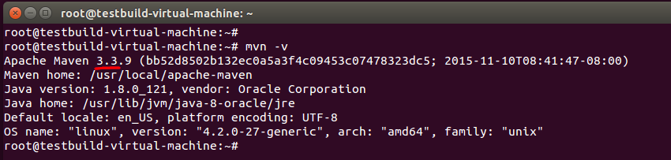

# Building OSC Images
This section describes how to setup a local build environment to build OSC images. Using OSC build process three types of images can be generated i.e:VMDK,QCOW2 and RAW image formats.

## Prerequisites
OSC image can only be built on Linux OS. Any type of Linux OS distribution can be used, for example Ubuntu, RedHat, etc.  Java related application in OSC can be compiled using Maven in windows using CYGWIN tool.  Following tools and packages are required and mandatory for OSC image builds.

1. Any Linux OS distribution
2. Java8
3. Maven3.3
4. [Access to OSC source code](./repo_access.md)

## Assumptions
This document assumes that user is performing following installation steps on Linux OS. And examples in this section are with reference to Ubuntu Desktop Linux OS.

## Installation Steps
### 1 : Install Java
Install Java on your system also make sure to installed JDK and JRE both. For example to install Java Development Kit on a local Ubuntu Linux OS. [Visit install Java 8 on Ubuntu](https://tecadmin.net/install-oracle-java-8-ubuntu-via-ppa/).  
Verify Java version and make sure the version is *1.8.xxx*.  

### 2 : Install Apache Maven  
After verifying java version on your system. Download Apache Maven from its official website or use following command to download Apache Maven 3.3.9.  
`$ cd /usr/local`  
`$ wget http://www-eu.apache.org/dist/maven/maven-3/3.3.9/binaries/apache-maven-3.3.9-bin.tar.gz`  
Now extract downloaded archive using following command.

`$ sudo tar xzf apache-maven-3.3.9-bin.tar.gz`  
`$ sudo ln -s apache-maven-3.3.9 apache-maven`  

### 3 : Setup Environment Variables
#### Maven and Java Path Setup
As you have downloaded pre compiled Apache Maven files on your system. Now set the environments variables by creating new file `apache-maven.sh`.

`$ sudo vi /etc/profile.d/apache-maven.sh`  
and add following content.  
```sh
export JAVA_HOME=/usr/lib/jvm/java-8-oracle
export M2_HOME=/usr/local/apache-maven
export MAVEN_HOME=/usr/local/apache-maven
export PATH=${M2_HOME}/bin:${PATH}
```

`$ source /etc/profile.d/apache-maven.sh`

Verify the Maven version and required version should be **3.3**.xxx  


#### Maven Proxy Setup
If connecting through a proxy create or modify `~/.m2/setting.xml` providing the proxy settings. 

### 4 :  Create CentOS Schroot Environment
OSC build process requires CentOS chroot environment to generate a VMDK,QCOW2 or a RAW image. This CentOS schroot environment allows the user to run a command or a login shell in a chroot environment.  

To create a CentOS schroot environment run following commands:  
`$ cd /local-working-directory/osc-core/osc-server-bon/bin`  
`$ ./create-centos`

### 5 : Build Commands
This section explains all the build command formats required to generate different type of images like VMDK,QCOW2 and RAW images. OSC virtual appliance will be packaged and distributed in OVF format.

Go to osc-core directory  
`$ cd /local-working-directory/osc-core/`  

#### Image Formats
##### Generate VMDK Image
`$ ant ovf`  
##### Generate QCOW2 Image
`$ ant ovf -Dimage-format=qcow2-only`
##### Generate both VMDK and QCOW2 Images
`$ ant ovf -Dimage-format=qcow2-vmdk`  
##### Generate RAW Image
`$ ant ovf -Dimage-format=raw-only`

#### Image Location
All images will be copied in following build location

`$ cd /local-working-directory/osc-core/BuildXX-XXXXXX`

## Troubleshooting Compilation Errors

### Network Issues
For any ***"network unreachable :"*** issues check the following on build machine:

1. Proxy setting, if the system is behind a proxy.
2. General network issues like ipaddress, mask, gateway and default route.

### Maven Errors
For Maven build related issues, see the [Building and Running OSC](./build_run_osc.md) documentation.  