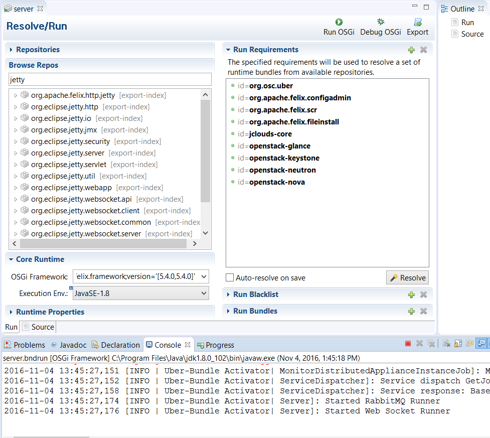

# Building and Running OSC

**IMPORTANT**:
Before building or running, navigate to the `org.osc.export` project and open the `server.bndrun` file as shown below.

Due to a bug in the bnd-export-maven-plugin, the following step is required before the first command-line build can succeed. This step is required until an expected resolution occurs.


The following error from the command-line build displays if this step is skipped:


## Command Line
### Building
Once the code is checked out, you can navigate to the folder osc-core and run:
```sh
$ mvn clean install
```


### Running
Run vmidc.sh script to start the server or 'vmidc.sh –console' to launch the server in the foreground.
```sh
$ vmidc.sh –console
```

## Eclipse
### Building

To create a proper maven build, complete the following:

Eclipse -> Run -> Run Configurations -> Maven Build


### Running

To launch the OSC server in Eclipse, complete the following:

- Ensure you have a full maven build of osc-core from [the command line](#building).
- Navigate to `org.osc.export` project in Eclipse, and then open `server.bndrun`
- Click **Run OSGi**. This launches the OSC server in Eclipse, as shown below.
- You can now browse to [https://localhost](https://localhost).


