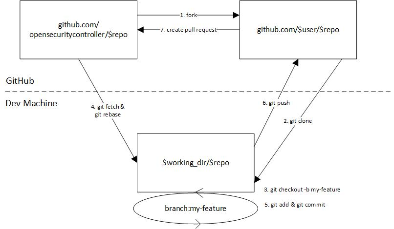
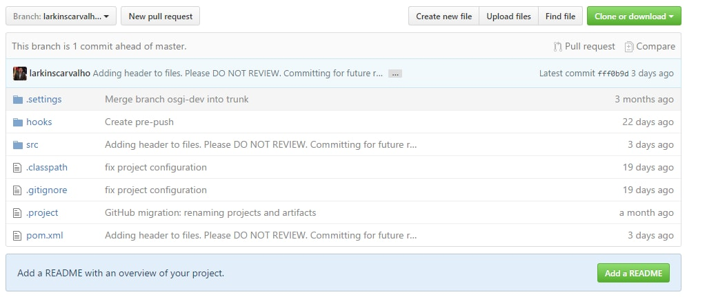
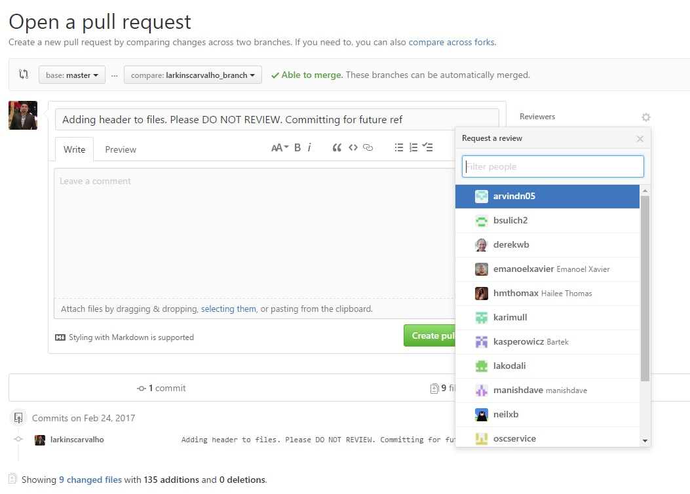

# Development Workflow

## Requirements

 - **Code Access:**  Complete the steps **[Accessing OSC Repositories](repo_access.md)**.


## Workflow
The image below depicts the OSC development workflow. Other flows may also be valid.



## Cloning The Repositories
See **Requirements** above or if you choose to clone the repositories differently ensure to set the git hooks under the /hooks/ directory for each repository, [see](./scripts/clone-repos.sh).  

## Create a Branch
Once you have cloned the OSC repositories you must create a new branch. 
> **You should NOT commit or push changes directly on the 'master' branch**.

You may create as many branches as you wish, branches that you intend to push to GitHub should be prefixed by your GitHub user name. Since you cannot commit or push to the 'master' branch you will need at least one branch pushed remotely. 
```sh
git checkout -b [YOUR_GITHUB_USER_NAME]_branch
```
## Keeping Your Branch In Sync

Use the following commands to synchronize your branch with the master branch.
```sh
git fetch origin
git rebase origin/master
```

## Committing Your Changes

You can commit and push your changes on your branch as often as you would like. 
The following commands can be used for that:


```sh
# Adding files to your commit.
git add "filename1"
git add "filename2"
# ...
git commit -m "Message"
git push -f origin [YOUR_GITHUB_USER_NAME]_branch
# Make your code changes
```

Make sure to use meaningfull messages on your commits. Clear messages help describe your pull request for code reviews.


## Creating a Pull Request
Once your changes are pushed to your branch on GitHub you can perform the following steps for creating a pull request. See **[Pull Requests](pull_requests.md)** for more details:

1.	On GitHub review the changes on your branch and click "Compare and pull request".
	
2.	Add a name and description for your Pull Request.
3.	Add the reviewers.
	
4.	Click "Create Pull Request".

