# Eclipse Setup
This document describes the actions to configure Eclipse OSC workspace settings, install Eclipse plugins and import the OSC projects.

## Requirements
The following requirements must be met to complete the Eclipse setup:

 * Eclipse Neon and higher

## Java Runtime
To set the Java Runtime settings, navigate to:

*Set Java -> Installed JREs to jdk1.8*

 
## Workspace Settings
The following sections describe the configuration of workplace settings.

### Text Editors
To set the text editor settings, navigate to:

*Window -> Preferences -> General -> Editors*

*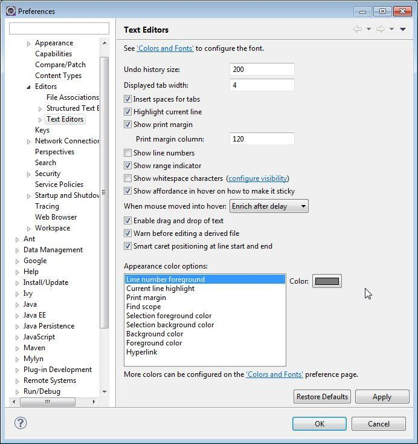

### Code Style

Import Code Style files into the eclipse workspace. The files **[cleanup_profile.xml](https://github.com/opensecuritycontroller/osc-core/blob/master/vmidc_cleanup_profile.xml)**, **[code-style-format.xml](https://github.com/opensecuritycontroller/osc-core/blob/master/vmiDC-code-style-format.xml)** and **[code-templates.xml](https://github.com/opensecuritycontroller/osc-core/blob/master/vmiDC-code-templates.xml)** are included in the osc-core repository and can be uploaded as follows:

*Window -> Preferences -> Java -> Code Style -> Clean up*

*Window -> Preferences -> Java -> Code Style -> Formatter*

*Window -> Preferences -> Java -> Code Style -> Code Templates*

Organize Imports must also be modified. To do this, navigate to:

*Window -> Preferences -> Java -> Code Style -> Organize Imports*, and then enter the number **3** into the **Number of Static imports needed for .\*** field as shown below:

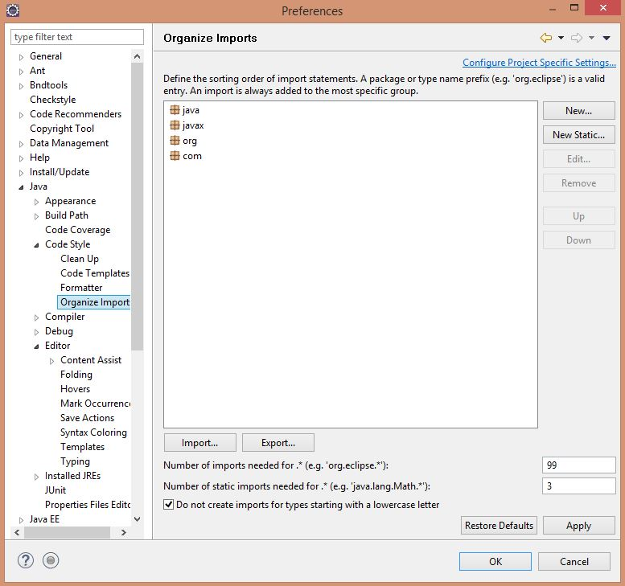

### Save Actions

To configure the Save Actions, navigate to:

*Window -> Preferences -> Java -> Editor -> Save Actions*, and then select **Configure**.

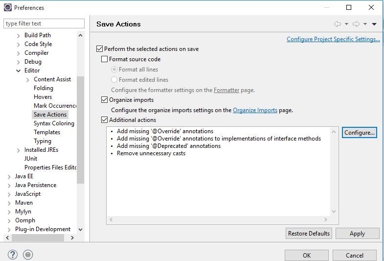

Ensure your settings match the following:

*Code Organizing*

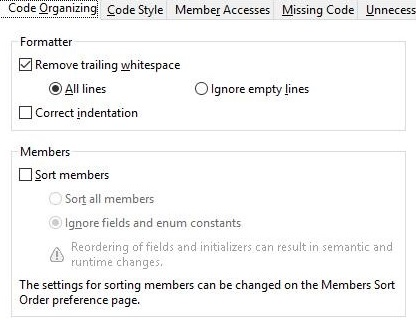

*Code Style*

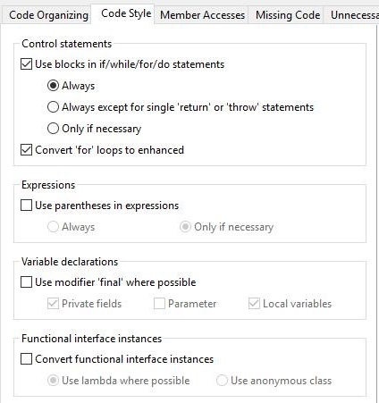

*Member Accesses*

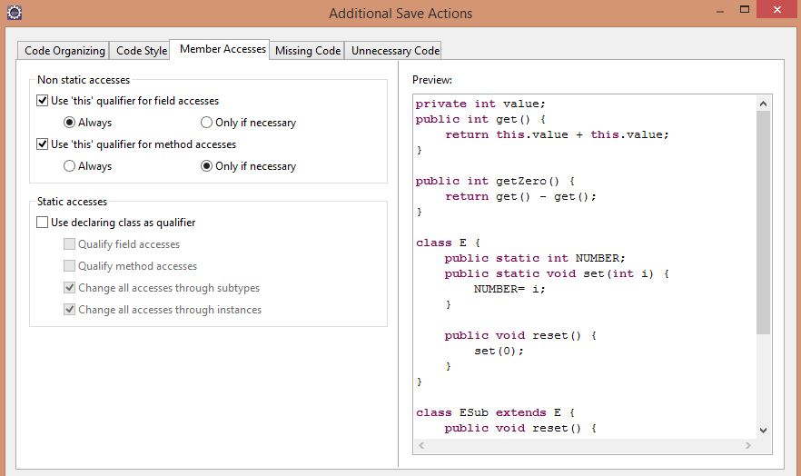

*Missing Code*

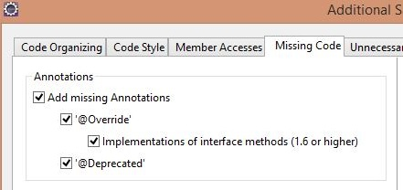

*Unnecessary Code*

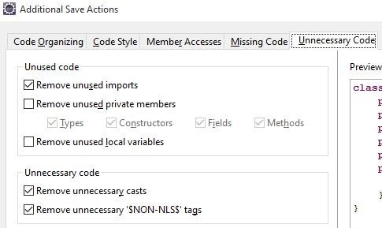

*Apply*

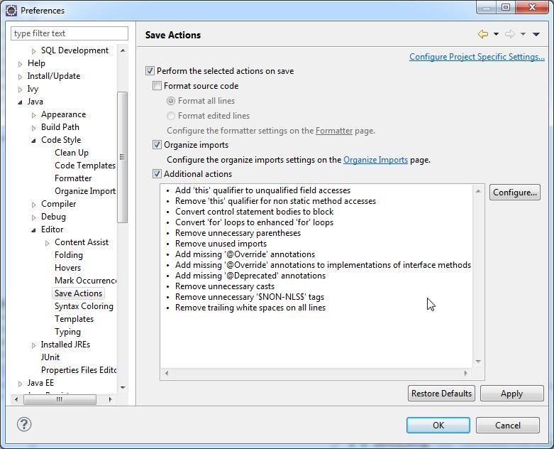

## Plugin Install

### BndTools

Install the bndtools plugin 3.3.0.REL from the Eclipse marketplace as shown below:

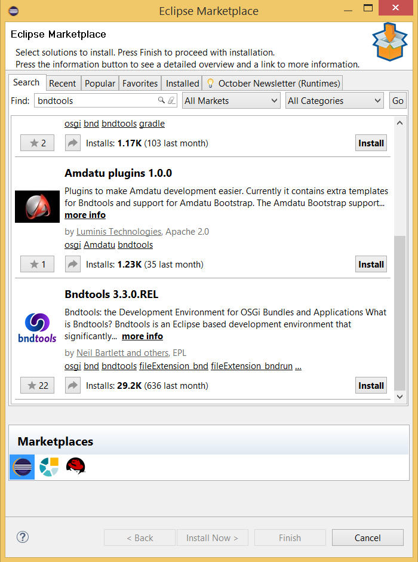

### EclEmma Java Code Coverage

Although optional, it is highly recommended to add the code coverage plugin to facilitate unit testing.

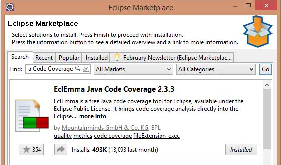

## Import OSC Projects

To import OSC projects, complete the following steps:

Select *File -> Import*

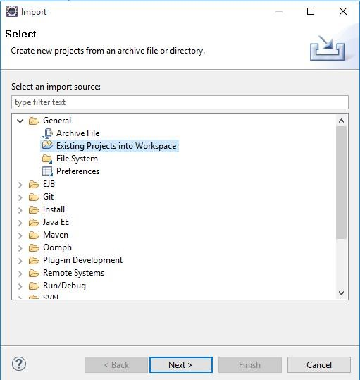

*Browse -> Select the Folder*

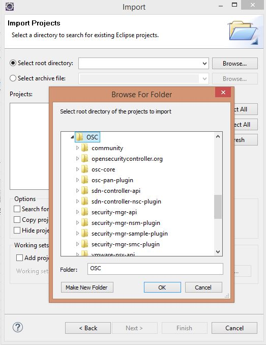

*Select All -> Finish*

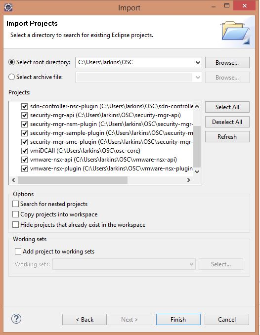

## Next Steps

- **[Build and Run OSC](build_run_osc.md)**
