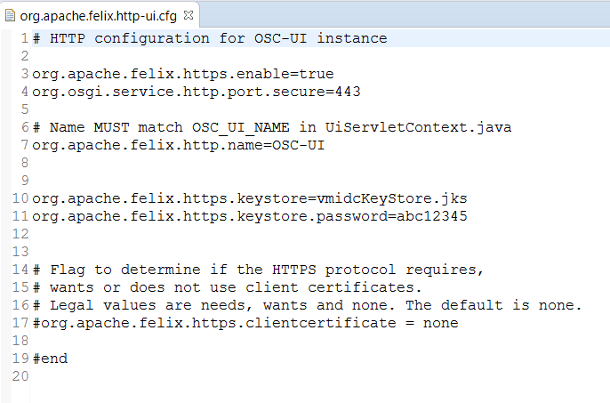
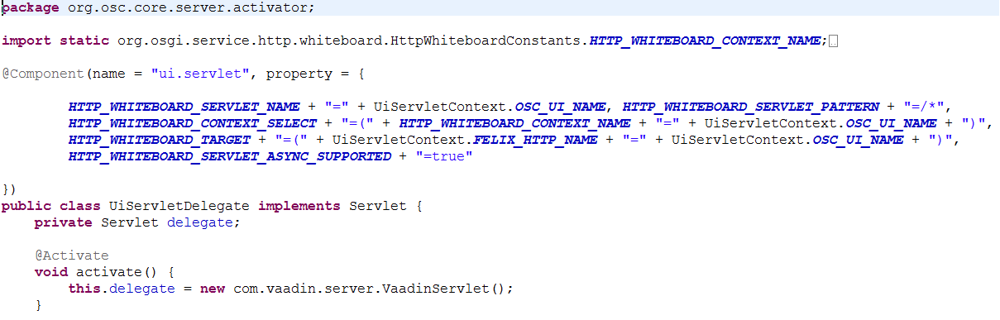
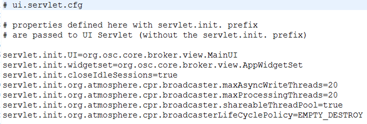

# Configuration Changes

org.osc.export/config contains:

- apache.felix.http-api.cfg
- apache.felix.http-redirect.cfg
- apache.felix.http-ui.cfg

The names of these files are important. The first part of the name "org.apache.felix.http" means that the configuration they contain will be passed to the Felix HTTP Service. The configuration details then determine the name, port and SSL etc.

The configuration for the UI HTTP instance is shown below.

The name "OSC-UI" is used in the UI Servlet definition to ensure it is hosted on the correct HTTP instance. See the annotations on the UiServletDelegate overleaf:

The remaining files in org.osc.export/config are:

- servlet.cfg
- servlet.context.cfg

Their name is also important.  In this case the name refers to the '@Component(name = "ui.servlet")' in the screenshot above. It means that the configuration in ui.servlet.cfg will be used to configure the UiServletDelegate. The configuration is shown below and corresponds to the configuration in the old web.xml that is no longer used:

Servlet context parameters are defined in a similar way in the file ui.servlet.context.cfg.