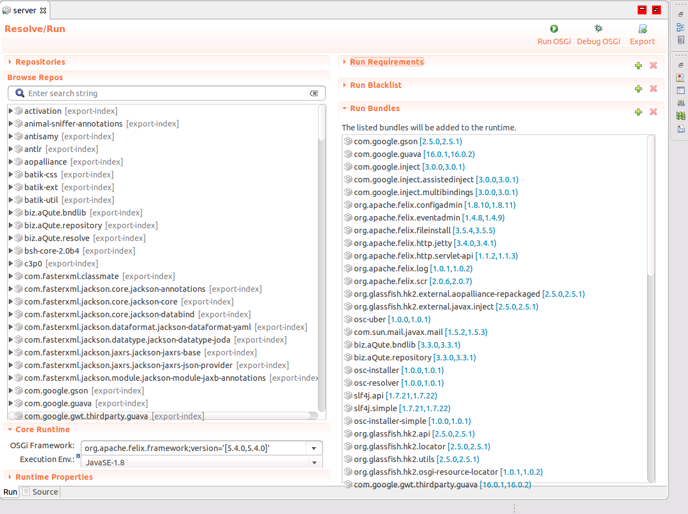
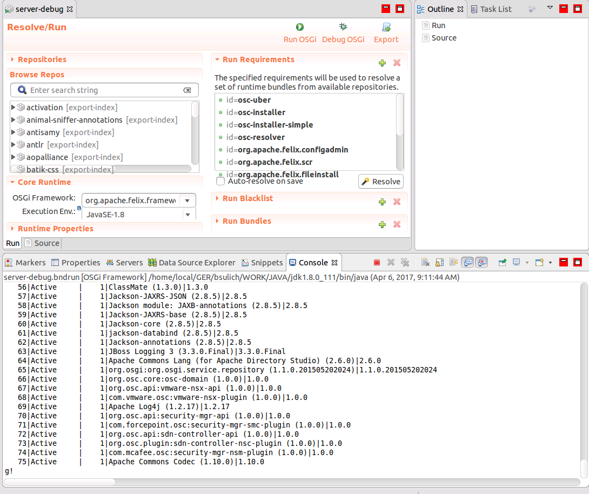
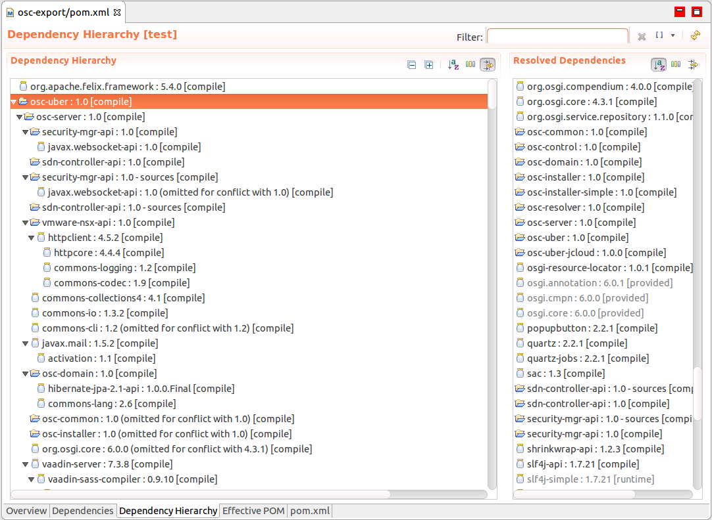

# OSC And OSGi Development Guide

In this article you can find information how is [OSGi](https://en.wikipedia.org/wiki/OSGi) integrated into project, and how to avoid and handle some typical OSGi troubles related to development. 


## OSGi Modules in OSC

- `osc-uber` - contains `osc-common`, `osc-server` and dependencies from`pom.xml` not injected directly into OSGi container
- `osc-domain` - data access object module
- `osc-uber-jcloud` - contains all dependencies to integrate with Openstack


## OSGi Container

OSGi container is a place, where all OSGi compatible jars(aka bundle) should be placed. In `osc-export` you can find few important files:

- `server.bnd`- included into server*.bndrun files, defines run environment, requirements, properties etc.
- `server.bndrun`- contains all bundles that are fundamental part of our application
- `server-debug.bndrun`- contains bundles from `server.bndrun` and bundles to run OSGi [GoGo Shell](http://enroute.osgi.org/appnotes/gogo.html)

To add new bundle into OSGi container you have to include it in `server.bndrun`(also add it to `server-debug.bndrun`) in that part:

```java
-runbundles: \
  biz.aQute.repository;version='[3.3.0,3.3.1)',\
  com.google.gson;version='[2.5.0,2.5.1)',\
  com.google.guava;version='[16.0.1,16.0.2)',\
  com.google.gwt.thirdparty.guava;version='[16.0.1,16.0.2)',\
  com.google.inject;version='[3.0.0,3.0.1)',\
  com.google.inject.assistedinject;version='[3.0.0,3.0.1)',\
  com.google.inject.multibindings;version='[3.0.0,3.0.1)',\
  com.sun.mail.javax.mail;version='[1.5.6,1.5.7)',\
  org.apache.felix.configadmin;version='[1.8.10,1.8.11)',\
  org.apache.felix.eventadmin;version='[1.4.8,1.4.9)',\
  org.apache.felix.fileinstall;version='[3.5.4,3.5.5)',\
  org.apache.felix.http.jetty;version='[3.4.0,3.4.1)',\
  org.apache.felix.http.servlet-api;version='[1.1.2,1.1.3)',\
  org.apache.felix.log;version='[1.0.1,1.0.2)',\
  org.apache.felix.scr;version='[2.0.6,2.0.7)',\
  org.glassfish.hk2.external.aopalliance-repackaged;version='[2.5.0,2.5.1)',\
  org.glassfish.hk2.external.javax.inject;version='[2.5.0,2.5.1)',\
  osc-installer;version='[1.0.0,1.0.1)',\
  osc-installer-simple;version='[1.0.0,1.0.1)',\
  osc-resolver;version='[1.0.0,1.0.1)',\
  osc-uber;version='[1.0.0,1.0.1)',\
  slf4j.api;version='[1.7.21,1.7.22)',\
  slf4j.simple;version='[1.7.21,1.7.22)',\
  org.apache.felix.metatype;version='[1.1.2,1.1.3)',\
  org.apache.felix.resolver;version='[1.10.1,1.10.2)',\
  javassist;version='[3.20.0,3.20.1)',\
  org.glassfish.hk2.api;version='[2.5.0,2.5.1)',\
  org.glassfish.hk2.locator;version='[2.5.0,2.5.1)',\
  org.glassfish.hk2.osgi-resource-locator;version='[1.0.1,1.0.2)',\
  org.glassfish.hk2.utils;version='[2.5.0,2.5.1)',\
  osc-uber-jcloud;version='[1.0.0,1.0.1)',\
  javax.websocket-api;version='[1.0.0,1.0.1)',\
  javax.ws.rs-api;version='[2.0.1,2.0.2)',\
  javax.annotation-api;version='[1.2.0,1.2.1)',\
  javax.validation.api;version='[1.1.0,1.1.1)',\
  org.glassfish.jersey.core.jersey-server;version='[2.25.0,2.25.1)',\
  org.glassfish.jersey.containers.jersey-container-servlet-core;version='[2.25.0,2.25.1)',\
  org.glassfish.jersey.core.jersey-common;version='[2.25.0,2.25.1)',\
  org.glassfish.jersey.core.jersey-client;version='[2.25.0,2.25.1)',\
  org.glassfish.jersey.bundles.repackaged.jersey-guava;version='[2.25.0,2.25.1)',\
  org.glassfish.jersey.media.jersey-media-json-jackson;version='[2.25.0,2.25.1)',\
  org.glassfish.jersey.media.jersey-media-jaxb;version='[2.25.0,2.25.1)',\
  org.glassfish.jersey.ext.jersey-entity-filtering;version='[2.25.0,2.25.1)',\
  org.hibernate.validator;version='[5.1.3,5.1.4)',\
  com.fasterxml.classmate;version='[1.3.0,1.3.1)',\
  com.fasterxml.jackson.jaxrs.jackson-jaxrs-json-provider;version='[2.8.5,2.8.6)',\
  com.fasterxml.jackson.jaxrs.jackson-jaxrs-base;version='[2.8.5,2.8.6)',\
  com.fasterxml.jackson.core.jackson-core;version='[2.8.5,2.8.6)',\
  com.fasterxml.jackson.core.jackson-databind;version='[2.8.5,2.8.6)',\
  com.fasterxml.jackson.core.jackson-annotations;version='[2.8.5,2.8.6)',\
  org.jboss.logging.jboss-logging;version='[3.3.0,3.3.1)',\
  biz.aQute.bndlib;version='[3.3.0,3.3.1)',\
  org.apache.commons.lang;version='[2.6.0,2.6.1)',\
  org.osgi.service.repository;version='[1.1.0,1.1.1)',\
  osc-domain;version='[1.0.0,1.0.1)',\
  openstack-keystone;version='[2.0.0,2.0.1)',\
  org.apache.servicemix.bundles.antlr;version='[2.7.7,2.7.8)',\
  org.apache.servicemix.bundles.dom4j;version='[1.6.1,1.6.2)',\
  org.h2;version='[1.4.194,1.4.195)',\
  org.hibernate.common.hibernate-commons-annotations;version='[5.0.1,5.0.2)',\
  org.hibernate.core;version='[5.2.8,5.2.9)',\
  org.jboss.jandex;version='[2.0.3,2.0.4)',\
  tx-control-provider-jpa-local;version='[0.0.2,0.0.3)',\
  tx-control-service-local;version='[0.0.2,0.0.3)',\
  org.apache.aries.jpa.container;version='[2.6.0,2.6.1)',\
  org.hibernate.osgi;version='[5.2.8,5.2.9)',\
  com.fasterxml.jackson.module.jackson-module-jaxb-annotations;version='[2.8.5,2.8.6)',\
  jclouds-compute;version='[2.0.0,2.0.1)',\
  openstack-neutron;version='[2.0.0,2.0.1)',\
  openstack-nova;version='[2.0.0,2.0.1)'
```
There are few things worth to notice:

- You need to define a version of bundle/jar to include
- In OSC order of bundles don't matter
- Sometimes you include only by name, i. e. `openstack-nova;version='[2.0.0,2.0.1)'` but there are also cases where you have to specify bundle with it's groupId i. e. `com.fasterxml.jackson.core.jackson-annotations;version='[2.8.5,2.8.6)',\ ` 

*Notice: It is very helpful to use Eclipse BND Tools to import bundles into `server.bndrun` . Just simply Drag'n'Drop from Repos to Run Bundles*




## OSGi GoGo Shell

To run OSC with GoGo Shell just simply open in Eclipse `server-debug.bndrun` and Run OSGi. You should be able now to type in console. To list all bundles, type `lb`



Situation when using GoGo Shell is helpful:

- Adding new bundles to OSGi Conatiner - you can install them directly via GoGo Shell
- If from any reason, bundle won't be active, you can try to reinstall it and see the reason why it failed
- To see if your freshly added bundle via Eclipse BND Tools is installed and active

To read more about bundle lifecycle go to [link](http://eclipsesource.com/blogs/2013/01/23/how-to-track-lifecycle-changes-of-osgi-bundles/).


## OSC Bundles

Every project mentioned in previous paragraph has `bnd.bnd` file inside which treats `pom.xml` like a repository. It is extremely important to correctly scope your dependencies in the `pom.xml`. You can read more about Maven dependency scope under [this](https://maven.apache.org/guides/introduction/introduction-to-dependency-mechanism.html) link.

### Adding Dependencies to the Uber Bundle

*Notice: Only **runtime** dependencies that are not compatible with OSGi should be added to this bundle.*

Let us take a look at `osc-uber\bnd.bnd` . It is bundle that contains it's own java classes but also classes from dependencies selected to `bnd.bnd` from `pom.xml`.

First of all, if we want to include resources based on `pom.xml` to our bundle we need to have that line in our `bnd.bnd` file:

```
# depend.bnd is generated by antrun prior to running bnd-maven-plugin
-include target/depend.bnd
```

then we are able to include resources like below:

```
-includeresource: \
    @${activation.dep},\
    @${amqp-client.dep},\
    @${annotations.dep},\
    @${atmosphere-runtime.dep},\
    @${c3p0.dep},\
    @${commons-cli.dep},\
    @${commons-collections4.dep},\
    ...
```

#### Excluding packages

There are situations, when we include some resource to our bundle, but we don't want to use all packages from that jar. Then we are able to exclude package using exclamation mark. Let us consider `osc-uber\bnd.bnd` file again:

```java
exclude-tomcat:\
  !org.apache.catalina,\
  !org.apache.catalina.comet,\
  !org.apache.catalina.connector,\
  !org.apache.catalina.util,\
  !org.apache.catalina.websocket,\
  !org.apache.tomcat.util.http.mapper,\
  !org.apache.coyote.http11.upgrade,\
  !javax.servlet.jsp,\
  !javax.servlet.jsp.tagext,\
  !javax.ejb
  ...
```

In above fragment from `bnd.bnd` file we exclude `!javax.servlet.jsp` and `!javax.servlet.jsp.tagext`, however if you go to class `com.mcafee.vmidc.server.Server` you can notice that we use other packages from `javax.servlet`, i. e. :

```java
package com.mcafee.vmidc.server;

...
import javax.servlet.http.HttpSession;
...

@Component(immediate = true, service = Server.class)
public class Server {
...
}
```

#### Importing packages

It is easy now to see that if we want to import some package from bundle injected directly into OSGi container, we just don't use exclamation mark at start of a line:

```java
import-extra:\
  org.ietf.jgss,\
  org.w3c.dom,\
  org.xml.sax,\
  org.xml.sax.ext,\
  org.xml.sax.helpers,\
  sun.rmi.transport,\
  javax.servlet,\
  javax.servlet.annotation,\
  javax.servlet.descriptor,\
  javax.servlet.http,\
  javax.transaction;version="[1.1,2)",\
  javax.transaction.xa;version="[1.1,2)",\
  com.fasterxml.jackson.annotation,\
  com.fasterxml.jackson.databind.exc,\
  com.fasterxml.jackson.core
```

*Notice: if you will use some class i. e. `com.fasterxml.jackson.annotation.JsonIgnore;`, which is from bundle injected into OSGi container and forget to import `com.fasterxml.jackson.annotation`,  annotation `@JsonIgnore` won't work in runtime and you will get an error on an endpoint where you have to use `@JsonIgnore`. Please take a look at [VersionUtil.java](https://github.com/opensecuritycontroller/osc-core/blob/master/osc-common/src/main/java/org/osc/core/util/VersionUtil.java#L100)*

## Resolving Exception Problems

#### Missing Requirements in the OSGi Container

While adding a new bundle to the OSGi container you also need to include the bundles required by the new dependency.

Let us  take a look at example below:

1. Remove from `server-debug.bndrun` all bundles with groupId `com.fasterxml.jackson.jaxrs`.

2. In console you should see messages:

   ```java
   ! Failed to start bundle org.glassfish.jersey.media.jersey-media-json-jackson-2.25.0, exception Unable to resolve org.glassfish.jersey.media.jersey-media-json-jackson [46](R 46.0): missing requirement [org.glassfish.jersey.media.jersey-media-json-jackson [46](R 46.0)] osgi.wiring.package; (&(osgi.wiring.package=com.fasterxml.jackson.jaxrs.base)(version>=2.8.0)(!(version>=3.0.0))) Unresolved requirements: [[org.glassfish.jersey.media.jersey-media-json-jackson [46](R 46.0)] osgi.wiring.package; (&(osgi.wiring.package=com.fasterxml.jackson.jaxrs.base)(version>=2.8.0)(!(version>=3.0.0)))]
   ```

   and list of bundles in GoGo Shell should contain:

   ```java
   START LEVEL 1
      ID|State      |Level|Name
      ...
      14|Active     |    1|javax.inject:1 as OSGi bundle (2.5.0.b05)|2.5.0.b05
      15|Resolved   |    1|org.osc.core:osc-uber (1.0.0)|1.0.0
      16|Active     |    1|JavaMail API (1.5.6)|1.5.6
      ...
      45|Active     |    1|Bean Validation API (1.1.0.Final)|1.1.0.Final
      46|Installed  |    1|jersey-media-json-jackson (2.25.0)|2.25.0
      47|Active     |    1|jersey-media-jaxb (2.25.0)|2.25.0
      ...
        
   ```

3. We can see that two bundles are not active because something is missing when looking at log file:

   ```java
   osgi.wiring.package=com.fasterxml.jackson.jaxrs.json
   ```

   So in this situation we have to add  `com.fasterxml.jackson.jaxrs.jackson-jaxrs-json-provider` which we use in OSC Rest API. 

4. Add `com.fasterxml.jackson.jaxrs.jackson-jaxrs-json-provider;version='[2.8.5,2.8.6)',\` to `server-debug.bndrun` and Run OSGi

5. Look at console log:

   ```java
   ! Failed to start bundle osc-uber-1.0.0, exception Unable to resolve osc-uber [15](R 15.0): missing requirement [osc-uber [15](R 15.0)] osgi.wiring.package; (&(osgi.wiring.package=com.fasterxml.jackson.jaxrs.json)(version>=2.8.0)(!(version>=3.0.0))) [caused by: Unable to resolve com.fasterxml.jackson.jaxrs.jackson-jaxrs-json-provider [50](R 50.0): missing requirement [com.fasterxml.jackson.jaxrs.jackson-jaxrs-json-provider [50](R 50.0)] osgi.wiring.package; (&(osgi.wiring.package=com.fasterxml.jackson.jaxrs.base)(version>=2.8.0)(!(version>=3.0.0)))] Unresolved requirements: [[osc-uber [15](R 15.0)] osgi.wiring.package; (&(osgi.wiring.package=com.fasterxml.jackson.jaxrs.json)(version>=2.8.0)(!(version>=3.0.0)))]
   ! Failed to start bundle org.glassfish.jersey.media.jersey-media-json-jackson-2.25.0, exception Unable to resolve org.glassfish.jersey.media.jersey-media-json-jackson [46](R 46.0): missing requirement [org.glassfish.jersey.media.jersey-media-json-jackson [46](R 46.0)] osgi.wiring.package; (&(osgi.wiring.package=com.fasterxml.jackson.jaxrs.base)(version>=2.8.0)(!(version>=3.0.0))) Unresolved requirements: [[org.glassfish.jersey.media.jersey-media-json-jackson [46](R 46.0)] osgi.wiring.package; (&(osgi.wiring.package=com.fasterxml.jackson.jaxrs.base)(version>=2.8.0)(!(version>=3.0.0)))]
   ! Failed to start bundle com.fasterxml.jackson.jaxrs.jackson-jaxrs-json-provider-2.8.5, exception Unable to resolve com.fasterxml.jackson.jaxrs.jackson-jaxrs-json-provider [50](R 50.0): missing requirement [com.fasterxml.jackson.jaxrs.jackson-jaxrs-json-provider [50](R 50.0)] osgi.wiring.package; (&(osgi.wiring.package=com.fasterxml.jackson.jaxrs.base)(version>=2.8.0)(!(version>=3.0.0))) Unresolved requirements: [[com.fasterxml.jackson.jaxrs.jackson-jaxrs-json-provider [50](R 50.0)] osgi.wiring.package; (&(osgi.wiring.package=com.fasterxml.jackson.jaxrs.base)(version>=2.8.0)(!(version>=3.0.0)))]

   ```

   and list bundles should contain:

   ```
      14|Active     |    1|javax.inject:1 as OSGi bundle (2.5.0.b05)|2.5.0.b05
      15|Resolved   |    1|org.osc.core:osc-uber (1.0.0)|1.0.0
      16|Active     |    1|JavaMail API (1.5.6)|1.5.6
      ...
      46|Installed  |    1|jersey-media-json-jackson (2.25.0)|2.25.0
      47|Active     |    1|jersey-media-jaxb (2.25.0)|2.25.0
      48|Active     |    1|jersey-ext-entity-filtering (2.25.0)|2.25.0
      49|Active     |    1|ClassMate (1.3.0)|1.3.0
      50|Resolved   |    1|Jackson-JAXRS-JSON (2.8.5)|2.8.5
      51|Active     |    1|Jackson-core (2.8.5)|2.8.5
      ...
   ```

   So you can see that freshly added bundle `com.fasterxml.jackson.jaxrs.jackson-jaxrs-json-provider;version='[2.8.5,2.8.6)',\` is in our Container, but it is missing some dependency that also is missed in `osc-uber` and `jersey-media-json-jackson` like before in step 2

6. Now add `com.fasterxml.jackson.jaxrs.jackson-jaxrs-base;version='[2.8.5,2.8.6)',\` to `server-debug.bndrun` and re-run. 

7. After listing bundles in console you should see that all mentioned modules are `Active` now:

   ```java
      14|Active     |    1|javax.inject:1 as OSGi bundle (2.5.0.b05)|2.5.0.b05
      15|Active     |    1|org.osc.core:osc-uber (1.0.0)|1.0.0
      16|Active     |    1|JavaMail API (1.5.6)|1.5.6
      ...
      46|Active     |    1|jersey-media-json-jackson (2.25.0)|2.25.0
      47|Active     |    1|jersey-media-jaxb (2.25.0)|2.25.0
      48|Active     |    1|jersey-ext-entity-filtering (2.25.0)|2.25.0
      49|Active     |    1|ClassMate (1.3.0)|1.3.0
      50|Active     |    1|Jackson-JAXRS-JSON (2.8.5)|2.8.5
      51|Active     |    1|Jackson-core (2.8.5)|2.8.5
      ...
   ```

   ​

*Notice: to know exactly what dependency should be added to OSGi Container while adding some new one, you need to look at dependency network of that bundle and provide all that are require. In Eclipse open `pom.xml` and go to Dependency Hierarchy tab:*



#### Missing Requirements in the OSC Uber Bundle

Non OSGi dependencies being added to the OSC uber bundle may also have missing requirements. This situation gives us same log as that one before, but our intend is different. We want to include resource inside `osc-uber` bundle.

Let us take a look at example below:

1. Remove ` @${yavijava.dep},\` from `osc-uber\bnd.bnd` and then recompile and Run OSGi with GoGo Shell.

2. Look at console log:

   ```java
   ! Failed to start bundle osc-uber-1.0.0, exception Unable to resolve osc-uber [15](R 15.0): missing requirement [osc-uber [15](R 15.0)] osgi.wiring.package; (osgi.wiring.package=com.vmware.vim25) Unresolved requirements: [[osc-uber [15](R 15.0)] osgi.wiring.package; (osgi.wiring.package=com.vmware.vim25)]
   ```

   and list of bundles should contains:

   ```java
      ...
      14|Active     |    1|javax.inject:1 as OSGi bundle (2.5.0.b05)|2.5.0.b05
      15|Installed  |    1|org.osc.core:osc-uber (1.0.0)|1.0.0
      16|Active     |    1|JavaMail API (1.5.6)|1.5.6
      ...
   ```

   ​

3. In this case we are adding back `@${yavijava.dep},\` to our `osc-uber\bnd.bnd` file recompiling and then Run OSGi with GoGo Shelll. 

4. Our application started without any problem

   ```java
      ...
      14|Active     |    1|javax.inject:1 as OSGi bundle (2.5.0.b05)|2.5.0.b05
      15|Active     |    1|org.osc.core:osc-uber (1.0.0)|1.0.0
      16|Active     |    1|JavaMail API (1.5.6)|1.5.6
      ...
   ```

*Notice: remember that pom.xml file is just repository of  your libs. You decide where you want lib to be: OSGi Container or inside some uber bundle i. e. `osc-uber`.*

#### Missing Non-Runtime Requirements

In some situation, we would like to include some library but it's dependency force us to include also some other lib to our Uber bundle. In this situation we can exclude packages that requires other libs.

Let us take a look at example:

1. Go to `osc-uber\bnd.bnd` and remove line `!org.apache.commons.beanutils,\`. Recompile and Run OSGi with GoGo Shell.

2. Look at cosnole log:

   ```java
   ! Failed to start bundle osc-uber-1.0.0, exception Unable to resolve osc-uber [15](R 15.0): missing requirement [osc-uber [15](R 15.0)] osgi.wiring.package; (osgi.wiring.package=org.apache.commons.beanutils) Unresolved requirements: [[osc-uber [15](R 15.0)] osgi.wiring.package; (osgi.wiring.package=org.apache.commons.beanutils)]
   ```

   and list of bundles should contain:

   ```java
      ...
      14|Active     |    1|javax.inject:1 as OSGi bundle (2.5.0.b05)|2.5.0.b05
      15|Installed  |    1|org.osc.core:osc-uber (1.0.0)|1.0.0
      16|Active     |    1|JavaMail API (1.5.6)|1.5.6
      ...
   ```

   ​

3. If you add line that was removed in point 1, everything works just fine.

*Notice: excluding some packages is very helpful way to avoid big size of our bundle. We should always know what libs and packages we need inside our bundle.*


## OSC-Control

Inside `osc-core` you can find project named `osc-control` . This is just standalone jar application that run/stop/reset server and do few more things. However, in this paragraph we will discuss only the way it is build with BND Tools.

#### BND.BND In OSC-Control

Basically, this is build as a bundle and includes dependencies that are necessary to work without problems in runtime. Let us take a llok at `bnd.bnd` file:

1. It contains line that help us to work with `pom.xml` as a repository:

   ```java
   -include target/depend.bnd
   ```

2. We have conditional package section, that imports packages only from libs that are inside `pomx.ml`:

   ```java
   # include minimal contents for stand-alone jar
   # also avoids refering to jar by name
   -conditionalpackage:\
       org.osc.core.broker.rest.server.model,\
       org.osc.core.rest.client.*,\
       org.osc.core.util,\
       com.google.gson.*
   ```

3. Finally we have a block that we should be familiar with:

   ```
   -includeresource: \
       @${log4j.dep},\
       @${commons-cli.dep},\
       @${commons-io.dep},\
       @${guava.dep},\
       @${aopalliance-repackaged.dep},\
       @${osgi-resource-locator.dep},\
       @${javax.ws.rs-api.dep},\
       @${javax.annotation-api.dep},\
       @${javax.inject.dep},\
       @${javassist.dep},\
       @${jersey-client.dep},\
       @${jersey-common.dep},\
       @${jersey-guava.dep},\
       @${jersey-entity-filtering.dep},\
       @${jersey-container-servlet-core.dep},\
       @${jersey-server.dep},\
       @${jackson-annotations.dep},\
       @${jackson-core.dep},\
       @${jackson-databind.dep},\
       @${jackson-jaxrs-json-provider.dep},\
       @${jackson-module-jaxb-annotations.dep},\
       @${jackson-jaxrs-base.dep},\
       @${hk2-locator.dep},\
       @${hk2-utils.dep},\
       @${hk2-api.dep},\
   	@${gson.dep}
   ```

   This is a minimal set required to work properly in runtime.

*Notice: remember that if you add some external lib from pom - check if it is included in `osc-control\bnd.bnd` . Also, if you would like to use a class from package that is not in conditional package set, add it there.*