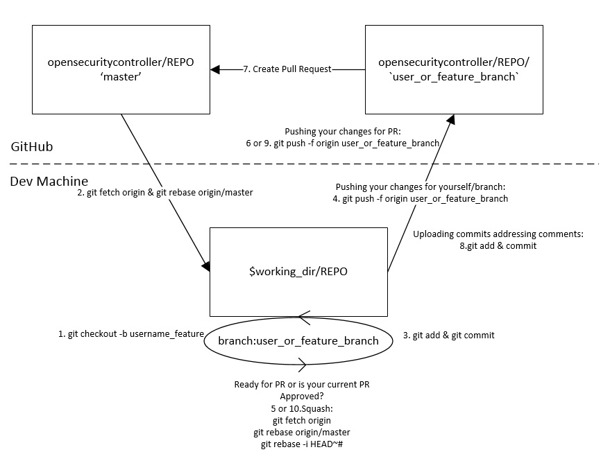

# Pull Requests

The code and documentation review process for OSC is driven by GitHub pull requests. This document describes the guidelines and actions related to PRs.

## Requirements
 - **Development Workflow:**  Complete the steps **[Development Workflow](dev_flow.md)**.

## Pull Request Flow
The diagram below depicts the detailed steps with git commands involved in a **PR** lifecycle:  
  
*Pull Request Steps and Commands*  

## Squashing Commits
Pull requests should generally have a single commit. You may send pull requests with more than one commit if that accrues to the clarity of the `master` logs. Commits that are not meant to be present in the git logs of the master branch should be **[squashed](https://ariejan.net/2011/07/05/git-squash-your-latests-commits-into-one/)** prior to sending and merging a PR.  
> **NOTE:** Commits added to a **PR** in response to code review comments **SHOULD NOT** be squashed until the PR is ready to be merged (**Approved**)

## Addressing Comments
Once a pull requested is created it will go through a code review/discussion. All the comments must be addressed prior to merging either with a response or code change.  

## Merging Pull Requests
Once the PR has been flagged as '**Approved**' the PR owner can merge it to the master branch. 

