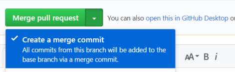

# OSC Releases

OSC releases are represented across all OSC repositories by a release branch. This document describes the process for committing changes on release branches and updating *master* with those changes.

## Release Branches
OSC release branches are protected and merges can only be made by the organization admin. Commits to these branches are reserved only for hotfixes of high priority bugs identified on that release and approved by triage.  
To submit commits for a release branch follow the same steps defined in the [pull requests (PRs) flow](pull_requests.md), diverging only on the last step: once your PR is approved the organization admin will merge it to the respective release branch.

### Merging a Hotfix to *Master*
Once your hotfix has been committed to the release branch you must also merge it to the *master* branch. It is a responsibility of the hotfix submitter to update *master* with the fix, for that follow the steps:
```sh
# Create a local branch from the HEAD of master that will be used to perform the merge of the release branch:  
# (before running this, ensure to have your local master up to date with the remote)
$ git checkout -b owner/master_merge
# Merge the release branch in the newly created branch:
$ git fetch
$ git merge --no-ff releasebranch
# Push the merge branch to the remote: 
$ git push -f origin owner/master_merge
```

At this point, you must create a PR from your branch to master on GitHub. If your merge had any conflicts or required any additional changes follow the [code review process](pull_requests.md#addressing-comments), otherwise you can directly merge your PR.

> **Important**: As opposed to a regular PR flow, when merging changes originated from a release branch **DO NOT** squash the commits, instead use the GitHub option **Merge pull request**: 
> 
