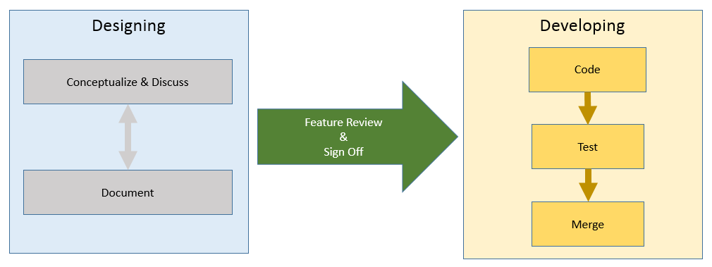

# Feature Development Phases

This document describes the expected stages for the design and development of new OSC features. 

*OSC Feature Design and Development*

## Designing

### Conceptualize and Discuss
A new feature will typically start with some research and discussions. Common activities during this phase are discussions on our Slack channel, creation of PoCs, mock ups, etc. Our community welcomes sharing and discussing new ideas at any time. 

### Document 
Once there is intention for development or integration with the OSC code base it is time to document the new feature. The intent of this document is ultimately to facilitate the feature review and code review processes. See the [OSC New Feature Proposal Template](new-feature-template.md) for creating this document. 

### Review and Sign Off
Once your document is ready for review you can share it through a regular [pull request](../development/pull_requests.md) flow. The pull request will be merged once the feature is approved for development.

## Developing 

### Code
After approval, contributions towards a feature development are welcome from anyone, see the [code contributions flow](../development/dev_flow.md) to learn more about the code review and merging processes.  

### Test
Testing should be done as part of the feature development through unit and functional tests. When designing a new feature keep the following test aspects in mind:  
    1. New code must always include unit tests in the pull request. See the [unit tests guidelines](../development/unit_test_guidelines.md) for more details.  
    2. API tests must be included for any new features.
> Note: The details for this process are currently being defined. In the meantime, a feature should still be demonstrable through a series of scripted API calls.

3. UI tests must be executed for any new features surfaced in the UI.  
4. Any feature should be demonstrable and testable in isolation from any particular vendor plugin or environment.  
     
### Merge
Code contributions for a feature should be merged frequently. Piecemeal changes are easier to test and code review. 

