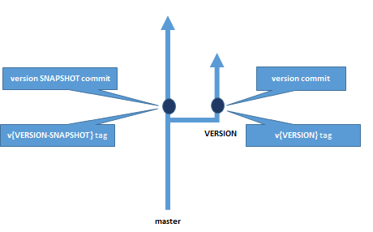
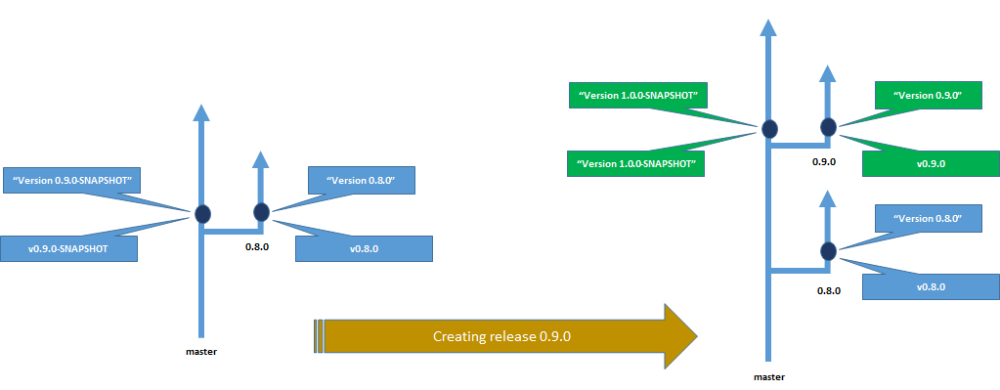
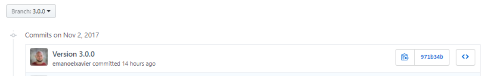
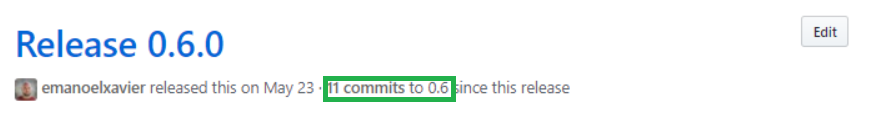
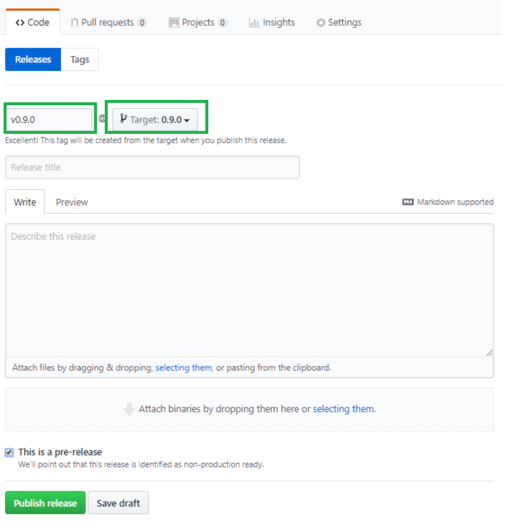
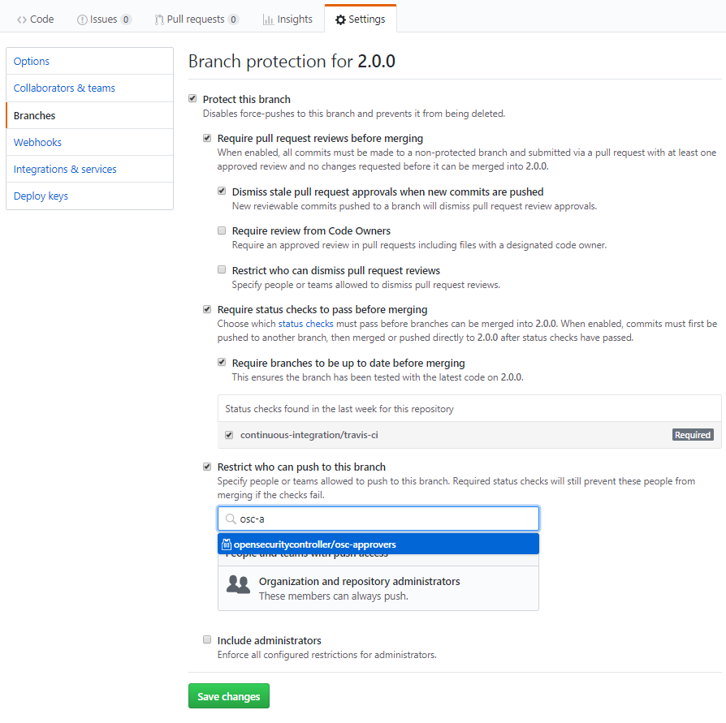

# Creating OSC Releases

## OSC Releases
OSC releases are represented across all OSC code repositories by a git tag and a branch. The picture below highlights the key elements related to an OSC release and created as part of the steps listed on the next section of this document.

  
*OSC Release Branches and Tags* 

* **master branch:** Used for ongoing development. Commits on this branch should only be tagged with **SNAPSHOT** tags and never a release tag.
* **VERSION branch:** This is a release branch. Only hotfixes and high priority and severity bugs should be merged to this branch.  Any commit on these branches must be cherry-picked to the master branch.
* **version commit:** This is the commit where the pom file(s) of the repo is changed for the corresponding version.
* **v{VERSION} tag:** This is the git tag that represents this version.
* **version SNAPSHOT commit:** This is the commit where the pom file(s) of the repo is changed for the corresponding SNAPSHOT version. 
* **v{VERSION-SNAPSHOT} tag:** This is the git tag that represents this SNAPSHOT version.
> **SNAPSHOT** versions are only a **guess** of what the next version will be. They DO NOT mandate the next release version, they must only be higher than the last release version.

The picture below shows a concrete example:
  
*OSC Release Branches: Creating a New Release* 

On the left side we have an initial state of a given OSC repo: the latest release was 0.8.0 with the respective commit (when the pom files were updated for this version) and tag. The master branch was tagged with version 0.8.0-SNAPSHOT also on the corresponding commit.  
On the right side, after the creation of the release 0.9.0, we see the new commit, tag and branch for this version. We also see the new SNAPSHOT versions on master. The previous SNAPSHOT tag is no longer of interest and has been deleted.

## Creating a Release
### Requirements and Pre-Steps
1.  The script [create-release.py](./scripts/create-release.py) must be copied to the root of your local OSC repos. For instance, if you have your repos under ```C:/git/osc/...``` that script must be copied into this directory and must always be executed from this directory.

2. Update your local copy of the script `create-release.py`.  Before you run it, you will need to update the following values with the versions you are creating:
```py
# new version for osc-core in the master branch
core_master_version = "1.2.0-SNAPSHOT"
# new version for the sdn ctrlr SDK and plugins in the master branch
sdn_ctrlr_api_master_version = "3.0.1-SNAPSHOT"
# new version for the security mgr SDK and plugins in the master branch
sec_mgr_api_master_version = "3.0.1-SNAPSHOT"
# new version for osc-core in the release branch
core_release_version = "0.9.0"
# new version for the sdn ctrlr SDK and plugins in the release branch
sdn_ctrlr_api_release_version = "3.0.0"
# new version for the security mgr SDK and plugins in the release branch
sec_mgr_api_release_version = "3.0.0"
``` 
Also review the values for `core-projects`, `repo_snapshots` and `repo_releases` and ensure that the list of repos and core projects are up to date with the code base.
> Note: This script is heavly documented and self-explanatory, to learn more about what it does refer to the script code.

3. You must have the credentials to allow publishing the SDN controller and Security Mananager plugins SDK in the OSC Nexus repository http://ci.opensecuritycontroller.org:8082/nexus/content/repositories configured on your local Maven `settings.xml`, i.e.: 
```
<server>
      <id>osc-nexus</id>
      <username>USER_NAME</username>
      <password>PASSWORD</password>
    </server>
  </servers>
```

4.  Python 3.6.2 on the machine where you will be creating the releases from.
5.  The Python package ```lxmlx``` that can be installed with:
```pip3 install lxml```
6. Ensure that all your local repos have the remote `upstream`, like this:
```sh  
$ git remote --v
upstream        git@github.com:opensecuritycontroller/osc-core.git (fetch)
upstream        git@github.com:opensecuritycontroller/osc-core.git (push)
```
> Note: By default you may not have the `push` URL set for the `upstream` remote. You will need to set that before creating the releases. Once you are finished you should remove that URL to avoid accidental pushes to the `upstream` remote.

### Release Branches and Tags 
Below are the steps you must perform to create a release branch and respective tags accross all the OSC repos.

**1. Ensure your `master` branches accross all local repos are clean**
```py
$ python create-release.py cleanup
```

**2. Create the releases branches**  
```py
$ python create-release.py branch-release
```

**3. Review the created branches on GitHub**  
   Go to **each** OSC repository on GitHub and look for the release branch corresponding to the targeted release version you are creating. You should see that these branches will be one commit ahead of master and this commit will have a message with the format *"Version XXX"*.  For instance:
  
*OSC Release Branch and Commit on GitHub*  

   Review the content of this commit observing the version changes on the pom.xml file. For the `osc-core` repository multiple pom files, one for each project, will be changed.  
   > Note: The script should take care of all the needed changes in the pom file(s) but if any adjusting is needed add new commits to the branch squashing them to the version commit.

**4. Create a placeholder release on GitHub**  
   GitHub has a nice feature when you look at the Releases for a given repository:
  
*Release Branchs and Commit Count*  

   In the picture above we see the number of commits above the release tag **on the release branch**, in this example `0.6`. For this to work however a **Release** has to be created on GitHub using the targeted branch.  This step is to ensure this GitHub feature will work, if not done the commit count we see for a given release will be done using the `master` branch instead of the release branch which is not ideal.  
   To create a placeholder release on GitHub do the following:  

   For **each** repo go to the **Releases** tab and click on **Draft a new release**. Create the new release as shown below, ensure to use the new **release branch** and **v[VERSION]  for the tag**, on the picture below they are`0.9.0` and `v0.9.0`.  Click **Publish release**.
  
*Release Placeholder on GitHub*  

**5. Create the release tags**  
   While the previous step did create a tag on the branch, the tags created by GitHub are not annotated.  This step creates an annotated git tag on all the branches and force pushes them to GitHub:
```py
$ python create-release.py tag-release
```

**6. Publish plugin OSC SDKs to Nexus**  
Run the following command for the SDN controller SDK and Security Manager SDK from the *release* branch:
```sh
$ mvn clean deploy
```
This will publish the release version of these plugins in the OSC Nexus. After finishing that command double check that the dependencies are available at http://ci.opensecuritycontroller.org:8082/nexus/content/repositories/releases/org/osc/api/ for the release versions you are creating.


**7. Review Travis Build Status**  
For each repo on GitHub restart the Travis build in the release branches and observe the status. They should all show `green` at this point.


**8. Updating the server.bndrun files**  
Using Eclipse with your OSC solution open the files `server.bndrun` and `server-debug.bndrun`. For each of them click **Resolve**. This will modify these files adjusting for the new dependencies. Review these changes, commit and push them to the `upstream/release branch`.  

**9. Protecting the release branches**  
For each repository the new release branches must be configured as protected branches on GitHub. The picture below shows the correct settings for that:
  
*Protecting an OSC Release Branch*  


**10. Update any other continuous integration/delivery jobs**  
The new release branches are now ready to be consumed. At this point if you do have any internal continuous integration or delivery service (i.e.: Jenkins) you should update them to use the new release branches and generate your builds.

### SNAPSHOT Versions
Once the release branches and tags are created we must now tag the master branch of each repo with the next intended SNAPSHOT version. The following steps implement this task:  

**1. Create the SNAPSHOT tags for the repos with the command:**
```sh
$ python create-release.py create-snapshot
```

**2. Review the SNAPSHOT commits**  
Go to **each** OSC repository on GitHub and on the master branch you will have one new commit that will have a message with the format *"Version XXX-SNAPSHOT"*.
Review the content of this commit observing the version changes on the pom.xml file. For the `osc-core` repository multiple pom files, one for each project, will be changed.  
> Note: The script should take care of all the needed changes in the pom file(s) but if any ajusting is needed add new commits to the branch and push them to the `upstream` remote. **DO NOT** force push the new commits, a regular push should work and suffice. This is also safer since you are working on the active `master` branch.

**3. Review Travis Build Status**  
For each repo on GitHub restart the Travis build in the master branches and observe the status. They should all show `green` at this point.

**4. Running any other continuous integration/delivery job**  
The master branches are now tagged with the next **SNAPSHOT** version. At this point if you do have any internal continuous integration or delivery service (i.e.: Jenkins) you should run them to generate a new build with this version.

**5. Delete previous SNAPSHOT versions on GitHub**  
For each repository go to `Releases` on GitHub and delete any older SNAPSHOT version that was previously created. With the new SNAPSHOT version tag in place the older ones are no longer needed.

